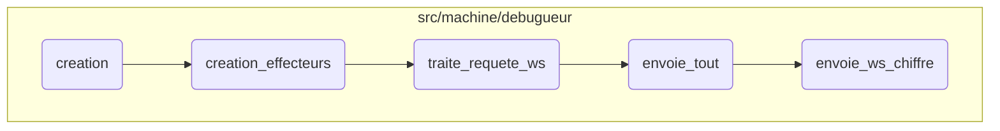

This document explains the flow of creating and managing client connections, processing their requests, and ensuring secure communication. The process involves setting up the server to accept client connections, handling <SwmToken path="src/machine/debugueur/debugueur.cpp" pos="368:6:6" line-data="		SVM_TRACE(&quot;Ouverture WebSocket demandee &quot; &lt;&lt; client.get());">`WebSocket`</SwmToken> requests, sending relevant data to clients, and encrypting messages for secure transmission.

First, the server is set up to accept client connections. When a client connects, it is added to the list of active clients. The server then processes <SwmToken path="src/machine/debugueur/debugueur.cpp" pos="368:6:6" line-data="		SVM_TRACE(&quot;Ouverture WebSocket demandee &quot; &lt;&lt; client.get());">`WebSocket`</SwmToken> requests from the clients, handling different types of messages like PING, PONG, and TEXT. Based on the client's subscriptions, the server sends the relevant data to the client. Finally, messages are encrypted before being sent to ensure secure communication.

# Flow drill down



<SwmSnippet path="/src/machine/debugueur/debugueur.cpp" line="78">

---

## Handling client connections

First, the <SwmToken path="src/machine/debugueur/debugueur.cpp" pos="78:4:4" line-data="void Debugueur::creation_effecteurs()">`creation_effecteurs`</SwmToken> function sets up the server to accept client connections. It opens a socket and waits for incoming connections. When a client connects, it checks if the maximum number of clients has been reached. If not, it accepts the connection and adds the client to the list of active clients. This ensures that the server can handle multiple clients simultaneously.

```c++
void Debugueur::creation_effecteurs()
{
	std::ostringstream os;
	_fd_fin = TCP::ouvrir<false,false,true>(os,SOCK_STREAM,"localhost",_port);
	if(_fd_fin<0)
	{
		SVM::Machine::Trace(_historique,"debug") << os.str() << "Abort Simple Virtual Machine boot!";
		throw PasDeDebuggueur();
	}
	struct sockaddr sock_client;
	socklen_t longueur_client = sizeof(sock_client);
	SVM_TRACE("accept - avant");
	_fd_declenchement_fin = ::accept(_fd_serveur,&sock_client,&longueur_client);
	linger linger = { 1, 0 };
	::setsockopt(_fd_declenchement_fin,SOL_SOCKET,SO_LINGER,&linger,sizeof(linger));
	SVM_TRACE("accept - apres");
	SVM_TRACE("ouverture declenchement fin : " << _fd_declenchement_fin);
	_lecteur = std::thread([this] ()
		{
			for( ; ; )
			{
```

---

</SwmSnippet>

<SwmSnippet path="/src/machine/debugueur/debugueur.cpp" line="422">

---

## Processing <SwmToken path="src/machine/debugueur/debugueur.cpp" pos="368:6:6" line-data="		SVM_TRACE(&quot;Ouverture WebSocket demandee &quot; &lt;&lt; client.get());">`WebSocket`</SwmToken> requests

Next, the <SwmToken path="src/machine/debugueur/debugueur.cpp" pos="422:4:4" line-data="void Debugueur::traite_requete_ws(const ClientSP&amp; client, const std::string&amp; requete)">`traite_requete_ws`</SwmToken> function processes <SwmToken path="src/machine/debugueur/debugueur.cpp" pos="368:6:6" line-data="		SVM_TRACE(&quot;Ouverture WebSocket demandee &quot; &lt;&lt; client.get());">`WebSocket`</SwmToken> requests from clients. It decodes the <SwmToken path="src/machine/debugueur/debugueur.cpp" pos="368:6:6" line-data="		SVM_TRACE(&quot;Ouverture WebSocket demandee &quot; &lt;&lt; client.get());">`WebSocket`</SwmToken> message and handles different types of requests such as PING, PONG, and TEXT. For TEXT messages, it processes the message content, handles authentication, and executes commands based on the client's state. This function ensures that the server can handle various <SwmToken path="src/machine/debugueur/debugueur.cpp" pos="368:6:6" line-data="		SVM_TRACE(&quot;Ouverture WebSocket demandee &quot; &lt;&lt; client.get());">`WebSocket`</SwmToken> operations and maintain client sessions.

```c++
void Debugueur::traite_requete_ws(const ClientSP& client, const std::string& requete)
{
	WS ws = WS::decode_ws(requete);
	SVM_TRACE(ws);
	if(not ws)
	{
		SVM_TRACE("message non WS");
		return;
	}
	switch(ws._opcode)
	{
		case WS::FIN:
			{
				client->envoie(WS::encode_ws(WS(true,WS::FIN)));
				client->_protocole = Client::Protocole::HTTP;
				return;
			}
			break;
		case WS::PING:
			{
				WS trame(true,WS::PONG);
```

---

</SwmSnippet>

<SwmSnippet path="/src/machine/debugueur/debugueur.cpp" line="690">

---

## Sending data to clients

Then, the <SwmToken path="src/machine/debugueur/debugueur.cpp" pos="690:4:4" line-data="void Debugueur::envoie_tout(const ClientSP&amp; client) const">`envoie_tout`</SwmToken> function sends data to clients based on their subscriptions. It iterates through the client's subscribed objects and indexes, sending the relevant data to the client. This function ensures that clients receive the latest data they are interested in.

```c++
void Debugueur::envoie_tout(const ClientSP& client) const
{
	std::lock_guard<std::mutex> verrou(_protection);
	for(const auto& o: client->_souscription_objet)
	{
		auto it = _pieges.find(o);
		if(it==_pieges.end()) continue;
		auto p = it->second.lock();
		if(not p) continue;
		client->envoie_ws_chiffre(p->description());
	}
	for(const auto& i: client->_souscription_index)
	{
		auto t = _index.find(i);
		client->envoie_ws_chiffre(t->second);
	}
}
```

---

</SwmSnippet>

<SwmSnippet path="/src/machine/debugueur/client.h" line="61">

---

## Encrypting and sending <SwmToken path="src/machine/debugueur/debugueur.cpp" pos="368:6:6" line-data="		SVM_TRACE(&quot;Ouverture WebSocket demandee &quot; &lt;&lt; client.get());">`WebSocket`</SwmToken> messages

Finally, the <SwmToken path="src/machine/debugueur/client.h" pos="61:3:3" line-data="	void envoie_ws_chiffre(const std::string&amp; message)">`envoie_ws_chiffre`</SwmToken> function encrypts and sends <SwmToken path="src/machine/debugueur/debugueur.cpp" pos="368:6:6" line-data="		SVM_TRACE(&quot;Ouverture WebSocket demandee &quot; &lt;&lt; client.get());">`WebSocket`</SwmToken> messages to clients. If encryption is enabled, it encrypts the message before sending it. This function ensures that sensitive data is securely transmitted to clients.

```c
	void envoie_ws_chiffre(const std::string& message)
	{
		SVM_TRACE("Envoi chiffre: " << message);
		if(not _chiffre)
		{
			envoie_ws(message);
			return;
		}
		WS ws(true,WS::TEXTE);
		ws._message=Securite::encode_hex(_chiffre->chiffre(message));
		envoie(WS::encode_ws(ws));
	}
```

---

</SwmSnippet>

&nbsp;

*This is an auto-generated document by Swimm 🌊 and has not yet been verified by a human*

<SwmMeta version="3.0.0" repo-id="Z2l0aHViJTNBJTNBc3ZtLTIuNy4yMDI0MTEwNyUzQSUzQVN3aW1tLURlbW8=" repo-name="svm-2.7.20241107"><sup>Powered by [Swimm](/)</sup></SwmMeta>
