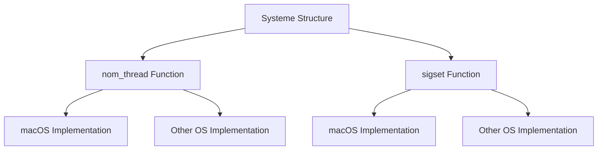

# Getting Started with Systeme Structure

Systeme is a structure within the Global namespace of the SVM project. It provides utility functions for thread naming and signal handling. This document will guide you through the main functions of the Systeme structure, specifically focusing on <SwmToken path="src/global/systeme.h" pos="34:5:5" line-data="		static void nom_thread(const T_ID&amp; tid, const std::string&amp; nom)">`nom_thread`</SwmToken> and <SwmToken path="src/global/systeme.h" pos="46:5:5" line-data="		static void sigset(sigset_t *ss, int signal)">`sigset`</SwmToken>.

## Systeme Structure Overview

The Systeme structure provides utility functions for thread naming and signal handling. These functions are implemented with specific considerations for different operating systems to ensure cross-platform compatibility.

<SwmSnippet path="/src/global/systeme.h" line="31">

---

The Systeme structure is defined in the file <SwmPath>[src/global/systeme.h](src/global/systeme.h)</SwmPath>. It includes the <SwmToken path="src/global/systeme.h" pos="34:5:5" line-data="		static void nom_thread(const T_ID&amp; tid, const std::string&amp; nom)">`nom_thread`</SwmToken> and <SwmToken path="src/global/systeme.h" pos="46:5:5" line-data="		static void sigset(sigset_t *ss, int signal)">`sigset`</SwmToken> functions, which are crucial for thread management and signal handling.

```c
	struct Systeme
	{
		template<typename T_ID>
		static void nom_thread(const T_ID& tid, const std::string& nom)
		{
// __LINUX__
// BSD
// __APPLE__
// _WIN32
#if defined(__APPLE__)
			::pthread_setname_np(nom.substr(0,14).c_str());
#else
			::pthread_setname_np(tid,nom.substr(0,14).c_str());
#endif
		}
		static void sigset(sigset_t *ss, int signal)
		{
#if defined(__APPLE__)
			sigemptyset(ss);
			sigaddset(ss,signal);
#else
```

---

</SwmSnippet>

## <SwmToken path="src/global/systeme.h" pos="34:5:5" line-data="		static void nom_thread(const T_ID&amp; tid, const std::string&amp; nom)">`nom_thread`</SwmToken> Function

The <SwmToken path="src/global/systeme.h" pos="34:5:5" line-data="		static void nom_thread(const T_ID&amp; tid, const std::string&amp; nom)">`nom_thread`</SwmToken> function sets the name of a thread. It has specific implementations for different operating systems, such as macOS and others. This function ensures that the thread name is set correctly based on the operating system.

<SwmSnippet path="/src/global/systeme.h" line="33">

---

The <SwmToken path="src/global/systeme.h" pos="34:5:5" line-data="		static void nom_thread(const T_ID&amp; tid, const std::string&amp; nom)">`nom_thread`</SwmToken> function is implemented in the Systeme structure. For macOS, it uses <SwmToken path="src/global/systeme.h" pos="41:2:2" line-data="			::pthread_setname_np(nom.substr(0,14).c_str());">`pthread_setname_np`</SwmToken> with the thread name truncated to 14 characters. For other operating systems, it uses <SwmToken path="src/global/systeme.h" pos="41:2:2" line-data="			::pthread_setname_np(nom.substr(0,14).c_str());">`pthread_setname_np`</SwmToken> with the thread ID and the truncated name.

```c
		template<typename T_ID>
		static void nom_thread(const T_ID& tid, const std::string& nom)
		{
// __LINUX__
// BSD
// __APPLE__
// _WIN32
#if defined(__APPLE__)
			::pthread_setname_np(nom.substr(0,14).c_str());
#else
			::pthread_setname_np(tid,nom.substr(0,14).c_str());
#endif
		}
```

---

</SwmSnippet>

## sigset Function

The <SwmToken path="src/global/systeme.h" pos="46:5:5" line-data="		static void sigset(sigset_t *ss, int signal)">`sigset`</SwmToken> function initializes and adds a signal to a signal set. Similar to <SwmToken path="src/global/systeme.h" pos="34:5:5" line-data="		static void nom_thread(const T_ID&amp; tid, const std::string&amp; nom)">`nom_thread`</SwmToken>, it has specific implementations for different operating systems. This function is essential for handling signals in a cross-platform manner.

<SwmSnippet path="/src/global/systeme.h" line="46">

---

The <SwmToken path="src/global/systeme.h" pos="46:5:5" line-data="		static void sigset(sigset_t *ss, int signal)">`sigset`</SwmToken> function is implemented in the Systeme structure. For macOS, it uses <SwmToken path="src/global/systeme.h" pos="49:1:1" line-data="			sigemptyset(ss);">`sigemptyset`</SwmToken> and <SwmToken path="src/global/systeme.h" pos="50:1:1" line-data="			sigaddset(ss,signal);">`sigaddset`</SwmToken> to initialize and add the signal to the set. For other operating systems, it uses the same functions but with different implementations.

```c
		static void sigset(sigset_t *ss, int signal)
		{
#if defined(__APPLE__)
			sigemptyset(ss);
			sigaddset(ss,signal);
#else
			::sigemptyset(ss);
			::sigaddset(ss,signal);
#endif
		}
```

---

</SwmSnippet>



&nbsp;

*This is an auto-generated document by Swimm 🌊 and has not yet been verified by a human*

<SwmMeta version="3.0.0" repo-id="Z2l0aHViJTNBJTNBc3ZtLTIuNy4yMDI0MTEwNyUzQSUzQVN3aW1tLURlbW8=" repo-name="svm-2.7.20241107"><sup>Powered by [Swimm](/)</sup></SwmMeta>
