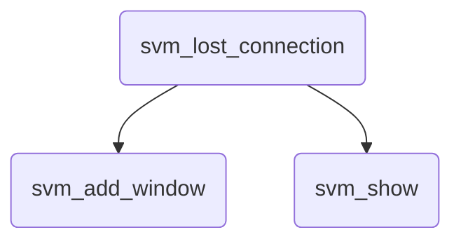
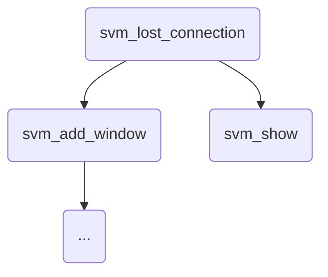
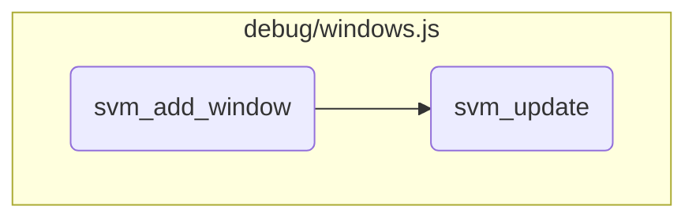

This document explains the process of handling lost connections within the SVM environment. It covers the steps taken when a connection to the SVM controller is lost, including displaying error messages and updating the user interface.

When the connection to the SVM controller is lost, the system first checks if the user is logged in. If the user is logged in, an error message is displayed indicating that the connection is lost. If the user is not logged in, the login window is removed, and a message is shown indicating that the login failed and suggesting the user reload the page. The error messages are displayed in new windows, which are created and made visible through a series of functions that handle window creation, updating, and event handling.

Here is a high level diagram of the flow, showing only the most important functions:



# Flow drill down

First, we'll zoom into this section of the flow:



<SwmSnippet path="/debug/views.js" line="1897">

---

## Handling Lost Connection

First, the <SwmToken path="debug/views.js" pos="1897:1:1" line-data="	svm_lost_connection()">`svm_lost_connection`</SwmToken> function checks if the connection to the SVM controller has ended. If the user is logged in, it displays an error message indicating that the connection to SVM is lost. If the user is not logged in, it removes the login window and displays a message indicating that the login failed and suggests reloading the page.

```javascript
	svm_lost_connection()
	{
		if(svm_controler.svm_end) return;
		if(svm_controler.svm_login)
		{
			var b = this.svm_desktop.svm_add_window("erreur","Error","<div>Connection to SVM lost!</div>",null,new SVM_PositionClever(this.svm_desktop,200,100,null),new SVM_SizeFixed(200,100));
		}
		else
		{
			svm_interface.svm_desktop.svm_remove_window(svm_interface.login_box);
			var b = this.svm_desktop.svm_add_window("erreur","Error","<div>Login failed!</div><div>You shall reload the page to get a new login.</div>",new SVM_Events(null,null,null,null,function(f) {f.svm_show();},null,null,function(f) { return false; }),new SVM_PositionClever(this.svm_desktop,200,100,null),new SVM_SizeFixed(200,100));
		}
		b.svm_notify();
	}
```

---

</SwmSnippet>

<SwmSnippet path="/debug/windows.js" line="303">

---

## Showing Error Messages

Next, the <SwmToken path="debug/windows.js" pos="303:1:1" line-data="	svm_show()">`svm_show`</SwmToken> function is responsible for making the error window visible. It sets the window's visibility to true and triggers any associated show events before drawing the window on the screen.

```javascript
	svm_show()
	{
		this.svm_visible = true;
		if(this.svm_events != null && this.svm_events.svm_show != null)
		{
			this.svm_events.svm_show(this);
		}
		this.svm_draw();
	}
```

---

</SwmSnippet>

Now, lets zoom into this section of the flow:



<SwmSnippet path="/debug/windows.js" line="408">

---

## Adding a Window

First, the <SwmToken path="debug/windows.js" pos="408:1:1" line-data="	svm_add_window(svm_category,svm_title,svm_content,svm_events,svm_position,svm_size,svm_help)">`svm_add_window`</SwmToken> function checks if a window with the same category already exists. If it does, it highlights the existing window and returns it. If not, it creates a new window, makes it draggable, and adds it to the list of windows. The new window is then highlighted and drawn. Finally, it updates and redraws any associated bars and the windows list.

```javascript
	svm_add_window(svm_category,svm_title,svm_content,svm_events,svm_position,svm_size,svm_help)
	{
		if(this.svm_unique.indexOf(svm_category)!=-1)
		{
			var w = this.svm_windows.find(e => e.svm_category==svm_category);
			if(w != undefined)
			{
				w.svm_highlight();
				return w;
			}
		}
		var svm_window_dom = svm_create_div(this.dom,'window');
		svm_window_dom.draggable = true;
		var svm_window = new SVM_Window(svm_window_dom,this,svm_category,svm_title,svm_content,svm_events,svm_position,svm_size,svm_help);
		this.svm_windows.push(svm_window);
		svm_window.svm_highlight();
		svm_window.svm_draw();
		for(var b of this.svm_bars)
		{
			b.svm_update(svm_window.svm_depth+1);
			b.svm_draw();
```

---

</SwmSnippet>

<SwmSnippet path="/debug/windows.js" line="169">

---

## Updating a Window

Next, the <SwmToken path="debug/windows.js" pos="169:1:1" line-data="	svm_update()">`svm_update`</SwmToken> function updates the window's DOM elements. It sets the window's position to fixed, creates various div elements for the window's box, title bar, title, buttons, and content. It also sets up event listeners for help, alarm, hide, and close buttons, as well as for click, mousedown, and dragstart events. These event listeners handle user interactions with the window, such as displaying help, acknowledging alarms, hiding, closing, highlighting, and moving the window.

```javascript
	svm_update()
	{
		this.dom.classList.add(this.svm_category);
		this.dom.innerHTML = "";
		this.dom.style.position = 'fixed';
		var svm_box = svm_create_div(this.dom,'window_box');
		var svm_title_bar = svm_create_div(svm_box,'window_title_bar');
		var svm_title = svm_create_inline_block_div(svm_title_bar,'window_title');
		svm_title.innerHTML = this.svm_title;
		var svm_buttons = svm_create_inline_div(svm_title_bar,'window_buttons');
		var svm_alarm = svm_create_inline_div(svm_buttons,'window_buttons_alarm');
		svm_alarm.classList.add('window_button');
		if(this.svm_help != null)
		{
			var svm_help = svm_create_inline_div(svm_buttons,'window_buttons_help');
			svm_help.classList.add('window_button');
		}
		var svm_hide = svm_create_inline_div(svm_buttons,'window_buttons_hide');
		svm_hide.classList.add('window_button');
		var svm_close = svm_create_inline_div(svm_buttons,'window_buttons_close');
		svm_close.classList.add('window_button');
```

---

</SwmSnippet>

&nbsp;

*This is an auto-generated document by Swimm 🌊 and has not yet been verified by a human*

<SwmMeta version="3.0.0" repo-id="Z2l0aHViJTNBJTNBc3ZtLTIuNy4yMDI0MTEwNyUzQSUzQVN3aW1tLURlbW8=" repo-name="svm-2.7.20241107"><sup>Powered by [Swimm](/)</sup></SwmMeta>
