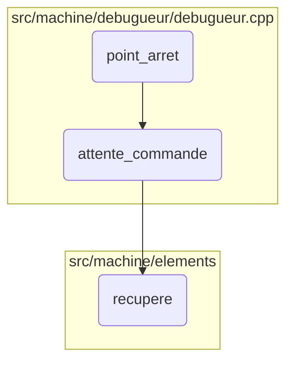
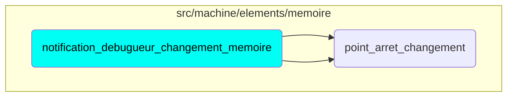

This document explains the flow of handling memory change notifications within a virtual machine environment. The process involves setting breakpoints and waiting for commands to manage memory changes effectively.

The flow starts with setting a breakpoint when a memory change is detected. Then, it waits for commands to handle the change. This ensures that any modifications in memory are managed properly and can be debugged if necessary.

Here is a high level diagram of the flow, showing only the most important functions:

# Flow drill down

# Where is this flow used?

This flow is used multiple times in the codebase as represented in the following diagram:

&nbsp;

*This is an auto-generated document by Swimm 🌊 and has not yet been verified by a human*

<SwmMeta version="3.0.0" repo-id="Z2l0aHViJTNBJTNBc3ZtLTIuNy4yMDI0MTEwNyUzQSUzQVN3aW1tLURlbW8=" repo-name="svm-2.7.20241107">Powered by [Swimm](/)</SwmMeta>
