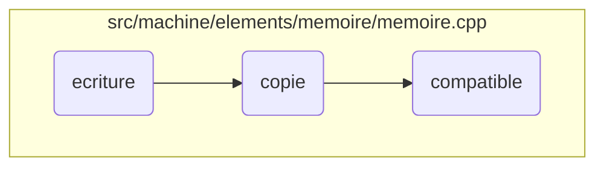
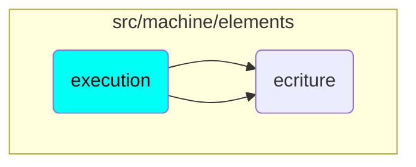

In this document, we will explain the process of handling memory operations. The process involves writing values to memory, copying memory blocks, and ensuring compatibility between memory blocks.

The flow starts with writing a value to a specific memory address, ensuring the address is valid and the value is compatible. Next, it involves copying memory from one location to another, checking for copyable elements and avoiding unnecessary operations. Finally, it ensures that the source and destination memory blocks are compatible in terms of size and type, verifying each element and throwing errors if any incompatibility is found.

# Flow drill down



<SwmSnippet path="/src/machine/elements/memoire/memoire.cpp" line="515">

---

## Handling Memory Writing

First, the <SwmToken path="src/machine/elements/memoire/memoire.cpp" pos="515:4:4" line-data="void Memoire::ecriture(const SVM_Valeur::AdresseMemoire&amp; adresse, const ValeurSP&amp; valeur)">`ecriture`</SwmToken> function handles writing a value to a specific memory address. It checks if the address is valid and if the value is not null. If the address is not defined or the value type is incompatible, it throws an error. This ensures that only valid and compatible values are written to memory, maintaining data integrity.

```c++
void Memoire::ecriture(const SVM_Valeur::AdresseMemoire& adresse, const ValeurSP& valeur)
{
	ASSERT(static_cast<bool>(valeur),"ecriture en memoire sans valeur");
	if(adresse._adresse>=_elements.size())
	{
		throw EcritureAdresseNonDefinie(adresse);
	}
	ElementSP element = _elements[adresse._adresse];
	if(not element)
	{
		throw EcritureAdresseNonDefinie(adresse);
	}
	SVM_Synchronisation::EcrivainUP ecrivain;
	if(static_cast<bool>(element->_acces))
	{
		ecrivain = element->_acces->ecrivain();
	}
	if(static_cast<bool>(_piege))
	{
		_piege->point_arret_ecriture(adresse,element->_type,element->_valeur,*valeur,valeur,_piege);
	}
```

---

</SwmSnippet>

<SwmSnippet path="/src/machine/elements/memoire/memoire.cpp" line="935">

---

## Handling Memory Copying

Next, the <SwmToken path="src/machine/elements/memoire/memoire.cpp" pos="935:4:4" line-data="void Memoire::copie(const SVM_Valeur::Pointeur&amp; origine, const SVM_Memoire::MemoireSP&amp; distante, const SVM_Valeur::Pointeur&amp; destination)">`copie`</SwmToken> function manages copying memory from one location to another. It first checks if the source and destination are the same to avoid unnecessary operations. It then verifies if the elements at the source address are copyable. If not, it throws an error. This function ensures that memory blocks are copied correctly and handles any potential issues during the process.

```c++
void Memoire::copie(const SVM_Valeur::Pointeur& origine, const SVM_Memoire::MemoireSP& distante, const SVM_Valeur::Pointeur& destination)
{
	if(this==distante.get() and (origine==destination)) return;
	std::vector<SVM_Synchronisation::LecteurUP> lecteurs;
	std::vector<SVM_Synchronisation::EcrivainUP> ecrivains;
	compatible(origine,distante,destination,lecteurs,ecrivains);
	for(size_t adresse = origine.adresse()._adresse ; adresse<origine.apres()._adresse ; ++adresse)
	{
		if(not _elements[adresse]->_type.copiable())
		{
			throw CopieNonDisponible(SVM_Valeur::AdresseMemoire(adresse),_elements[adresse]->_type);
		}
	}
	if(origine.adresse()<destination.adresse())
	{
		for(size_t o = origine.apres()._adresse, d=destination.apres()._adresse ; ; )
		{
			if(o<=origine.adresse()._adresse) break;
			--o;
			--d;
			ElementSP& eo = _elements[o];
```

---

</SwmSnippet>

<SwmSnippet path="/src/machine/elements/memoire/memoire.cpp" line="886">

---

## Ensuring Memory Compatibility

Finally, the <SwmToken path="src/machine/elements/memoire/memoire.cpp" pos="886:4:4" line-data="void Memoire::compatible(const SVM_Valeur::Pointeur&amp; origine, const SVM_Memoire::MemoireSP&amp; distante, const SVM_Valeur::Pointeur&amp; destination, std::vector&lt;SVM_Synchronisation::LecteurUP&gt;&amp; lecteurs, std::vector&lt;SVM_Synchronisation::EcrivainUP&gt;&amp; ecrivains) const">`compatible`</SwmToken> function checks if the source and destination memory blocks are compatible in terms of size and type. It iterates through the memory addresses and verifies that each element is defined and that their types match. If any incompatibility is found, it throws an error. This function is crucial for ensuring that memory operations do not result in type mismatches or undefined behavior.

```c++
void Memoire::compatible(const SVM_Valeur::Pointeur& origine, const SVM_Memoire::MemoireSP& distante, const SVM_Valeur::Pointeur& destination, std::vector<SVM_Synchronisation::LecteurUP>& lecteurs, std::vector<SVM_Synchronisation::EcrivainUP>& ecrivains) const
{
	if(origine.taille()!=destination.taille())
	{
		throw TailleBlocIncompatibles(origine.taille(),destination.taille());
	}
	SVM_Valeur::AdresseMemoire o = origine.adresse();
	SVM_Valeur::AdresseMemoire d = destination.adresse();
	for( ; origine.interieur(o) and destination.interieur(d) ; ++o, ++d)
	{
		SVM_TRACE(origine << "/" << o << " vs " << destination << "/" << d);
		if(o._adresse>=_elements.size())
		{
			throw LectureAdresseNonDefinie(o);
		}
		if(d._adresse>=distante->_elements.size())
		{
			throw EcritureAdresseNonDefinie(d);
		}
		ElementSP eo = _elements[o._adresse];
		ElementSP ed = distante->_elements[d._adresse];
```

---

</SwmSnippet>

# Where is this flow used?

This flow is used multiple times in the codebase as represented in the following diagram:



&nbsp;

*This is an auto-generated document by Swimm 🌊 and has not yet been verified by a human*

<SwmMeta version="3.0.0" repo-id="Z2l0aHViJTNBJTNBc3ZtLTIuNy4yMDI0MTEwNyUzQSUzQVN3aW1tLURlbW8=" repo-name="svm-2.7.20241107"><sup>Powered by [Swimm](/)</sup></SwmMeta>
