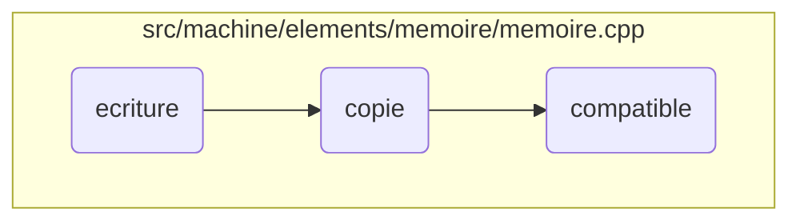

This document explains the process of handling memory operations within a virtual machine environment. It covers the steps involved in writing values to memory, copying memory from one location to another, and ensuring compatibility between memory blocks.

The flow starts with writing values to memory, where the system checks if the size of the pointer matches the size of the values and writes them to the memory addresses. Next, it involves copying memory from one location to another, ensuring that the source and destination are compatible and handling any necessary type adjustments. Finally, it ensures that the source and destination memory blocks are compatible by checking their sizes and types.

# Flow drill down



<SwmSnippet path="/src/machine/elements/memoire/memoire.cpp" line="578">

---

## Handling Memory Writing

First, the <SwmToken path="src/machine/elements/memoire/memoire.cpp" pos="578:4:4" line-data="void Memoire::ecriture(const SVM_Valeur::Pointeur&amp; pointeur, const std::vector&lt;ValeurSP&gt;&amp; valeurs)">`ecriture`</SwmToken> function handles writing values to memory. It checks if the size of the pointer matches the size of the values. If not, it throws an error. It then iterates over the values and writes them to the memory addresses, ensuring that the types are compatible and handling any traps or automatic types.

```c++
void Memoire::ecriture(const SVM_Valeur::Pointeur& pointeur, const std::vector<ValeurSP>& valeurs)
{
	if(pointeur.taille()!=valeurs.size())
	{
		throw TailleBlocIncompatibles(valeurs.size(),pointeur.taille());
	}
	SVM_Valeur::AdresseMemoire adresse = pointeur.adresse();
	std::vector<SVM_Synchronisation::EcrivainUP> ecrivains;
	for(auto& v:valeurs)
	{
		if(adresse._adresse>=_elements.size())
		{
			throw EcritureAdresseNonDefinie(adresse);
		}
		ElementSP element = _elements[adresse._adresse];
		if(not element)
		{
			throw EcritureAdresseNonDefinie(adresse);
		}
		if(static_cast<bool>(element->_acces))
		{
```

---

</SwmSnippet>

<SwmSnippet path="/src/machine/elements/memoire/memoire.cpp" line="935">

---

## Handling Memory Copying

Next, the <SwmToken path="src/machine/elements/memoire/memoire.cpp" pos="935:4:4" line-data="void Memoire::copie(const SVM_Valeur::Pointeur&amp; origine, const SVM_Memoire::MemoireSP&amp; distante, const SVM_Valeur::Pointeur&amp; destination)">`copie`</SwmToken> function manages copying memory from one location to another. It first checks if the source and destination are the same and returns if they are. It then ensures compatibility between the source and destination memory blocks and iterates over the addresses to copy the values, handling traps and type adjustments as needed.

```c++
void Memoire::copie(const SVM_Valeur::Pointeur& origine, const SVM_Memoire::MemoireSP& distante, const SVM_Valeur::Pointeur& destination)
{
	if(this==distante.get() and (origine==destination)) return;
	std::vector<SVM_Synchronisation::LecteurUP> lecteurs;
	std::vector<SVM_Synchronisation::EcrivainUP> ecrivains;
	compatible(origine,distante,destination,lecteurs,ecrivains);
	for(size_t adresse = origine.adresse()._adresse ; adresse<origine.apres()._adresse ; ++adresse)
	{
		if(not _elements[adresse]->_type.copiable())
		{
			throw CopieNonDisponible(SVM_Valeur::AdresseMemoire(adresse),_elements[adresse]->_type);
		}
	}
	if(origine.adresse()<destination.adresse())
	{
		for(size_t o = origine.apres()._adresse, d=destination.apres()._adresse ; ; )
		{
			if(o<=origine.adresse()._adresse) break;
			--o;
			--d;
			ElementSP& eo = _elements[o];
```

---

</SwmSnippet>

<SwmSnippet path="/src/machine/elements/memoire/memoire.cpp" line="886">

---

## Ensuring Memory Compatibility

Finally, the <SwmToken path="src/machine/elements/memoire/memoire.cpp" pos="886:4:4" line-data="void Memoire::compatible(const SVM_Valeur::Pointeur&amp; origine, const SVM_Memoire::MemoireSP&amp; distante, const SVM_Valeur::Pointeur&amp; destination, std::vector&lt;SVM_Synchronisation::LecteurUP&gt;&amp; lecteurs, std::vector&lt;SVM_Synchronisation::EcrivainUP&gt;&amp; ecrivains) const">`compatible`</SwmToken> function ensures that the source and destination memory blocks are compatible. It checks if the sizes match and iterates over the addresses to verify that the types are compatible. If any incompatibility is found, it throws an error.

```c++
void Memoire::compatible(const SVM_Valeur::Pointeur& origine, const SVM_Memoire::MemoireSP& distante, const SVM_Valeur::Pointeur& destination, std::vector<SVM_Synchronisation::LecteurUP>& lecteurs, std::vector<SVM_Synchronisation::EcrivainUP>& ecrivains) const
{
	if(origine.taille()!=destination.taille())
	{
		throw TailleBlocIncompatibles(origine.taille(),destination.taille());
	}
	SVM_Valeur::AdresseMemoire o = origine.adresse();
	SVM_Valeur::AdresseMemoire d = destination.adresse();
	for( ; origine.interieur(o) and destination.interieur(d) ; ++o, ++d)
	{
		SVM_TRACE(origine << "/" << o << " vs " << destination << "/" << d);
		if(o._adresse>=_elements.size())
		{
			throw LectureAdresseNonDefinie(o);
		}
		if(d._adresse>=distante->_elements.size())
		{
			throw EcritureAdresseNonDefinie(d);
		}
		ElementSP eo = _elements[o._adresse];
		ElementSP ed = distante->_elements[d._adresse];
```

---

</SwmSnippet>

&nbsp;

*This is an auto-generated document by Swimm 🌊 and has not yet been verified by a human*

<SwmMeta version="3.0.0" repo-id="Z2l0aHViJTNBJTNBc3ZtLTIuNy4yMDI0MTEwNyUzQSUzQVN3aW1tLURlbW8=" repo-name="svm-2.7.20241107"><sup>Powered by [Swimm](/)</sup></SwmMeta>
