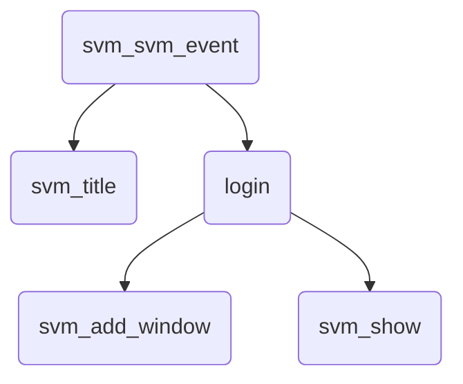
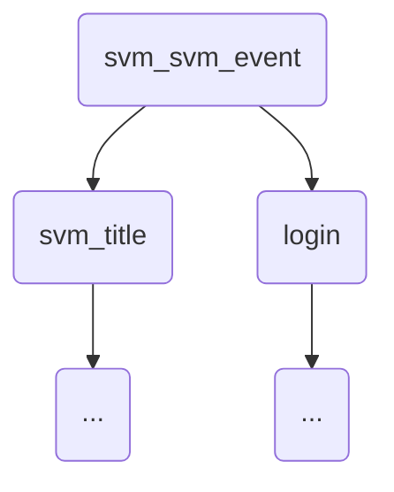
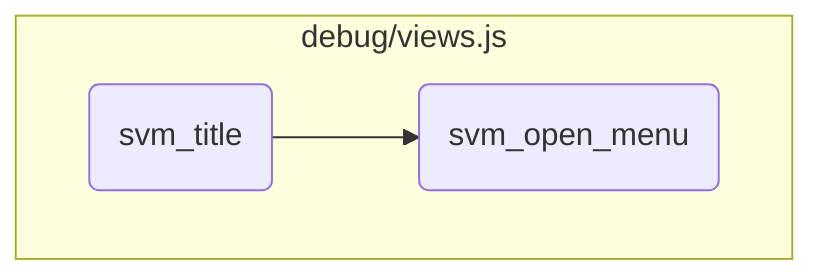
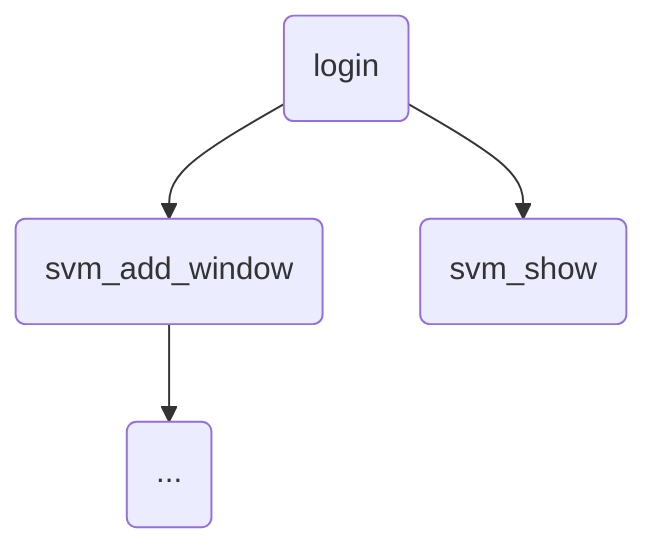
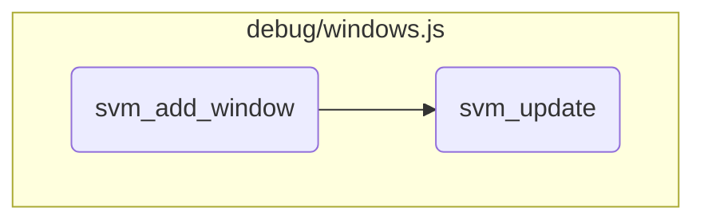

This document explains the flow of handling various message commands within the Simple Virtual Machine (SVM). The process involves deciphering messages, parsing them, and executing specific actions based on the command type. Key commands include 'object', 'delete', 'event', 'index', 'client', 'login', 'title', 'cipher', and 'end'. Each command triggers different functions to manage the SVM's behavior and user interactions.

The flow starts by checking if a message needs to be deciphered. If it does, the message is deciphered using active cipher keys. The message is then parsed to determine its command type. Depending on the command, different actions are taken. For example, the 'login' command initiates the login process by displaying a login window for the user. The 'title' command updates the application title. Other commands like 'object', 'delete', and 'event' trigger specific functions associated with the message identifier. This ensures that the SVM responds appropriately to various user actions and system events.

Here is a high level diagram of the flow, showing only the most important functions:



# Flow drill down

First, we'll zoom into this section of the flow:



<SwmSnippet path="/debug/controler.js" line="104">

---

## Handling different message commands

First, the <SwmToken path="debug/controler.js" pos="104:1:1" line-data="	svm_svm_event(svm_raw_message)">`svm_svm_event`</SwmToken> function checks if the message needs to be deciphered. If so, it deciphers the message using the active cipher keys. Then, it parses the message and handles different commands such as 'object', 'delete', 'event', 'index', 'client', 'login', 'title', 'cipher', and 'end'. Each command triggers specific actions, such as calling functions associated with the message identifier or type, initiating the login process, updating the title, or setting cipher keys.

```javascript
	svm_svm_event(svm_raw_message)
	{
		if(this.svm_active_cipher)
		{
			svm_raw_message = svm_decipher(hex2rstr(svm_raw_message),this.svm_cipher_keys);
		}
		var message = JSON.parse(svm_raw_message);
		if((message.command==="object") || (message.command==="delete") || (message.command==="event"))
		{
			for(var i=0 ; i<this.svm_views.length ; ++i)
			{
				if(this.svm_views[i].svm_object_functions.has(message.identifier))
				{
					if(this.svm_views[i].svm_object_functions.get(message.identifier).has(message.command))
					{
						this.svm_views[i].svm_object_functions.get(message.identifier).get(message.command).svm_call(message);
					}
				}
			}
		}
		else if(message.command==="index")
```

---

</SwmSnippet>

<SwmSnippet path="/debug/views.js" line="29">

---

### Initiating the login process

Next, the <SwmToken path="debug/views.js" pos="29:3:3" line-data="		svm_controler.login = function(a,message)">`login`</SwmToken> function is called when the 'login' command is received. This function sets up a login window where the user can enter their login credentials. The window includes a form with an input field for the login, which triggers a login attempt when the user presses 'Enter' or clicks the 'Send' button. This ensures that only authorized users can access the Simple Virtual Machine instance.

```javascript
		svm_controler.login = function(a,message)
		{
			a.challenge = message.challenge;
			a.login_box = a.svm_desktop.svm_add_window("login","Login","<form style=\"padding: 10px; margin-bottom: 0px;\"><label style=\"margin-left: 25px\"for=\"login\">Login</label><input style=\"margin:10px; margin-top: 20px\"id=\"login\" type=\"text\" autofocus oninput=\"if(event.target.value.length>=60) { svm_interface.svm_login_attempt(event); }\" onkeydown=\"if(event.code=='Enter') { svm_interface.svm_login_attempt(event); }\" onclick='if(event.ctrlKey) { event.target.value=\"\"; }'/><br/><div class=\"button\" style=\"text-align: center;\" onclick=\"svm_interface.svm_login_attempt(event)\">Send</button></form>",new SVM_Events(null,null,function(f){document.getElementById("login").focus();},null,function(f) {f.svm_show();},null,null,function(f) { return false; }),new SVM_PositionClever(a.svm_desktop,300,100,null),new SVM_SizeMinimum(300,100),'<div class="help_large_content">This window requires you to enter the login provided by the Simple Virtual Machine instance. Before you enter the login, you can control-click on the input to clear any text previously entered.<br/>This login is displayed by the instance in a dedicated trace:<br/><pre style="display: block;">### Simple Virtual Machine [pid] : debug ##########################\nConnection from [client IP]:[client port]. Login: <b>[generated login]</b></pre>This will ensure you are:<ul><li>either the owner of this Simple Virtual Machine instance, <b>transferring the login from the instance to this window through a secured channel</b>,</li><li>or authorized by its owner <b>who has sent you the login through a secured channel</b> to access to the application code, its related data, and interact with this Simple Virtual Machine instance.</li></ul>Any login attempt is prohibited in other cases.</div>');
		}
```

---

</SwmSnippet>

Now, lets zoom into this section of the flow:



<SwmSnippet path="/debug/views.js" line="34">

---

## Setting the Application Title

First, the <SwmToken path="debug/views.js" pos="34:3:3" line-data="		svm_controler.svm_title = function(a,message)">`svm_title`</SwmToken> function sets the application title by updating the inner HTML of <SwmToken path="debug/views.js" pos="37:1:3" line-data="			a.svm_application.innerHTML = message.title;">`a.svm_application`</SwmToken> and <SwmToken path="debug/views.js" pos="38:1:3" line-data="			a.svm_title.innerHTML += &quot; - &quot; + message.title;">`a.svm_title`</SwmToken> with the provided message title. This step ensures that the application displays the correct title to the user.

```javascript
		svm_controler.svm_title = function(a,message)
		{
			svm_controler.svm_login = true;
			a.svm_application.innerHTML = message.title;
			a.svm_title.innerHTML += " - " + message.title;
```

---

</SwmSnippet>

<SwmSnippet path="/debug/views.js" line="39">

---

## Removing the Login Box

Next, the login box is removed from the desktop using <SwmToken path="debug/views.js" pos="39:1:10" line-data="			a.svm_desktop.svm_remove_window(a.login_box);">`a.svm_desktop.svm_remove_window(a.login_box)`</SwmToken>. This step clears the login interface once the user is logged in, providing a clean workspace.

```javascript
			a.svm_desktop.svm_remove_window(a.login_box);
```

---

</SwmSnippet>

<SwmSnippet path="/debug/views.js" line="40">

---

## Adding Menu Entries

Then, several menu entries are added to <SwmToken path="debug/views.js" pos="40:1:3" line-data="			a.svm_menu.push(a.svm_menu_entry(&quot;Breakpoints&quot;,&quot;svm_interface.svm_open_breakpoints_list&quot;));">`a.svm_menu`</SwmToken> for different functionalities like Breakpoints, Machine, Schedulers, Processes, Kernels, Events, and Plugins. These entries provide the user with quick access to various features of the application.

```javascript
			a.svm_menu.push(a.svm_menu_entry("Breakpoints","svm_interface.svm_open_breakpoints_list"));
			a.svm_menu.push(a.svm_menu_entry("Machine","svm_interface.svm_open_machine"));
			a.svm_menu.push(a.svm_menu_entry("Schedulers","svm_interface.svm_open_schedulers_list"));
			a.svm_menu.push(a.svm_menu_entry("Processes","svm_interface.svm_open_processes_list"));
			a.svm_menu.push(a.svm_menu_entry("Kernels","svm_interface.svm_open_kernels_list"));
			a.svm_menu.push(a.svm_menu_entry("Events","svm_interface.svm_open_events"));
			a.svm_menu.push(a.svm_menu_entry("Plugins","svm_interface.svm_open_plugins"));
```

---

</SwmSnippet>

<SwmSnippet path="/debug/views.js" line="47">

---

## Opening the Main Menu

Moving to the next step, an event listener is added to the main bar's first child to open the menu when clicked. Finally, the <SwmToken path="debug/views.js" pos="49:3:3" line-data="				svm_interface.svm_open_menu();">`svm_open_menu`</SwmToken> function is called to display the main menu immediately.

```javascript
			svm_main_bar.children[0].addEventListener("click",function(event)
			{
				svm_interface.svm_open_menu();
			});
			svm_interface.svm_open_menu();
```

---

</SwmSnippet>

<SwmSnippet path="/debug/views.js" line="66">

---

## Displaying the Main Menu

Diving into the <SwmToken path="debug/views.js" pos="66:1:1" line-data="	svm_open_menu()">`svm_open_menu`</SwmToken> function, it adds a window to the desktop with the title 'Main menu' and includes all the menu entries. This window provides users with access to all elements of the Simple Virtual Machine and controls for the user interface.

```javascript
	svm_open_menu()
	{
		this.svm_desktop.svm_add_window("svm_menu","Main menu",this.svm_menu.join('')+this.svm_menu_entry("Windows list","svm_interface.svm_open_windows_list"),null,new SVM_PositionFixed(5,5),new SVM_SizeMinimum(200,200),'<div style="width: 300px;">This menu allows you to access all elements of the Simple Virtual Machine.<br/>It also allows you to control this user interface through the <div class="button line">Windows list</div> entry.</div>');
	}
```

---

</SwmSnippet>

Now, lets zoom into this section of the flow:



<SwmSnippet path="/debug/windows.js" line="303">

---

## Handling the visibility and drawing of the window

First, the <SwmToken path="debug/windows.js" pos="303:1:1" line-data="	svm_show()">`svm_show`</SwmToken> function sets the window's visibility to true. Then, it checks if there are any events associated with showing the window and triggers them if they exist. Finally, it calls the <SwmToken path="debug/windows.js" pos="310:3:3" line-data="		this.svm_draw();">`svm_draw`</SwmToken> function to render the window.

```javascript
	svm_show()
	{
		this.svm_visible = true;
		if(this.svm_events != null && this.svm_events.svm_show != null)
		{
			this.svm_events.svm_show(this);
		}
		this.svm_draw();
	}
```

---

</SwmSnippet>

Now, lets zoom into this section of the flow:



<SwmSnippet path="/debug/windows.js" line="408">

---

## Adding a Window

First, the <SwmToken path="debug/windows.js" pos="408:1:1" line-data="	svm_add_window(svm_category,svm_title,svm_content,svm_events,svm_position,svm_size,svm_help)">`svm_add_window`</SwmToken> function checks if the window category already exists. If it does, it highlights the existing window and returns it. If not, it creates a new window, makes it draggable, and adds it to the list of windows. It then highlights and draws the new window, updates the depth of any bars, and redraws the window list.

```javascript
	svm_add_window(svm_category,svm_title,svm_content,svm_events,svm_position,svm_size,svm_help)
	{
		if(this.svm_unique.indexOf(svm_category)!=-1)
		{
			var w = this.svm_windows.find(e => e.svm_category==svm_category);
			if(w != undefined)
			{
				w.svm_highlight();
				return w;
			}
		}
		var svm_window_dom = svm_create_div(this.dom,'window');
		svm_window_dom.draggable = true;
		var svm_window = new SVM_Window(svm_window_dom,this,svm_category,svm_title,svm_content,svm_events,svm_position,svm_size,svm_help);
		this.svm_windows.push(svm_window);
		svm_window.svm_highlight();
		svm_window.svm_draw();
		for(var b of this.svm_bars)
		{
			b.svm_update(svm_window.svm_depth+1);
			b.svm_draw();
```

---

</SwmSnippet>

<SwmSnippet path="/debug/windows.js" line="169">

---

## Updating a Window

Next, the <SwmToken path="debug/windows.js" pos="169:1:1" line-data="	svm_update()">`svm_update`</SwmToken> function updates the window's DOM elements. It sets the window's position to fixed, creates various div elements for the window's box, title bar, title, buttons, and content. It also sets up event listeners for help, alarm, hide, and close buttons, as well as for click, mousedown, and dragstart events to handle user interactions with the window.

```javascript
	svm_update()
	{
		this.dom.classList.add(this.svm_category);
		this.dom.innerHTML = "";
		this.dom.style.position = 'fixed';
		var svm_box = svm_create_div(this.dom,'window_box');
		var svm_title_bar = svm_create_div(svm_box,'window_title_bar');
		var svm_title = svm_create_inline_block_div(svm_title_bar,'window_title');
		svm_title.innerHTML = this.svm_title;
		var svm_buttons = svm_create_inline_div(svm_title_bar,'window_buttons');
		var svm_alarm = svm_create_inline_div(svm_buttons,'window_buttons_alarm');
		svm_alarm.classList.add('window_button');
		if(this.svm_help != null)
		{
			var svm_help = svm_create_inline_div(svm_buttons,'window_buttons_help');
			svm_help.classList.add('window_button');
		}
		var svm_hide = svm_create_inline_div(svm_buttons,'window_buttons_hide');
		svm_hide.classList.add('window_button');
		var svm_close = svm_create_inline_div(svm_buttons,'window_buttons_close');
		svm_close.classList.add('window_button');
```

---

</SwmSnippet>

&nbsp;

*This is an auto-generated document by Swimm 🌊 and has not yet been verified by a human*

<SwmMeta version="3.0.0" repo-id="Z2l0aHViJTNBJTNBc3ZtLTIuNy4yMDI0MTEwNyUzQSUzQVN3aW1tLURlbW8=" repo-name="svm-2.7.20241107"><sup>Powered by [Swimm](/)</sup></SwmMeta>
