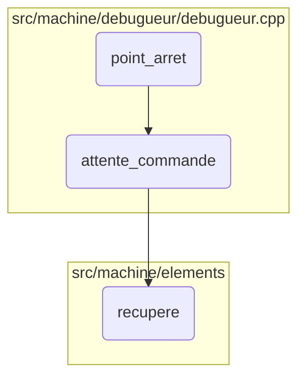
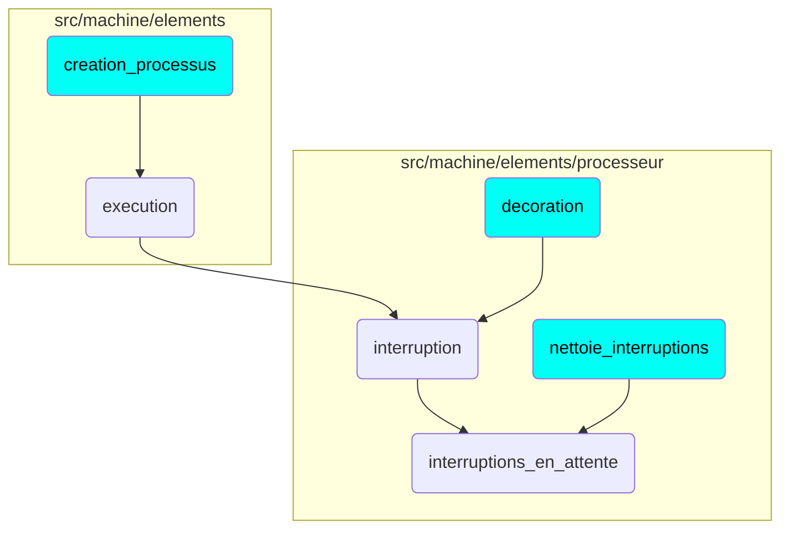

This document explains the flow of handling pending interruptions within a virtual machine. The process involves several steps, including waiting for commands, retrieving necessary data, and managing the interruptions.

The flow starts with the system waiting for a command. Once a command is received, the system retrieves the necessary data and processes it. If an interruption occurs, it is added to the list of pending interruptions. The system then continues to monitor and manage these interruptions to ensure smooth operation.

Here is a high level diagram of the flow, showing only the most important functions:

# Flow drill down

# Where is this flow used?

This flow is used multiple times in the codebase as represented in the following diagram:

&nbsp;

*This is an auto-generated document by Swimm 🌊 and has not yet been verified by a human*

<SwmMeta version="3.0.0" repo-id="Z2l0aHViJTNBJTNBc3ZtLTIuNy4yMDI0MTEwNyUzQSUzQVN3aW1tLURlbW8=" repo-name="svm-2.7.20241107">Powered by [Swimm](/)</SwmMeta>
