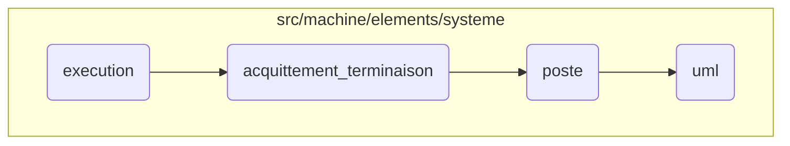

This document explains the process of handling system events. The process involves initiating a thread to handle events, acknowledging termination events, posting events to the system, and generating a string representation of events for debugging purposes.

The flow starts with initiating a thread that continuously retrieves and processes system events. When a termination event is detected, it acknowledges the termination. Then, it posts the event to the system, ensuring the event-driven architecture is maintained. Finally, it generates a human-readable format of the event details for debugging and logging.

# Flow drill down



<SwmSnippet path="/src/machine/elements/ordonnanceur/ordonnanceur.cpp" line="50">

---

## Execution

First, the <SwmToken path="src/machine/elements/ordonnanceur/ordonnanceur.cpp" pos="50:4:4" line-data="void Ordonnanceur::execution()">`execution`</SwmToken> function initiates a thread to handle system events. It continuously retrieves events and processes them based on their type. For example, if the event type is <SwmToken path="src/machine/elements/systeme/evenement.h" pos="140:5:5" line-data="				case Type::TERMINAISON: oss &lt;&lt; &quot;terminate&quot;; break;">`TERMINAISON`</SwmToken>, it calls the <SwmToken path="src/machine/elements/systeme/systeme.cpp" pos="224:4:4" line-data="void Systeme::acquittement_terminaison(const SVM_Synchronisation::AdresseSP&amp; source)">`acquittement_terminaison`</SwmToken> function to acknowledge the termination.

```c++
void Ordonnanceur::execution()
{
	try
	{
		_effecteur = std::thread([this] ()
		{
			thread_local size_t echeance = 0;
			for( ; ; )
			{
				SVM_Synchronisation::AdresseSP source;
				SVM_Systeme::EvenementSP evenement;
				if(echeance==0)
				{
					if(not _livraison->recupere(_adresse,source,evenement))
						continue;
				}
				else
				{
					if(not _livraison->recupere_echeance(_adresse,source,evenement,echeance))
					{
						try
```

---

</SwmSnippet>

<SwmSnippet path="/src/machine/elements/systeme/systeme.cpp" line="224">

---

## Acquittement Terminaison

Next, the <SwmToken path="src/machine/elements/systeme/systeme.cpp" pos="224:4:4" line-data="void Systeme::acquittement_terminaison(const SVM_Synchronisation::AdresseSP&amp; source)">`acquittement_terminaison`</SwmToken> function posts a response event indicating successful termination. This ensures that the system acknowledges the completion of a process.

```c++
void Systeme::acquittement_terminaison(const SVM_Synchronisation::AdresseSP& source)
{
	_livraison->poste(_adresse,source,std::make_shared<SVM_Systeme::Evenement>(SVM_Systeme::Evenement::Type::REPONSE,SVM_Systeme::Evenement::Reponse::OUI));
}
```

---

</SwmSnippet>

<SwmSnippet path="/src/machine/elements/systeme/evenement.h" line="187">

---

## Poste

Then, the <SwmToken path="src/machine/elements/systeme/evenement.h" pos="187:3:3" line-data="		void poste(const SVM::Machine::Element::Synchronisation::AdresseSP&amp; source, const SVM::Machine::Element::Synchronisation::AdresseSP&amp; destination, const EvenementSP&amp; evenement)">`poste`</SwmToken> function is used to post events to the system. It locks the event queue, adds the event, and notifies the system of the new event. This function is crucial for maintaining the event-driven architecture.

```c
		void poste(const SVM::Machine::Element::Synchronisation::AdresseSP& source, const SVM::Machine::Element::Synchronisation::AdresseSP& destination, const EvenementSP& evenement)
		{
			std::lock_guard<std::mutex> verrou(_protection);
			auto e = SVM_Debugueur::JSON::objet({ { "source" , PiegeEvenements::adresse(source) } , { "target" , PiegeEvenements::adresse(destination) } , { "type" , SVM_Debugueur::JSON::chaine("post") } , { "event" , SVM_Debugueur::JSON::chaine(evenement->uml()) } });
			auto indice = _evenements->taille();
			e->ajoute("id",SVM_Debugueur::JSON::entier(indice));
			_evenements->ajoute(e);
			_index.insert(std::make_pair(evenement.get(),indice));
			notification_evenement_objet(SVM_Debugueur::Evenement::Categorie::CHANGEMENT_OBJET,e);
		}
```

---

</SwmSnippet>

<SwmSnippet path="/src/machine/elements/systeme/evenement.h" line="124">

---

## UML

Finally, the <SwmToken path="src/machine/elements/systeme/evenement.h" pos="124:5:5" line-data="		std::string uml() const">`uml`</SwmToken> function generates a string representation of the event. This is useful for debugging and logging purposes, as it provides a human-readable format of the event details.

```c
		std::string uml() const
		{
			std::ostringstream oss;
			switch(_type)
			{
				case Type::ETAT: oss << "state " << SVM_Processus::Etat::texte(_etat); break;
				case Type::EXECUTION:
					{
						oss << "execute";
						if(_entier>0)
						{
							oss << " with delay " << _entier << "ms";
						}
						break;
					}
				case Type::SUSPENSION: oss << "suspend"; break;
				case Type::TERMINAISON: oss << "terminate"; break;
				case Type::VERROUILLAGE:
					{
						oss << "lock";
						if(_reponse==Reponse::OUI)
```

---

</SwmSnippet>

&nbsp;

*This is an auto-generated document by Swimm 🌊 and has not yet been verified by a human*

<SwmMeta version="3.0.0" repo-id="Z2l0aHViJTNBJTNBc3ZtLTIuNy4yMDI0MTEwNyUzQSUzQVN3aW1tLURlbW8=" repo-name="svm-2.7.20241107"><sup>Powered by [Swimm](/)</sup></SwmMeta>
