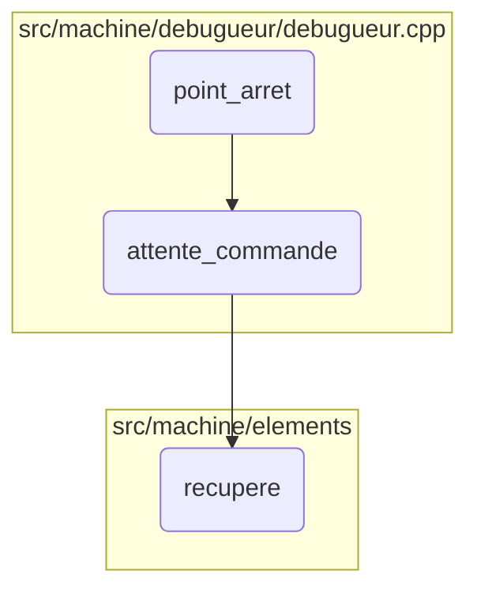

This document explains the process of handling a write breakpoint. The process involves setting a breakpoint, waiting for a command, and retrieving the necessary information.

The flow starts with setting a write breakpoint, then it waits for a command to be issued. Once the command is received, it retrieves the necessary information to proceed.

Here is a high level diagram of the flow, showing only the most important functions:

# Flow drill down

&nbsp;

*This is an auto-generated document by Swimm 🌊 and has not yet been verified by a human*

<SwmMeta version="3.0.0" repo-id="Z2l0aHViJTNBJTNBc3ZtLTIuNy4yMDI0MTEwNyUzQSUzQVN3aW1tLURlbW8=" repo-name="svm-2.7.20241107">Powered by [Swimm](/)</SwmMeta>
