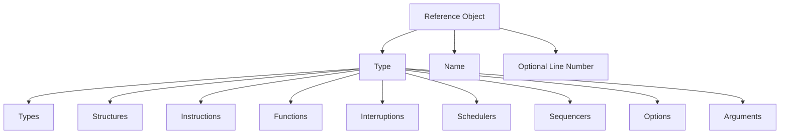

# Introduction to Reference Object in Machine Extensions

The Reference Object is a structure defined within the Machine Extensions namespace. It is used to categorize and manage different types of elements such as types, structures, instructions, functions, interruptions, schedulers, sequencers, options, and arguments. The structure includes an enumerator <SwmToken path="src/machine/extensions/gestionnaire/gestionnaire.cpp" pos="107:5:5" line-data="				case ReferenceObjet::Type::OPTION:">`Type`</SwmToken> which defines these categories.

# Structure of Reference Object

Each Reference Object instance holds a type, a name represented by <SwmToken path="src/machine/extensions/gestionnaire/gestionnaire.cpp" pos="219:10:10" line-data="PatronTypeExtensionSP Gestionnaire::type(const SVM_Valeur::PointEntreeExtension&amp; type) const">`PointEntreeExtension`</SwmToken>, and an optional line number. The structure also provides comparison operators and a method to convert the type to a string representation.

# Why and How to Use Reference Object

The Reference Object is essential for categorizing and managing various elements within the Machine Extensions. By holding a type, a name, and an optional line number, it allows for efficient organization and retrieval of these elements. The comparison operators and string conversion method further enhance its utility.

# Where Reference Object is Used

The Reference Object is utilized in several files within the project, including <SwmPath>[src/machine/extensions/gestionnaire/gestionnaire.cpp](src/machine/extensions/gestionnaire/gestionnaire.cpp)</SwmPath>, <SwmPath>[src/machine/extensions/description.h](src/machine/extensions/description.h)</SwmPath>, and <SwmPath>[src/machine/extensions/gestionnaire/gestionnaire.h](src/machine/extensions/gestionnaire/gestionnaire.h)</SwmPath>.

# Usage Example

In <SwmPath>[src/machine/extensions/gestionnaire/gestionnaire.cpp](src/machine/extensions/gestionnaire/gestionnaire.cpp)</SwmPath>, the Reference Object is used to manage different types of elements. Below is an example of its usage:

<SwmSnippet path="/src/machine/extensions/gestionnaire/gestionnaire.cpp" line="102">

---

This code snippet demonstrates how the Reference Object is instantiated and used to manage different types of elements. The switch statement handles different types defined in the Reference Object.

```c++
		{
			ReferenceObjet r = *d;
			auto p = d->patron(extension._nom,so._so);
			switch(r._type)
			{
				case ReferenceObjet::Type::OPTION:
					{
						auto o = std::dynamic_pointer_cast<PatronOptionExtension>(p);
						auto it = options.find(o->_clef);
						if(it!=options.end())
						{
							if(not (SVM_Memoire::Type(o->_type)==static_cast<SVM_Memoire::Type>(*it->second)))
							{
								if(o->_type==SVM_Memoire::Type::TypeInterne::BOOLEEN)
								{

									throw OptionAvecValeur(description->_nom,o->_clef);
								}
								else
								{
									throw OptionTypeIncorrect(description->_nom,o->_clef,SVM_Memoire::Type(o->_type));
```

---

</SwmSnippet>



&nbsp;

*This is an auto-generated document by Swimm 🌊 and has not yet been verified by a human*

<SwmMeta version="3.0.0" repo-id="Z2l0aHViJTNBJTNBc3ZtLTIuNy4yMDI0MTEwNyUzQSUzQVN3aW1tLURlbW8=" repo-name="svm-2.7.20241107"><sup>Powered by [Swimm](/)</sup></SwmMeta>
