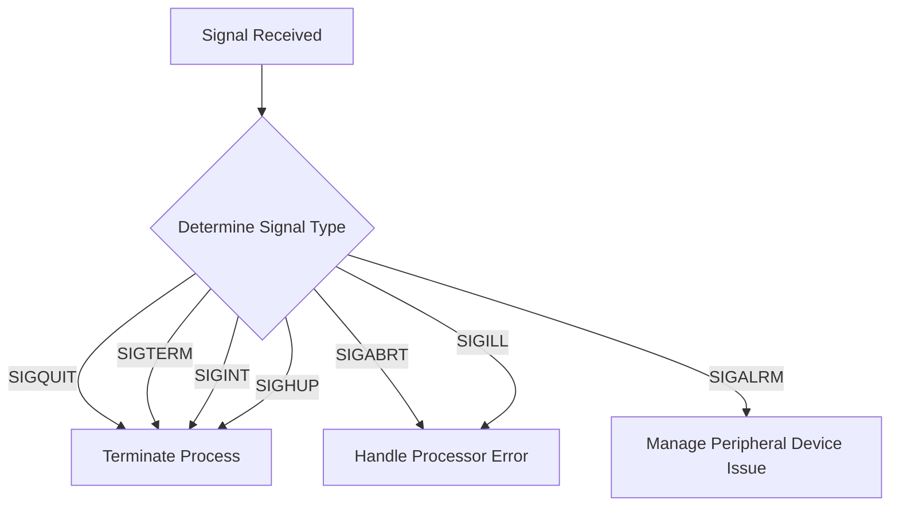

# Machine Interruption Overview

Machine Interruption refers to the handling of hardware and software interrupts within the virtual machine environment. It involves managing signals received by the system and executing appropriate actions based on the type of signal.

<SwmSnippet path="/src/machine/interruption/interruption.cpp" line="95">

---

The <SwmToken path="src/machine/interruption/interruption.cpp" pos="95:4:4" line-data="void Interruption::interruptions_materielles(const SVM::Machine::Element::Systeme::SystemeSP&amp; systeme, const int signal_recu)">`interruptions_materielles`</SwmToken> method processes signals and determines the internal interruption type. Depending on the signal received, different actions are taken, such as terminating processes, handling processor errors, or managing peripheral device issues.

```c++
void Interruption::interruptions_materielles(const SVM::Machine::Element::Systeme::SystemeSP& systeme, const int signal_recu)
{
	std::lock_guard<std::mutex> verrou(_protection);
	SVM_Valeur::Interruption::InterruptionInterne interne;
	bool quitter = false;
	switch(signal_recu)
	{
		case SIGQUIT:
			quitter = true;
		case SIGABRT:
			interne = SVM_Valeur::Interruption::InterruptionInterne::ECHEC;
			break;
		case SIGALRM:
		case SIGTERM:
		case SIGINT:
		case SIGHUP:
			interne = SVM_Valeur::Interruption::InterruptionInterne::TERMINAISON;
			break;
		case SIGILL:
			interne = SVM_Valeur::Interruption::InterruptionInterne::PROCESSEUR;
			break;
```

---

</SwmSnippet>

## Creating Interruptions

The <SwmToken path="src/machine/interruption/interruption.cpp" pos="48:4:4" line-data="InterruptionSP Interruption::creation_interruptions()">`creation_interruptions`</SwmToken> method sets up the signal handler and starts a thread to handle incoming signals. It uses the <SwmToken path="src/machine/interruption/interruption.cpp" pos="95:4:4" line-data="void Interruption::interruptions_materielles(const SVM::Machine::Element::Systeme::SystemeSP&amp; systeme, const int signal_recu)">`interruptions_materielles`</SwmToken> method to process these signals.

<SwmSnippet path="/src/machine/interruption/interruption.cpp" line="48">

---

The <SwmToken path="src/machine/interruption/interruption.cpp" pos="48:4:4" line-data="InterruptionSP Interruption::creation_interruptions()">`creation_interruptions`</SwmToken> method sets up the signal handler and starts a thread to handle incoming signals. It uses the <SwmToken path="src/machine/interruption/interruption.cpp" pos="95:4:4" line-data="void Interruption::interruptions_materielles(const SVM::Machine::Element::Systeme::SystemeSP&amp; systeme, const int signal_recu)">`interruptions_materielles`</SwmToken> method to process these signals.

```c++
InterruptionSP Interruption::creation_interruptions()
{
	InterruptionSP interruption = std::make_shared<Interruption>();
	struct sigaction sigaction;
	sigset_t sigset;
	::sigemptyset(&sigset);
	sigaction.sa_handler=::gestionnairesignalvide;
	sigaction.sa_flags=0;
	sigaction.sa_mask=sigset;
	::sigaction(REACTIVE_SIGNAL,&sigaction,nullptr);
	try
	{
		InterruptionWP avatar = interruption;
		interruption->_effecteur = std::thread([avatar] ()
			{
				SVM_TRACE("creation HwInt");
				sigset_t signaux_attendus;
				::sigfillset(&signaux_attendus);
				for( ; ; )
				{
					int signal_recu = -1;
```

---

</SwmSnippet>



&nbsp;

*This is an auto-generated document by Swimm 🌊 and has not yet been verified by a human*

<SwmMeta version="3.0.0" repo-id="Z2l0aHViJTNBJTNBc3ZtLTIuNy4yMDI0MTEwNyUzQSUzQVN3aW1tLURlbW8=" repo-name="svm-2.7.20241107"><sup>Powered by [Swimm](/)</sup></SwmMeta>
