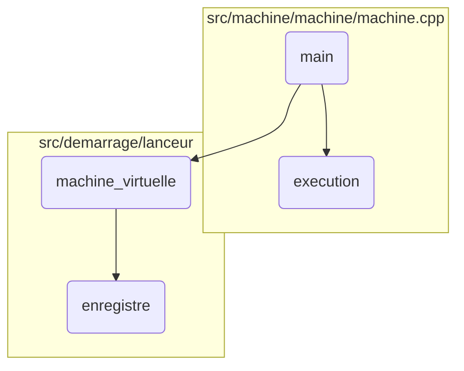
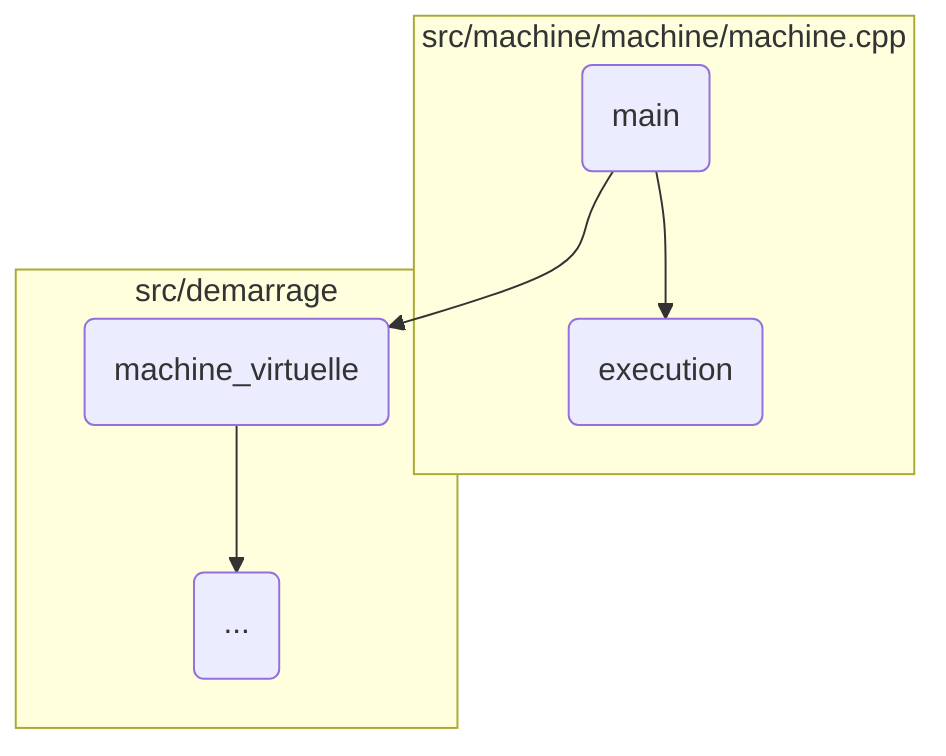
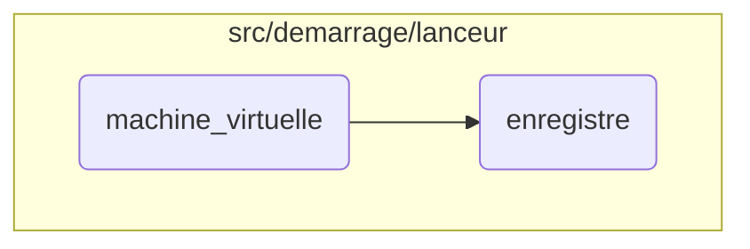

This document provides an overview of the main function's flow, detailing how it handles command-line arguments, processes help and version commands, analyzes and executes the virtual machine, and manages errors during execution.

The flow starts by checking if the necessary command-line arguments are provided. If not, it shows an error message. Then, it checks if the user requested help or version information and displays the appropriate message. Next, it analyzes the provided file and initializes the virtual machine. If the initialization is successful, it executes the virtual machine. If any errors occur during these steps, it catches the exceptions and shows relevant error messages.

Here is a high level diagram of the flow, showing only the most important functions:



# Flow drill down

First, we'll zoom into this section of the flow:



<SwmSnippet path="/src/demarrage/binaire/svm.cpp" line="35">

---

## Handling Command-Line Arguments

First, the program checks if the required command-line arguments are provided. If not, it outputs an error message indicating that a file name is <SwmPath>[missing](missing)</SwmPath> and returns an error code.

```c++
	if(argc<2)
	{
		std::cerr << "Boot error: Missing file name in command line" << std::endl;
		return 126;
	}
```

---

</SwmSnippet>

<SwmSnippet path="/src/demarrage/binaire/svm.cpp" line="46">

---

## Processing Help and Version Commands

Next, the program checks if the user has requested help or version information by checking for '-h' or '-v' arguments. If either is found, it creates a launcher object and calls the appropriate method to display the help or version information.

```c++
		if(fichier=="-h")
		{
			lanceur = std::make_shared<SVM::Demarrage::Lanceur::Lanceur>(std::string());
			lanceur->aide(std::cerr,argv[0]);
		}
		else if(fichier=="-v")
		{
			lanceur = std::make_shared<SVM::Demarrage::Lanceur::Lanceur>(std::string());
			lanceur->version(std::cerr,argv[0]);
		}
```

---

</SwmSnippet>

<SwmSnippet path="/src/demarrage/binaire/svm.cpp" line="57">

---

## Analyzing and Executing the Virtual Machine

Then, the program analyzes the provided file using the <SwmToken path="src/demarrage/binaire/svm.cpp" pos="58:11:11" line-data="			lanceur = SVM::Demarrage::Lanceur::Analyseur::analyse(fichier);">`Analyseur`</SwmToken> class and initializes the virtual machine. If the machine is successfully created, it proceeds to execute the machine. If the machine creation fails, it sets an error code.

```c++
		{
			lanceur = SVM::Demarrage::Lanceur::Analyseur::analyse(fichier);
			machine = lanceur->machine_virtuelle(argc,argv);
			if(not machine)
			{
				code_retour = 126;
			}
			else
			{
				code_retour = machine->execution();
			}
		}
```

---

</SwmSnippet>

<SwmSnippet path="/src/demarrage/binaire/svm.cpp" line="70">

---

## Handling Execution Errors

Moving to error handling, the program catches various exceptions that might occur during the initialization and execution of the virtual machine. It outputs relevant error messages and sets appropriate error codes based on the type of exception caught.

```c++
	catch(SVM::Demarrage::Lanceur::Erreur& erreur)
	{
		std::cerr << erreur << std::endl << std::endl;
		if(static_cast<bool>(lanceur))
		{
			lanceur->aide(std::cerr);
		}
		code_retour = 127;
	}
	catch(SVM_Valeur::ExceptionExecution& e)
	{
		SVM_Valeur::Interruption i(e);
		i.erreur(std::cerr);
		std::cerr << std::endl;
		code_retour = 126;
	}
	catch(SVM_Valeur::Interruption& i)
	{	
		i.erreur(std::cerr);
		std::cerr << std::endl;
		code_retour = 126;
```

---

</SwmSnippet>

<SwmSnippet path="/src/machine/machine/machine.cpp" line="31">

---

## Executing the Virtual Machine

Diving into the <SwmToken path="src/machine/machine/machine.cpp" pos="31:4:4" line-data="int Machine::execution()">`execution`</SwmToken> function, it starts by blocking signals and initializing the debugger and performance manager. It then sets up the extension manager and base system. The function iterates over processes, compiling and validating them. Finally, it creates the system and executes it, handling any errors that occur during execution and generating performance reports.

```c++
int Machine::execution()
{
	SVM::Machine::Interruption::Interruption::bloque_signaux();
	SVM_Debugueur::DebugueurSP debugueur;
	debugueur = SVM_Debugueur::Debugueur::creation(_debugueur);
	_debugueur.reset();
	SVM::Machine::Performance::PerformanceSP performance;
	performance = SVM::Machine::Performance::Performance::creation(_performance,_historique);
	_performance.reset();
	SVM_Extension::GestionnaireSP gestionnaire_extensions;
	try
	{
		gestionnaire_extensions = SVM_Extension::Gestionnaire::gestionnaire(_extensions,debugueur);
	}
	catch(...)
	{
		SVM_Debugueur::Debugueur::arret(debugueur);
		throw;
	}
	_base = std::make_shared<SVM_Base::Base>(gestionnaire_extensions,debugueur,performance);
	_piege = SVM_Debugueur::Debugueur::ajoute_piege<PiegeMachine>(_base->_debugueur);
```

---

</SwmSnippet>

Now, lets zoom into this section of the flow:



<SwmSnippet path="/src/demarrage/lanceur/lanceur.cpp" line="82">

---

## Handling Command-Line Options

First, the function <SwmToken path="src/demarrage/lanceur/lanceur.cpp" pos="82:6:6" line-data="SVM_Machine::MachineSP Lanceur::machine_virtuelle(int argc, char *argv[])">`machine_virtuelle`</SwmToken> initializes possible options and maps them for easy access. This step is crucial for setting up the environment based on user inputs.

```c++
SVM_Machine::MachineSP Lanceur::machine_virtuelle(int argc, char *argv[])
{
	std::string options_possibles;
	std::map<int,Option*> options;
	{
		std::ostringstream chaine_option;
		chaine_option << Option::reservees();
		for(auto& o: _options)
		{
			chaine_option << o._option << (o.argument()?":":"");
			options.insert(std::make_pair(o._option.c_str()[0],&o));
		}
		options_possibles = chaine_option.str();
	}
```

---

</SwmSnippet>

<SwmSnippet path="/src/demarrage/lanceur/lanceur.cpp" line="97">

---

## Parsing Command-Line Arguments

Next, the function parses the command-line arguments using a loop. It handles various options like help (<SwmToken path="src/demarrage/binaire/svm.cpp" pos="46:6:7" line-data="		if(fichier==&quot;-h&quot;)">`-h`</SwmToken>), version (<SwmToken path="src/demarrage/binaire/svm.cpp" pos="51:8:9" line-data="		else if(fichier==&quot;-v&quot;)">`-v`</SwmToken>), debug port (<SwmToken path="src/demarrage/lanceur/lanceur.cpp" pos="297:6:7" line-data="		&lt;&lt; &quot;\t-d port   : Launch in debug mode on this port&quot; &lt;&lt; std::endl">`-d`</SwmToken>), and performance (<SwmToken path="src/demarrage/lanceur/lanceur.cpp" pos="146:12:13" line-data="							throw Erreur() &lt;&lt; &quot;option -p with invalid integer value &quot; &lt;&lt; valeur;">`-p`</SwmToken>). Each option modifies the virtual machine's configuration accordingly.

```c++
	::opterr = 0;
	int option_trouvee;
	for( ; ; )
	{
		option_trouvee = ::getopt(argc,argv,options_possibles.c_str());
		if(option_trouvee==EOF)
			break;
		switch(option_trouvee)
		{
			case '?':
				throw Erreur() << "invalid option -" << std::string(1,optopt);
				break;
			case 'h':
				aide(std::cerr);
				return SVM_Machine::MachineSP();
				break;
			case 'v':
				version(std::cerr, argv[0]);
				return SVM_Machine::MachineSP();
				break;
			case 'd':
```

---

</SwmSnippet>

<SwmSnippet path="/src/demarrage/lanceur/lanceur.cpp" line="185">

---

## Constructing the Virtual Machine

Then, the function constructs the virtual machine by setting up its history, processes, debugger, and performance options. This step ensures that the virtual machine is ready to execute with all the specified configurations.

```c++
	SVM_Machine::HistoriqueSP historique = std::make_shared<SVM_Machine::Historique>();
	if(static_cast<bool>(_historique))
	{
		historique = *_historique;
	}
	bool tous_termines_automatiquement = true;
	std::vector<SVM_Machine::Processus> processus;
	for(auto& p: _processus)
	{
		SVM_Machine::Memoire memoire;
		if(not p._memoire.empty())
		{
			for(const auto& option: _options)
			{
				for(const auto& selecteur: p._memoire)
				{
					if(selecteur->selectionne(option._alias))
					{
						option.enregistre(memoire);
						break;
					}
```

---

</SwmSnippet>

<SwmSnippet path="/src/demarrage/lanceur/lanceur.h" line="137">

---

## Registering Memory Options

Finally, the <SwmToken path="src/demarrage/lanceur/lanceur.h" pos="137:3:3" line-data="		void enregistre(SVM_Machine::Memoire&amp; memoire) const">`enregistre`</SwmToken> function registers various memory options based on their types (flag, integer, string). This step is essential for storing the configuration in the virtual machine's memory.

```c
		void enregistre(SVM_Machine::Memoire& memoire) const
		{
			switch(_type)
			{
				case TypeOptions::DRAPEAU:
					if(_multiple)
					{	
						memoire.ajoute_unique(_alias,SVM_Memoire::Type::TypeInterne::ENTIER,std::make_shared<SVM_Memoire::Entier>(_compteur));
					}
					else
					{
						memoire.ajoute_unique(_alias,SVM_Memoire::Type::TypeInterne::BOOLEEN,std::make_shared<SVM_Memoire::Booleen>(_compteur>0));
					}
					break;
				case TypeOptions::ENTIER:
					if(_multiple)
					{
						std::vector<SVM_Memoire::ValeurSP> v;
						for(auto& e:_entier)
						{
							v.push_back(std::make_shared<SVM_Memoire::Entier>(e));
```

---

</SwmSnippet>

&nbsp;

*This is an auto-generated document by Swimm 🌊 and has not yet been verified by a human*

<SwmMeta version="3.0.0" repo-id="Z2l0aHViJTNBJTNBc3ZtLTIuNy4yMDI0MTEwNyUzQSUzQVN3aW1tLURlbW8=" repo-name="svm-2.7.20241107"><sup>Powered by [Swimm](/)</sup></SwmMeta>
