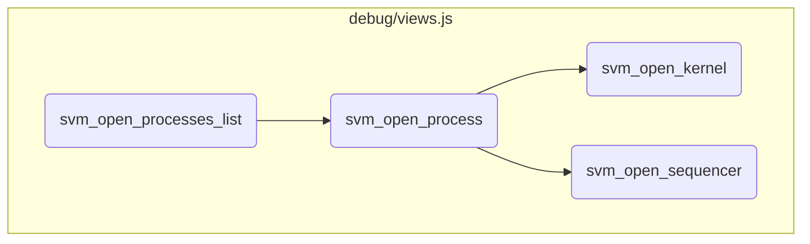
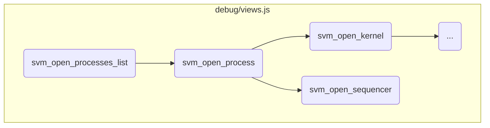
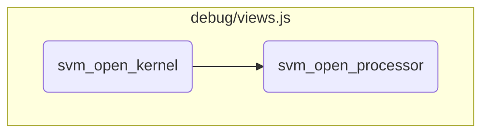

This document explains the flow of managing and displaying process-related information. It involves initializing views for the processes list, handling the display of process identifiers, and setting up interactions for opening specific processes and their associated components.

The flow starts by creating a view for the list of processes and adding it to the controller. It then sets up a function to display process identifiers and their buttons. When a button is clicked, it opens the respective process, showing detailed information about its state, locking information, and associated kernels. Additionally, it includes buttons to open the sequencer and the current kernel, which further display the sequencer's state and kernel-related information.

Here is a high level diagram of the flow, showing only the most important functions:



# Flow drill down

First, we'll zoom into this section of the flow:



<SwmSnippet path="/debug/views.js" line="235">

---

## Managing the display and interaction of process-related information

First, the <SwmToken path="debug/views.js" pos="235:1:1" line-data="	svm_open_processes_list()">`svm_open_processes_list`</SwmToken> function initializes a new view for the processes list and adds it to the controller. It then sets up an index function to handle the display of process identifiers and their corresponding buttons. Each button, when clicked, triggers the opening of the respective process.

```javascript
	svm_open_processes_list()
	{
		var svm_view = new SVM_ViewProcessesList();
		svm_controler.svm_add_view(svm_view);
		svm_controler.svm_add_index_function(svm_view,"process",svm_view.svm_box.svm_usable().childNodes[0],function(svm_view,dom,message)
			{
				dom.innerHTML="";
				for(var i of message.identifiers)
				{
					var ee = document.createElement('div');
					ee.classList.add("button");
					ee.innerText="...";
					ee.processus_id=i;
					ee.addEventListener("click",function(event) { svm_interface.svm_open_process(event.target.processus_id,event.target.svm_process_name); })
					dom.appendChild(ee);
					svm_controler.svm_add_object_function(svm_view,i,"object",ee,function(svm_view,dom,message)
					{
						dom.innerText = message.name+' ('+message.state+')';
						dom.svm_process_name = message.name;
					});
				}
```

---

</SwmSnippet>

<SwmSnippet path="/debug/views.js" line="260">

---

Next, the <SwmToken path="debug/views.js" pos="260:1:1" line-data="	svm_open_process(id,svm_name)">`svm_open_process`</SwmToken> function is responsible for displaying detailed information about a specific process. It creates a new view for the process, adds it to the controller, and sets up various elements to display the process state, locking information, and associated kernels. It also includes buttons to open the sequencer and the current kernel.

```javascript
	svm_open_process(id,svm_name)
	{
		var svm_view = new SVM_ViewProcess(svm_name);
		svm_controler.svm_add_view(svm_view);
		svm_controler.svm_add_object_function(svm_view,id,"object",svm_view.svm_box.svm_usable().childNodes[0],function(svm_view,dom,message)
			{
				dom.innerHTML = "";
				var s = document.createElement('div');
				s.innerText = "State: " + message.full_state;
				dom.appendChild(s);
				if('locking' in message)
				{
					var l = document.createElement('div');
					l.innerText = "Locking: " + message.locking.join(', ');
					dom.appendChild(l);
				}
				if('locked_by' in message)
				{
					var l = document.createElement('div');
					l.innerText = "Locked by: " + message.locked_by;
					dom.appendChild(l);
```

---

</SwmSnippet>

<SwmSnippet path="/debug/views.js" line="333">

---

Finally, the <SwmToken path="debug/views.js" pos="333:1:1" line-data="	svm_open_sequencer(svm_process,id,svm_box)">`svm_open_sequencer`</SwmToken> function handles the display of the sequencer associated with a process. It creates a new view for the sequencer, adds it to the controller, and sets up an element to display the sequencer's state.

```javascript
	svm_open_sequencer(svm_process,id,svm_box)
	{
		var svm_view = new SVM_ViewSequencer(svm_process,svm_box);
		svm_controler.svm_add_view(svm_view);
		svm_controler.svm_add_object_function(svm_view,id,"object",svm_view.svm_box.svm_usable().childNodes[0],function(svm_view,dom,message)
			{
				dom.innerText = message.state;
			});
		svm_controler.svm_send({ command: "object", identifier: id });
	}
```

---

</SwmSnippet>

Now, lets zoom into this section of the flow:



<SwmSnippet path="/debug/views.js" line="369">

---

## Handling Kernel View

First, the <SwmToken path="debug/views.js" pos="369:1:1" line-data="	svm_open_kernel(svm_process,id,svm_name,svm_box)">`svm_open_kernel`</SwmToken> function initializes a new kernel view using <SwmToken path="debug/views.js" pos="371:9:9" line-data="		var svm_view = new SVM_ViewKernel(svm_process,svm_name,svm_box);">`SVM_ViewKernel`</SwmToken>. This view is then added to the controller. The function also sets up an object function to handle messages related to the kernel state. It updates the DOM to reflect the current state and provides buttons to navigate to the processor and memory views.

```javascript
	svm_open_kernel(svm_process,id,svm_name,svm_box)
	{
		var svm_view = new SVM_ViewKernel(svm_process,svm_name,svm_box);
		svm_controler.svm_add_view(svm_view);
		svm_controler.svm_add_object_function(svm_view,id,"object",svm_view.svm_box.svm_usable(),function(svm_view,dom,message)
			{
				dom.innerHTML="";
				var s = document.createElement('div');
				s.innerText = 'State: ' + message.full_state;
				dom.appendChild(s);
				if(message.state==="I")
				{
					svm_view.svm_box.svm_notify();
				}
				var p = document.createElement('div');
				p.classList.add("button");
				p.innerText = "Processor";
				p.svm_process_name = svm_process;
				p.svm_kernel_name = svm_name;
				p.svm_processor_id = message.processor;
				p.svm_box = svm_view.svm_box;
```

---

</SwmSnippet>

<SwmSnippet path="/debug/views.js" line="605">

---

## Handling Processor View

Next, the <SwmToken path="debug/views.js" pos="605:1:1" line-data="	svm_open_processor(svm_process,svm_kernel,id,svm_box)">`svm_open_processor`</SwmToken> function initializes a new processor view using <SwmToken path="debug/views.js" pos="607:9:9" line-data="		var svm_view = new SVM_ViewProcessor(svm_process,&quot;K &quot;+svm_kernel.substring(7),id,svm_box);">`SVM_ViewProcessor`</SwmToken>. This view is added to the controller, and an object function is set up to handle events related to the processor state. The function updates the DOM to display the current instruction, memory state, and other relevant information. It also provides buttons to control the processor, such as pausing, running instructions, and executing functions.

```javascript
	svm_open_processor(svm_process,svm_kernel,id,svm_box)
	{
		var svm_view = new SVM_ViewProcessor(svm_process,"K "+svm_kernel.substring(7),id,svm_box);
		svm_controler.svm_add_view(svm_view);
		svm_controler.svm_add_object_function(svm_view,id,"event",svm_view.svm_box.svm_usable().children[0],function(svm_view,dom,message)
			{
				if(message.event.state != null)
				{
					dom.children[1].replaceChild(svm_interface.svm_processor_state(message.event.state,svm_view.id,true,svm_view.svm_name,svm_view),dom.children[1].children[0]);
				}
				if(message.event.current_instruction != null)
				{
					dom.children[1].children[0].children[1].children[0].innerText = "<" + message.event.current_instruction.code_name + "/" + message.event.current_instruction.local + ">";
					dom.children[1].children[0].children[1].children[1].svm_code_name = "<b>Code " + message.event.current_instruction.code_name+"</b> "+svm_view.svm_name.substring(9);
					dom.children[1].children[0].children[1].children[1].svm_code_id = message.event.current_instruction.code;
					dom.children[1].children[0].children[1].children[1].svm_cursor = message.event.current_instruction.local;
					dom.children[1].children[0].children[1].children[3].style.display = "none";
					dom.children[1].children[0].children[1].children[3].innerHTML = "";
				}
				if(message.event.next_instruction != null)
				{
```

---

</SwmSnippet>

&nbsp;

*This is an auto-generated document by Swimm 🌊 and has not yet been verified by a human*

<SwmMeta version="3.0.0" repo-id="Z2l0aHViJTNBJTNBc3ZtLTIuNy4yMDI0MTEwNyUzQSUzQVN3aW1tLURlbW8=" repo-name="svm-2.7.20241107"><sup>Powered by [Swimm](/)</sup></SwmMeta>
