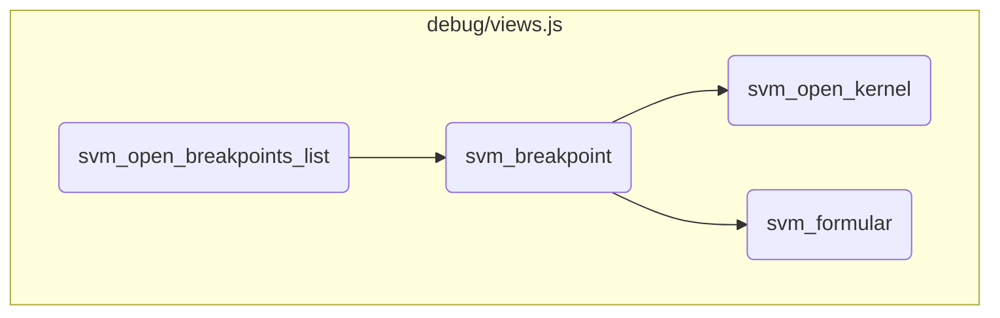
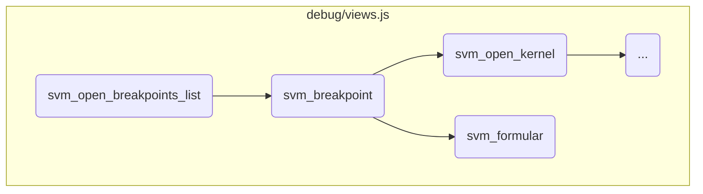
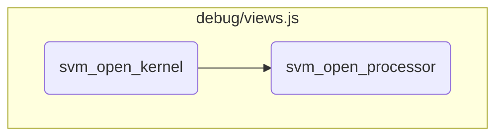

This document explains the process of managing breakpoints during debugging. It covers initializing the breakpoints list view, handling events for adding, removing, and clearing breakpoints, and creating detailed views for each breakpoint.

The flow starts with initializing the breakpoints list view and adding it to the controller. When a new breakpoint is added, it creates a new element and appends it to the DOM, allowing users to see it immediately. If a breakpoint is removed, the corresponding element is found and removed from the DOM. Additionally, forms associated with breakpoints can be cleared and updated as needed.

Here is a high level diagram of the flow, showing only the most important functions:



# Flow drill down

First, we'll zoom into this section of the flow:



<SwmSnippet path="/debug/views.js" line="1752">

---

## Managing Breakpoints

First, the <SwmToken path="debug/views.js" pos="1752:1:1" line-data="	svm_open_breakpoints_list()">`svm_open_breakpoints_list`</SwmToken> function initializes the breakpoints list view and adds it to the controller. It handles adding, removing, and clearing breakpoints based on events. This ensures that the user can manage breakpoints effectively during debugging.

```javascript
	svm_open_breakpoints_list()
	{
		var svm_view = new SVM_ViewBreakpointsList();
		svm_controler.svm_add_view(svm_view);
		svm_controler.svm_add_index_function(svm_view,"breakpoints",svm_view.svm_box.svm_usable(),function(svm_view,dom,message)
		{
			svm_controler.svm_add_object_function(svm_view,message.identifiers[0],"event",svm_view.svm_box.svm_usable().children[0],function(svm_view,dom,message)
			{
				if(message.event.add_breakpoint != null)
				{
					var pa = svm_interface.svm_breakpoint(message.event.add_breakpoint,message.identifier,svm_view);
					dom.children[0].appendChild(pa);
					pa.scrollIntoView({ behavior: "smooth"});
					svm_view.svm_box.svm_notify();
				}
				if(message.event.remove_breakpoint != null)
				{
					for(var i = 0 ; i<dom.children[0].children.length ; i++)
					{
						if(dom.children[0].children[i].svm_identifier == message.event.remove_breakpoint)
						{
```

---

</SwmSnippet>

<SwmSnippet path="/debug/views.js" line="1760">

---

### Adding Breakpoints

When a new breakpoint is added, it creates a new breakpoint element and appends it to the DOM. This allows users to see the newly added breakpoint immediately.

```javascript
				if(message.event.add_breakpoint != null)
				{
					var pa = svm_interface.svm_breakpoint(message.event.add_breakpoint,message.identifier,svm_view);
					dom.children[0].appendChild(pa);
					pa.scrollIntoView({ behavior: "smooth"});
					svm_view.svm_box.svm_notify();
```

---

</SwmSnippet>

<SwmSnippet path="/debug/views.js" line="1767">

---

### Removing Breakpoints

If a breakpoint is removed, it iterates through the DOM elements to find and remove the corresponding breakpoint element. This keeps the breakpoint list up-to-date.

```javascript
				if(message.event.remove_breakpoint != null)
				{
					for(var i = 0 ; i<dom.children[0].children.length ; i++)
					{
						if(dom.children[0].children[i].svm_identifier == message.event.remove_breakpoint)
						{
							dom.children[0].removeChild(dom.children[0].children[i]);
						}
					}
				}
```

---

</SwmSnippet>

<SwmSnippet path="/debug/views.js" line="1777">

---

### Clearing Forms

When a form is cleared, it updates the form fields to reflect the cleared state. This ensures that users can reset forms as needed during debugging.

```javascript
				if(message.event.clear_form != null)
				{
					for(var i = 0 ; i<dom.children[0].children.length ; i++)
					{
						if(dom.children[0].children[i].svm_identifier == message.event.clear_form.identifier)
						{
							dom.children[0].children[i].children[2].children[1].innerHTML="";
							dom.children[0].children[i].children[2].children[1].appendChild(svm_interface.svm_formular(message.event.clear_form.form));
						}
					}
				}
```

---

</SwmSnippet>

<SwmSnippet path="/debug/views.js" line="1692">

---

## Creating Breakpoint Elements

Next, the <SwmToken path="debug/views.js" pos="1692:1:1" line-data="	svm_breakpoint(p,id,svm_view)">`svm_breakpoint`</SwmToken> function creates a table row element for each breakpoint. It includes buttons for deleting and opening breakpoints, and displays the breakpoint details. This provides a detailed view of each breakpoint for the user.

```javascript
	svm_breakpoint(p,id,svm_view)
	{
		var pa = document.createElement("tr");
		pa.svm_identifier = p.identifier;
		var svm_delete = document.createElement("td");
		var svm_delete_button = document.createElement("div");
		svm_delete_button.classList.add("button");
		svm_delete_button.classList.add("delete");
		svm_delete_button.svm_breakpoint_id = p.identifier;
		svm_delete_button.svm_identifier = id;
		svm_delete_button.svm_view = svm_view;
		svm_delete_button.addEventListener("click",function(event) {
			if((event.target.parentNode.parentNode.children[2].children[1] != null)&&(event.target.parentNode.parentNode.children[2].children[1].childElementCount>2))
			{
				return;
			}
			event.target.svm_view.svm_box.svm_acknowledge();
			svm_controler.svm_send({ command: "event", identifier: event.target.svm_identifier, remove_breakpoint: event.target.svm_breakpoint_id});
		});
		svm_delete.appendChild(svm_delete_button);
		pa.appendChild(svm_delete);
```

---

</SwmSnippet>

<SwmSnippet path="/debug/views.js" line="1464">

---

## Handling Forms

Finally, the <SwmToken path="debug/views.js" pos="1464:1:1" line-data="	svm_formular(form)">`svm_formular`</SwmToken> function creates and manages forms associated with breakpoints. It handles different field types and validates user input. This ensures that users can interact with and submit forms correctly during debugging.

```javascript
	svm_formular(form)
	{
		var svm_formular = document.createElement("div");
		svm_formular.classList.add("form");
		var svm_title = document.createElement("div");
		svm_title.innerText = form.title + ":";
		svm_formular.appendChild(svm_title);
		var svm_fields = document.createElement("div");
		for(var c of form.fields)
		{
			var svm_field = document.createElement("div");
			svm_field.classList.add("field");
			if(c.type == "checkbox")
			{
				if(form.submitted != null)
				{
					var svm_checkbox = document.createElement("pre");
					svm_checkbox.style.display = "inline";
					if(!c.value)
					{
						svm_checkbox.innerText = "no ";
```

---

</SwmSnippet>

Now, lets zoom into this section of the flow:



<SwmSnippet path="/debug/views.js" line="369">

---

## Handling Kernel State

First, the <SwmToken path="debug/views.js" pos="369:1:1" line-data="	svm_open_kernel(svm_process,id,svm_name,svm_box)">`svm_open_kernel`</SwmToken> function initializes a new kernel view and adds it to the controller. It then sets up an object function to handle the kernel state updates and interactions. This includes displaying the current state and providing buttons to interact with the processor and memory.

```javascript
	svm_open_kernel(svm_process,id,svm_name,svm_box)
	{
		var svm_view = new SVM_ViewKernel(svm_process,svm_name,svm_box);
		svm_controler.svm_add_view(svm_view);
		svm_controler.svm_add_object_function(svm_view,id,"object",svm_view.svm_box.svm_usable(),function(svm_view,dom,message)
			{
				dom.innerHTML="";
				var s = document.createElement('div');
				s.innerText = 'State: ' + message.full_state;
				dom.appendChild(s);
				if(message.state==="I")
				{
					svm_view.svm_box.svm_notify();
				}
				var p = document.createElement('div');
				p.classList.add("button");
				p.innerText = "Processor";
				p.svm_process_name = svm_process;
				p.svm_kernel_name = svm_name;
				p.svm_processor_id = message.processor;
				p.svm_box = svm_view.svm_box;
```

---

</SwmSnippet>

<SwmSnippet path="/debug/views.js" line="605">

---

## Processor Interaction

Next, the <SwmToken path="debug/views.js" pos="605:1:1" line-data="	svm_open_processor(svm_process,svm_kernel,id,svm_box)">`svm_open_processor`</SwmToken> function initializes a new processor view and adds it to the controller. It sets up various object functions to handle processor events, such as state changes, instruction updates, memory allocations, and interruptions. This ensures that the processor state is accurately reflected and provides interactive elements for managing processor operations.

```javascript
	svm_open_processor(svm_process,svm_kernel,id,svm_box)
	{
		var svm_view = new SVM_ViewProcessor(svm_process,"K "+svm_kernel.substring(7),id,svm_box);
		svm_controler.svm_add_view(svm_view);
		svm_controler.svm_add_object_function(svm_view,id,"event",svm_view.svm_box.svm_usable().children[0],function(svm_view,dom,message)
			{
				if(message.event.state != null)
				{
					dom.children[1].replaceChild(svm_interface.svm_processor_state(message.event.state,svm_view.id,true,svm_view.svm_name,svm_view),dom.children[1].children[0]);
				}
				if(message.event.current_instruction != null)
				{
					dom.children[1].children[0].children[1].children[0].innerText = "<" + message.event.current_instruction.code_name + "/" + message.event.current_instruction.local + ">";
					dom.children[1].children[0].children[1].children[1].svm_code_name = "<b>Code " + message.event.current_instruction.code_name+"</b> "+svm_view.svm_name.substring(9);
					dom.children[1].children[0].children[1].children[1].svm_code_id = message.event.current_instruction.code;
					dom.children[1].children[0].children[1].children[1].svm_cursor = message.event.current_instruction.local;
					dom.children[1].children[0].children[1].children[3].style.display = "none";
					dom.children[1].children[0].children[1].children[3].innerHTML = "";
				}
				if(message.event.next_instruction != null)
				{
```

---

</SwmSnippet>

&nbsp;

*This is an auto-generated document by Swimm 🌊 and has not yet been verified by a human*

<SwmMeta version="3.0.0" repo-id="Z2l0aHViJTNBJTNBc3ZtLTIuNy4yMDI0MTEwNyUzQSUzQVN3aW1tLURlbW8=" repo-name="svm-2.7.20241107"><sup>Powered by [Swimm](/)</sup></SwmMeta>
