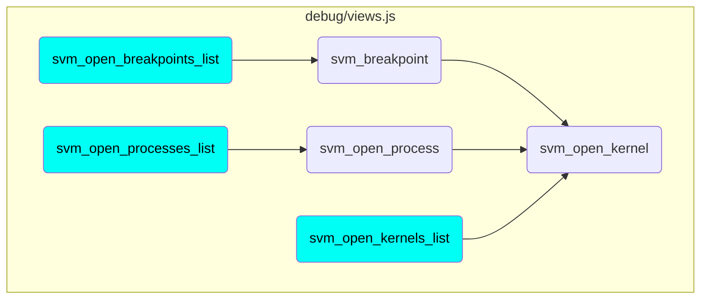

This document explains the process of initializing and managing kernel views, processor views, and code views within a virtual machine environment. It covers the steps involved in setting up these views, handling state updates, user interactions, and ensuring that the components are properly displayed and interactive for the user.

The flow starts with initializing a new kernel view and adding it to the controller. This view handles state updates and user interactions, such as opening processor or memory views. Next, a processor view is initialized and updated based on various events like state changes and memory allocations. The processor's state is then represented in detail, including current and next instructions. Instruction overrides are handled to ensure custom instructions are visible and accessible. Finally, a code view is initialized to display instructions and allow interaction with breakpoints and cursor positions.

# Flow drill down

```mermaid
graph TD;
      subgraph debugviewsjs["debug/views.js"]
a89e1dc44c4ac65e55d51df133bfaa5a017ff042861f7dcee603ff271c78378d(svm_open_kernel) --> 321a87929bacd832560dba58311f7e52b4e5eaefc0c5284d660e172b0cf72a96(svm_open_processor)
end

subgraph debugviewsjs["debug/views.js"]
321a87929bacd832560dba58311f7e52b4e5eaefc0c5284d660e172b0cf72a96(svm_open_processor) --> 29555e07655525e848746a6082b077e9f4b6d3ae03b88ac2214cd7b10918b6bd(svm_processor_state)
end

subgraph debugviewsjs["debug/views.js"]
29555e07655525e848746a6082b077e9f4b6d3ae03b88ac2214cd7b10918b6bd(svm_processor_state) --> 597c00c0f2d85b65443b766930e4f5130bcf9a5831538c56b5fecec61508e1ce(svm_processor_instruction_overrides)
end

subgraph debugviewsjs["debug/views.js"]
597c00c0f2d85b65443b766930e4f5130bcf9a5831538c56b5fecec61508e1ce(svm_processor_instruction_overrides) --> 7d7d069ebe0123f28bdc10ae5168a454c830ecac56597616837d29a4db51467f(svm_open_code)
end


      classDef mainFlowStyle color:#000000,fill:#7CB9F4
classDef rootsStyle color:#000000,fill:#00FFF4
classDef Style1 color:#000000,fill:#00FFAA
classDef Style2 color:#000000,fill:#FFFF00
classDef Style3 color:#000000,fill:#AA7CB9
```



<SwmSnippet path="/debug/views.js" line="369">

---

## Handling Kernel View

First, the <SwmToken path="debug/views.js" pos="369:1:1" line-data="	svm_open_kernel(svm_process,id,svm_name,svm_box)">`svm_open_kernel`</SwmToken> function initializes a new kernel view and adds it to the controller. It sets up the view to handle state updates and user interactions, such as opening the processor or memory views. This ensures that the kernel's state and related components are properly displayed and interactive for the user.

```javascript
	svm_open_kernel(svm_process,id,svm_name,svm_box)
	{
		var svm_view = new SVM_ViewKernel(svm_process,svm_name,svm_box);
		svm_controler.svm_add_view(svm_view);
		svm_controler.svm_add_object_function(svm_view,id,"object",svm_view.svm_box.svm_usable(),function(svm_view,dom,message)
			{
				dom.innerHTML="";
				var s = document.createElement('div');
				s.innerText = 'State: ' + message.full_state;
				dom.appendChild(s);
				if(message.state==="I")
				{
					svm_view.svm_box.svm_notify();
				}
				var p = document.createElement('div');
				p.classList.add("button");
				p.innerText = "Processor";
				p.svm_process_name = svm_process;
				p.svm_kernel_name = svm_name;
				p.svm_processor_id = message.processor;
				p.svm_box = svm_view.svm_box;
```

---

</SwmSnippet>

<SwmSnippet path="/debug/views.js" line="605">

---

## Handling Processor View

Next, the <SwmToken path="debug/views.js" pos="605:1:1" line-data="	svm_open_processor(svm_process,svm_kernel,id,svm_box)">`svm_open_processor`</SwmToken> function initializes a new processor view and adds it to the controller. It updates the view based on various events, such as state changes, current and next instructions, memory allocations, and interruptions. This function ensures that the processor's state and activities are accurately represented and interactive, allowing users to inspect and control the processor's behavior.

```javascript
	svm_open_processor(svm_process,svm_kernel,id,svm_box)
	{
		var svm_view = new SVM_ViewProcessor(svm_process,"K "+svm_kernel.substring(7),id,svm_box);
		svm_controler.svm_add_view(svm_view);
		svm_controler.svm_add_object_function(svm_view,id,"event",svm_view.svm_box.svm_usable().children[0],function(svm_view,dom,message)
			{
				if(message.event.state != null)
				{
					dom.children[1].replaceChild(svm_interface.svm_processor_state(message.event.state,svm_view.id,true,svm_view.svm_name,svm_view),dom.children[1].children[0]);
				}
				if(message.event.current_instruction != null)
				{
					dom.children[1].children[0].children[1].children[0].innerText = "<" + message.event.current_instruction.code_name + "/" + message.event.current_instruction.local + ">";
					dom.children[1].children[0].children[1].children[1].svm_code_name = "<b>Code " + message.event.current_instruction.code_name+"</b> "+svm_view.svm_name.substring(9);
					dom.children[1].children[0].children[1].children[1].svm_code_id = message.event.current_instruction.code;
					dom.children[1].children[0].children[1].children[1].svm_cursor = message.event.current_instruction.local;
					dom.children[1].children[0].children[1].children[3].style.display = "none";
					dom.children[1].children[0].children[1].children[3].innerHTML = "";
				}
				if(message.event.next_instruction != null)
				{
```

---

</SwmSnippet>

<SwmSnippet path="/debug/views.js" line="431">

---

## Processor State Representation

Then, the <SwmToken path="debug/views.js" pos="431:1:1" line-data="	svm_processor_state(svm_state,svm_processor_id,svm_current,svm_name,svm_view)">`svm_processor_state`</SwmToken> function creates a detailed representation of the processor's state, including current and next instructions, memory allocations, defined aliases, and interruptions. This function is crucial for providing a comprehensive view of the processor's current status and activities, enabling users to understand and debug the processor's operations.

```javascript
	svm_processor_state(svm_state,svm_processor_id,svm_current,svm_name,svm_view)
	{
		var e = document.createElement('div');
		e.innerText = "State:";
		var pi = document.createElement('div');
		pi.innerText = "Next instruction: ";
		var vpi = document.createElement('span');
		vpi.innerText = "<" + svm_state.next_instruction.code_name + "/" + svm_state.next_instruction.local + ">";
		pi.appendChild(vpi);
		e.appendChild(pi);
		var ic = document.createElement('div');
		ic.innerText = "Current instruction: ";
		var vic = document.createElement('span');
		vic.innerText = "<" + svm_state.current_instruction.code_name + "/" + svm_state.current_instruction.local + ">";
		ic.appendChild(vic);
		var svm_button = document.createElement('div');
		svm_button.classList.add("button");
		svm_button.style.marginLeft = "5px";
		svm_button.style.display = "inline-block";
		svm_button.innerText = "Code";
		svm_button.svm_code_name = "<b>Code "+svm_state.current_instruction.code_name+"</b>"+svm_name.substring(9);
```

---

</SwmSnippet>

<SwmSnippet path="/debug/views.js" line="404">

---

## Instruction Overrides Handling

Moving to the <SwmToken path="debug/views.js" pos="404:1:1" line-data="	svm_processor_instruction_overrides(iol,io,svm_view)">`svm_processor_instruction_overrides`</SwmToken> function, it handles the display and interaction of instruction overrides within the processor view. This function ensures that any custom instructions or overrides are visible and accessible to the user, allowing for detailed inspection and control.

```javascript
	svm_processor_instruction_overrides(iol,io,svm_view)
	{
		for(var i of io)
		{
			var svm_text = document.createTextNode(" <" + i.address.code_name + "/" + i.address.local + ">");
			iol.appendChild(svm_text);
			var svm_button = document.createElement('div');
			svm_button.classList.add("button");
			svm_button.style.marginLeft = "5px";
			svm_button.style.display = "inline-block";
			svm_button.innerText = "Code";
			svm_button.svm_code_name = "<b>Code "+i.address.code_name+"</b>"+svm_view.svm_name.substring(9);
			svm_button.svm_code_id = i.address.code;
			svm_button.svm_processor_id = svm_view.id;
			svm_button.svm_cursor = i.address.local;
			svm_button.addEventListener('click',function(event)
			{
				svm_interface.svm_open_code(false,event.target.svm_code_name,event.target.svm_code_id,event.target.svm_processor_id,event.target.svm_cursor,svm_view.svm_breakpoints,svm_view.svm_box);
			});
			iol.appendChild(svm_button);
			var svm_text2 = document.createTextNode(" => ");
```

---

</SwmSnippet>

<SwmSnippet path="/debug/views.js" line="1000">

---

## Code View Initialization

Finally, the <SwmToken path="debug/views.js" pos="1000:1:1" line-data="	svm_open_code(svm_current_state,svm_name,svm_code_id,svm_processor_id,svm_cursor,svm_breakpoints,svm_box)">`svm_open_code`</SwmToken> function initializes a new code view, displaying the instructions and allowing for interaction with breakpoints and cursor positions. This function is essential for providing a detailed view of the code being executed, enabling users to set breakpoints, view instruction details, and navigate through the code efficiently.

```javascript
	svm_open_code(svm_current_state,svm_name,svm_code_id,svm_processor_id,svm_cursor,svm_breakpoints,svm_box)
	{
		var svm_view = new SVM_ViewCode((svm_current_state?"":"=")+svm_name,svm_code_id,svm_processor_id,svm_current_state,svm_cursor,svm_breakpoints,svm_box);
		svm_controler.svm_add_view(svm_view);
		svm_controler.svm_add_object_function(svm_view,svm_code_id,"object",svm_view.svm_box.svm_usable(),function(svm_view,dom,message)
		{
			dom.children[1].innerHTML = "";
			var ti = document.createElement("table");
			ti.classList.add("code");
			var svm_address = 0;
			for(var i of message.instructions)
			{
				var ri = document.createElement("tr");
				ri.classList.add("code");
				var pa = document.createElement("td");
				pa.classList.add("break");
				pa.svm_code_id = svm_code_id;
				pa.svm_code_address = svm_address;
				pa.svm_processor_id = svm_processor_id;
				if(svm_view.svm_breakpoints.findIndex(function(p) { return (p.code == svm_code_id) && (p.local==svm_address); })>=0)
				{
```

---

</SwmSnippet>

# Where is this flow used?

This flow is used multiple times in the codebase as represented in the following diagram:



&nbsp;

*This is an auto-generated document by Swimm 🌊 and has not yet been verified by a human*

<SwmMeta version="3.0.0" repo-id="Z2l0aHViJTNBJTNBc3ZtLTIuNy4yMDI0MTEwNyUzQSUzQVN3aW1tLURlbW8=" repo-name="svm-2.7.20241107"><sup>Powered by [Swimm](/)</sup></SwmMeta>
