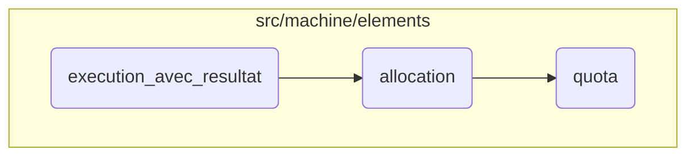

In this document, we will explain the process of executing a memory allocation request with a result. The process involves verifying memory aliases, allocating memory, managing memory quotas, and enforcing quota limits.

The flow starts with verifying the memory alias and allocating memory based on the provided block description. Then, it manages the memory quota by checking the requested block size, handling free memory, and updating memory elements. Finally, it enforces memory usage limits by notifying when the quota is reached, ensuring the system's stability.

# Flow drill down



<SwmSnippet path="/src/machine/elements/processeur/instructions/memoire.cpp" line="43">

---

## Handling Memory Allocation

First, the <SwmToken path="src/machine/elements/processeur/instructions/memoire.cpp" pos="43:6:6" line-data="SVM_Memoire::ValeurSP Memoire::execution_avec_resultat(const SVM_Noyau::NoyauSP&amp; noyau, const bool garder, const SVM_Memoire::DescriptionBloc&amp; description_bloc)">`execution_avec_resultat`</SwmToken> function verifies the memory alias and allocates memory based on the provided block description. This ensures that the memory is correctly assigned and managed.

```c++
SVM_Memoire::ValeurSP Memoire::execution_avec_resultat(const SVM_Noyau::NoyauSP& noyau, const bool garder, const SVM_Memoire::DescriptionBloc& description_bloc)
{
	noyau->_memoire->verification_alias(description_bloc);
	SVM_Valeur::Pointeur bloc = noyau->_memoire->allocation(description_bloc);
	noyau->_memoire->definition_alias(description_bloc,bloc);
	if(garder)
	{
		noyau->_processeur->retire_memoire_allouee({bloc});
		noyau->_processeur->retire_alias_definis(description_bloc.alias());
	}
	else
	{
		noyau->_processeur->memoire_allouee({bloc});
		noyau->_processeur->alias_definis(description_bloc.alias());
	}
	return std::make_shared<SVM_Memoire::Pointeur>(bloc);
}
```

---

</SwmSnippet>

<SwmSnippet path="/src/machine/elements/memoire/memoire.cpp" line="35">

---

## Managing Memory Quota

Next, the <SwmToken path="src/machine/elements/memoire/memoire.cpp" pos="35:6:6" line-data="SVM_Valeur::Pointeur Memoire::allocation(const DescriptionBloc&amp; bloc)">`allocation`</SwmToken> function handles the actual allocation of memory blocks. It checks the requested block size, manages free memory, and updates the memory elements. This step is crucial for ensuring that memory is allocated efficiently and without exceeding limits.

```c++
SVM_Valeur::Pointeur Memoire::allocation(const DescriptionBloc& bloc)
{
	size_t taille_bloc_demande = bloc._elements.size();
	if(static_cast<bool>(_utilisation))
	{
		_utilisation->augmente<SVM_Noyau::TropDeMemoireUtilisee>(taille_bloc_demande);
		if(static_cast<bool>(_piege)) { _piege->quota(_utilisation); }
	}
	auto memoire_libre_disponible = _memoire_libre.lower_bound(taille_bloc_demande);
	size_t adresse_debut;
	if(memoire_libre_disponible == _memoire_libre.end())
	{
		if(_memoire_libre.empty())
		{
			adresse_debut = _elements.size();
			_elements.insert(_elements.end(),taille_bloc_demande,ElementSP());
		}
		else
		{
			bool trouve = false;
			for(auto derniers_blocs = _memoire_libre.begin() ; derniers_blocs!=_memoire_libre.end() ; ++derniers_blocs)
```

---

</SwmSnippet>

<SwmSnippet path="/src/machine/elements/memoire/memoire.cpp" line="1356">

---

## Enforcing Quota Limits

Finally, the <SwmToken path="src/machine/elements/memoire/memoire.cpp" pos="1356:4:4" line-data="void PiegeMemoire::quota(const SVM_Noyau::LimiteUtilisationSP&amp; utilisation)">`quota`</SwmToken> function enforces memory usage limits by notifying when the quota is reached. This helps in maintaining the system's stability by preventing excessive memory usage.

```c++
void PiegeMemoire::quota(const SVM_Noyau::LimiteUtilisationSP& utilisation)
{
	auto e = SVM::Machine::Debugueur::JSON::objet();
	e->ajoute("quota",utilisation->debugueur());
	notification_evenement_objet(SVM_Debugueur::Evenement::Categorie::CHANGEMENT_OBJET,e);
}
```

---

</SwmSnippet>

&nbsp;

*This is an auto-generated document by Swimm 🌊 and has not yet been verified by a human*

<SwmMeta version="3.0.0" repo-id="Z2l0aHViJTNBJTNBc3ZtLTIuNy4yMDI0MTEwNyUzQSUzQVN3aW1tLURlbW8=" repo-name="svm-2.7.20241107"><sup>Powered by [Swimm](/)</sup></SwmMeta>
