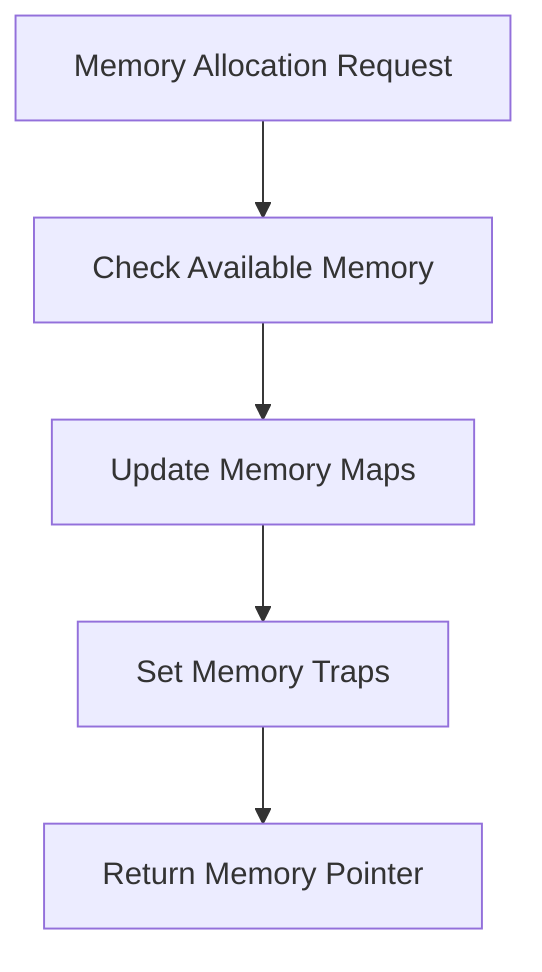

# What is Memory Management

Memory management refers to the process of controlling and coordinating computer memory, assigning portions called blocks to various running programs to optimize overall system performance. In the context of the virtual machine environment, memory management is handled by the <SwmToken path="src/machine/elements/memoire/memoire.h" pos="223:3:3" line-data="	struct Memoire : public std::enable_shared_from_this&lt;Memoire&gt;">`Memoire`</SwmToken> component.

# Memoire Component

The <SwmToken path="src/machine/elements/memoire/memoire.h" pos="223:3:3" line-data="	struct Memoire : public std::enable_shared_from_this&lt;Memoire&gt;">`Memoire`</SwmToken> component is responsible for the allocation, deallocation, and management of memory blocks. It also manages memory aliases, which are alternative names for memory addresses. Additionally, <SwmToken path="src/machine/elements/memoire/memoire.h" pos="223:3:3" line-data="	struct Memoire : public std::enable_shared_from_this&lt;Memoire&gt;">`Memoire`</SwmToken> includes mechanisms for setting breakpoints on memory access, such as read, write, and access points.

# Exception Handling

The <SwmToken path="src/machine/elements/memoire/memoire.h" pos="223:3:3" line-data="	struct Memoire : public std::enable_shared_from_this&lt;Memoire&gt;">`Memoire`</SwmToken> component handles exceptions related to memory operations, such as undefined addresses, uninitialized addresses, and type incompatibilities. It integrates with the debugging system to provide detailed information about memory operations and to set traps for specific memory events.

# Synchronization

Memoire ensures synchronization and desynchronization of memory addresses, which is essential for maintaining data consistency. It supports operations like copying, moving, and sharing memory blocks between different memory spaces.

<SwmSnippet path="/src/machine/elements/memoire/memoire.h" line="223">

---

# Memoire Class

The <SwmToken path="src/machine/elements/memoire/memoire.h" pos="223:3:3" line-data="	struct Memoire : public std::enable_shared_from_this&lt;Memoire&gt;">`Memoire`</SwmToken> class provides methods for memory allocation, deallocation, alias management, and synchronization. It includes methods like <SwmToken path="src/machine/elements/memoire/memoire.h" pos="237:5:5" line-data="		SVM_Valeur::Pointeur allocation(const DescriptionBloc&amp; bloc);">`allocation`</SwmToken>, <SwmToken path="src/machine/elements/memoire/memoire.h" pos="239:3:3" line-data="		void liberation(const std::set&lt;SVM_Valeur::Pointeur&gt;&amp; bloc);">`liberation`</SwmToken>, <SwmToken path="src/machine/elements/memoire/memoire.h" pos="240:3:3" line-data="		void verification_alias(const DescriptionBloc&amp; bloc);">`verification_alias`</SwmToken>, <SwmToken path="src/machine/elements/memoire/memoire.h" pos="241:3:3" line-data="		void definition_alias(const DescriptionBloc&amp; bloc, SVM_Valeur::Pointeur&amp; emplacement);">`definition_alias`</SwmToken>, and <SwmToken path="src/machine/elements/memoire/memoire.h" pos="242:3:3" line-data="		void suppression_alias(const std::set&lt;std::string&gt;&amp; alias);">`suppression_alias`</SwmToken>.

```c
	struct Memoire : public std::enable_shared_from_this<Memoire>
	{
		friend struct SVM::Machine::Element::Processeur::Processeur;
		friend struct PiegeMemoire;
		static MemoireSP creation_memoire(SVM::Machine::Debugueur::DebugueurSP& debugueur, const SVM_Noyau::ControleAccesSP& controle_acces);
		Memoire(const SVM_Noyau::ControleAccesSP& controle_acces)
		{
			if(static_cast<bool>(controle_acces)) { _utilisation = controle_acces->_memoire_allouee; }
			SVM_TRACE("Creation memoire " << this);
		}
		virtual ~Memoire()
		{
			SVM_TRACE("Destruction memoire " << this);
		}
		SVM_Valeur::Pointeur allocation(const DescriptionBloc& bloc);
		std::pair<bool,SVM_Valeur::Pointeur> allocation(const DescriptionBloc& bloc, const SVM_Valeur::AdresseMemoire& adresse);
		void liberation(const std::set<SVM_Valeur::Pointeur>& bloc);
		void verification_alias(const DescriptionBloc& bloc);
		void definition_alias(const DescriptionBloc& bloc, SVM_Valeur::Pointeur& emplacement);
		void suppression_alias(const std::set<std::string>& alias);
		void definition_alias(const std::string& alias, SVM_Valeur::Pointeur& emplacement);
```

---

</SwmSnippet>

<SwmSnippet path="/src/machine/elements/memoire/memoire.cpp" line="35">

---

# Allocation Method

The <SwmToken path="src/machine/elements/memoire/memoire.cpp" pos="35:6:6" line-data="SVM_Valeur::Pointeur Memoire::allocation(const DescriptionBloc&amp; bloc)">`allocation`</SwmToken> method allocates memory blocks based on the provided <SwmToken path="src/machine/elements/memoire/memoire.cpp" pos="35:10:10" line-data="SVM_Valeur::Pointeur Memoire::allocation(const DescriptionBloc&amp; bloc)">`DescriptionBloc`</SwmToken> and handles the allocation logic, including checking for available memory, updating memory maps, and setting traps for memory events.

```c++
SVM_Valeur::Pointeur Memoire::allocation(const DescriptionBloc& bloc)
{
	size_t taille_bloc_demande = bloc._elements.size();
	if(static_cast<bool>(_utilisation))
	{
		_utilisation->augmente<SVM_Noyau::TropDeMemoireUtilisee>(taille_bloc_demande);
		if(static_cast<bool>(_piege)) { _piege->quota(_utilisation); }
	}
	auto memoire_libre_disponible = _memoire_libre.lower_bound(taille_bloc_demande);
	size_t adresse_debut;
	if(memoire_libre_disponible == _memoire_libre.end())
	{
		if(_memoire_libre.empty())
		{
			adresse_debut = _elements.size();
			_elements.insert(_elements.end(),taille_bloc_demande,ElementSP());
		}
		else
		{
			bool trouve = false;
			for(auto derniers_blocs = _memoire_libre.begin() ; derniers_blocs!=_memoire_libre.end() ; ++derniers_blocs)
```

---

</SwmSnippet>



<SwmSnippet path="/src/machine/elements/memoire/memoire.cpp" line="658">

---

# Change Type Method

The <SwmToken path="src/machine/elements/memoire/memoire.cpp" pos="658:4:4" line-data="void Memoire::change_type(const SVM_Valeur::AdresseMemoire&amp; adresse, const Type&amp; type)">`change_type`</SwmToken> method changes the type of a memory address and handles related operations such as updating the memory element and setting traps for type changes.

```c++
void Memoire::change_type(const SVM_Valeur::AdresseMemoire& adresse, const Type& type)
{
	if(adresse._adresse>=_elements.size())
	{
		throw EcritureAdresseNonDefinie(adresse);
	}
	ElementSP element = _elements[adresse._adresse];
	if(not element)
	{
		throw EcritureAdresseNonDefinie(adresse);
	}
	SVM_Synchronisation::EcrivainUP ecrivain;
	if(static_cast<bool>(element->_acces))
	{
		ecrivain = element->_acces->ecrivain();
	}
	if(static_cast<bool>(_piege))
	{
		_piege->point_arret_ecriture(adresse,element->_type,element->_valeur,type,SVM_Memoire::ValeurSP(),_piege);
	}
	if(static_cast<bool>(_piege) and static_cast<bool>(element->_valeur))
```

---

</SwmSnippet>

&nbsp;

*This is an auto-generated document by Swimm 🌊 and has not yet been verified by a human*

<SwmMeta version="3.0.0" repo-id="Z2l0aHViJTNBJTNBc3ZtLTIuNy4yMDI0MTEwNyUzQSUzQVN3aW1tLURlbW8=" repo-name="svm-2.7.20241107"><sup>Powered by [Swimm](/)</sup></SwmMeta>
