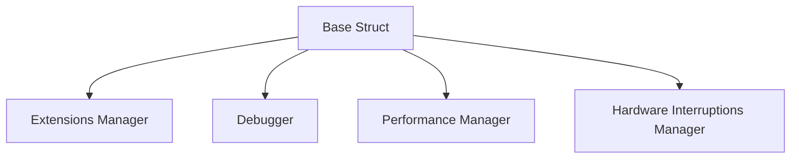

# What is Base Struct

The <SwmToken path="src/machine/machine/machine.cpp" pos="50:11:11" line-data="	_base = std::make_shared&lt;SVM_Base::Base&gt;(gestionnaire_extensions,debugueur,performance);">`Base`</SwmToken> struct is a fundamental component within the Machine Elements of the Simple Virtual Machine (SVM). It is responsible for managing key functionalities such as extensions, debugging, performance, and hardware interruptions.

The <SwmToken path="src/machine/machine/machine.cpp" pos="50:11:11" line-data="	_base = std::make_shared&lt;SVM_Base::Base&gt;(gestionnaire_extensions,debugueur,performance);">`Base`</SwmToken> struct includes members like `_gestionnaire_extensions`, <SwmToken path="src/machine/machine/machine.cpp" pos="51:16:16" line-data="	_piege = SVM_Debugueur::Debugueur::ajoute_piege&lt;PiegeMachine&gt;(_base-&gt;_debugueur);">`_debugueur`</SwmToken>, <SwmToken path="src/machine/machine/machine.cpp" pos="27:31:31" line-data=":_description(description), _historique(historique), _extensions(extensions), _processus(processus), _debugueur(debugueur), _performance(performance) ">`_performance`</SwmToken>, and `_gestionnaire_interruptions_materielles` to handle these functionalities.

The constructor of the <SwmToken path="src/machine/machine/machine.cpp" pos="50:11:11" line-data="	_base = std::make_shared&lt;SVM_Base::Base&gt;(gestionnaire_extensions,debugueur,performance);">`Base`</SwmToken> struct initializes these members and ensures that the interruption manager is properly created.

The <SwmToken path="src/machine/machine/machine.cpp" pos="50:11:11" line-data="	_base = std::make_shared&lt;SVM_Base::Base&gt;(gestionnaire_extensions,debugueur,performance);">`Base`</SwmToken> struct is used across various components of the SVM, including the machine and process elements, indicating its central role in the architecture.

<SwmSnippet path="/src/machine/machine/machine.cpp" line="49">

---

## Usage of Base in <SwmPath>[src/machine/machine/machine.cpp](src/machine/machine/machine.cpp)</SwmPath>

The <SwmToken path="src/machine/machine/machine.cpp" pos="50:11:11" line-data="	_base = std::make_shared&lt;SVM_Base::Base&gt;(gestionnaire_extensions,debugueur,performance);">`Base`</SwmToken> struct is instantiated with the necessary managers for extensions, debugging, and performance.

```c++
	}
	_base = std::make_shared<SVM_Base::Base>(gestionnaire_extensions,debugueur,performance);
	_piege = SVM_Debugueur::Debugueur::ajoute_piege<PiegeMachine>(_base->_debugueur);
```

---

</SwmSnippet>



&nbsp;

*This is an auto-generated document by Swimm 🌊 and has not yet been verified by a human*

<SwmMeta version="3.0.0" repo-id="Z2l0aHViJTNBJTNBc3ZtLTIuNy4yMDI0MTEwNyUzQSUzQVN3aW1tLURlbW8=" repo-name="svm-2.7.20241107"><sup>Powered by [Swimm](/)</sup></SwmMeta>
