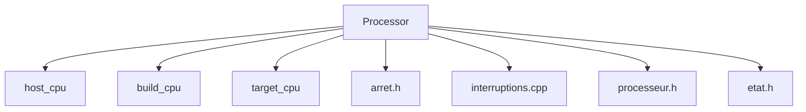

# Processor Overview

The Processor is a critical component within the Machine Components directory. It is responsible for executing instructions and managing the overall operation of the virtual machine.

# Processor Configuration

The Processor interacts with various macros such as <SwmToken path="src/machine/elements/processeur/Makefile.in" pos="377:0:0" line-data="host_cpu = @host_cpu@">`host_cpu`</SwmToken>, <SwmToken path="src/machine/elements/processeur/Makefile.in" pos="366:0:0" line-data="build_cpu = @build_cpu@">`build_cpu`</SwmToken>, and <SwmToken path="src/machine/elements/processeur/Makefile.in" pos="401:0:0" line-data="target_cpu = @target_cpu@">`target_cpu`</SwmToken> defined in the <SwmPath>[Makefile.in](Makefile.in)</SwmPath> files. These macros help in configuring the processor for different environments and targets.

<SwmSnippet path="/src/machine/elements/processeur/Makefile.in" line="375">

---

The Processor interacts with the <SwmToken path="src/machine/elements/processeur/Makefile.in" pos="377:0:0" line-data="host_cpu = @host_cpu@">`host_cpu`</SwmToken> macro to <SwmPath>[configure](configure)</SwmPath> the processor for the host environment.

```in
host = @host@
host_alias = @host_alias@
host_cpu = @host_cpu@
host_os = @host_os@
host_vendor = @host_vendor@
```

---

</SwmSnippet>

# Processor Instructions

The Processor includes several instruction files, such as <SwmPath>[src/machine/elements/processeur/instructions/arret.h](src/machine/elements/processeur/instructions/arret.h)</SwmPath>, which defines the `~ArretMachine` function. This function handles the termination of the machine's operations under specific conditions.

The `~ArretMachine` function in <SwmPath>[src/machine/elements/processeur/instructions/arret.h](src/machine/elements/processeur/instructions/arret.h)</SwmPath> handles the termination of the machine's operations.

# Processor Components

The Processor directory contains various other files like <SwmPath>[src/machine/elements/processeur/interruptions.cpp](src/machine/elements/processeur/interruptions.cpp)</SwmPath>, <SwmPath>[src/machine/elements/processeur/processeur.h](src/machine/elements/processeur/processeur.h)</SwmPath>, and <SwmPath>[src/machine/elements/processeur/etat.h](src/machine/elements/processeur/etat.h)</SwmPath>, which contribute to the processor's functionality by managing interruptions, processor states, and other related tasks.



&nbsp;

*This is an auto-generated document by Swimm 🌊 and has not yet been verified by a human*

<SwmMeta version="3.0.0" repo-id="Z2l0aHViJTNBJTNBc3ZtLTIuNy4yMDI0MTEwNyUzQSUzQVN3aW1tLURlbW8=" repo-name="svm-2.7.20241107"><sup>Powered by [Swimm](/)</sup></SwmMeta>
