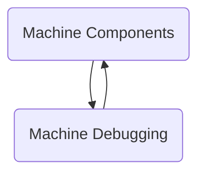

The repository `svm-2.7.20241107` implements a virtual machine environment. It includes functionalities for memory management, communication, boolean operations, and type management through various plugins.

## Main Components

### Global Configuration

Global Configuration refers to the definitions and implementations of macros, templates, and utility functions that are used throughout the virtual machine environment to manage shared pointers, weak pointers, unique pointers, and other global operations. These configurations ensure consistent behavior and provide essential functionalities such as memory management, file handling, and thread naming across the system.

- <SwmLink doc-title="Global configuration overview">[Global configuration overview](.swm/global-configuration-overview.nximdfi1.sw.md)</SwmLink>
- **Systeme**
  - <SwmLink doc-title="Getting started with systeme structure">[Getting started with systeme structure](.swm/getting-started-with-systeme-structure.jkgl2vsr.sw.md)</SwmLink>
- **Installation**
  - <SwmLink doc-title="Exploring installation in global configuration">[Exploring installation in global configuration](.swm/exploring-installation-in-global-configuration.jpoh4s5c.sw.md)</SwmLink>
- **Global**
  - <SwmLink doc-title="Overview of the global namespace">[Overview of the global namespace](.swm/overview-of-the-global-namespace.4iy6kkhk.sw.md)</SwmLink>
- **Build tools**
  - <SwmLink doc-title="Building the global directory with makefile">[Building the global directory with makefile](.swm/building-the-global-directory-with-makefile.mkpy7g7c.sw.md)</SwmLink>

### Machine Components

Machine components are essential for managing memory, processes, synchronization, and debugging within the virtual machine environment.

- <SwmLink doc-title="Overview of machine components">[Overview of machine components](.swm/overview-of-machine-components.t2xkgh8o.sw.md)</SwmLink>
- **Processor**
  - <SwmLink doc-title="Overview of the processor in machine components">[Overview of the processor in machine components](.swm/overview-of-the-processor-in-machine-components.lnedqkv2.sw.md)</SwmLink>
  - **Build tools**
    - <SwmLink doc-title="Building the processeur directory with makefile">[Building the processeur directory with makefile](.swm/building-the-processeur-directory-with-makefile.m374v463.sw.md)</SwmLink>
    - <SwmLink doc-title="Makefile">[Makefile](.swm/makefile.tjzl4ewg.sw.md)</SwmLink>
    - <SwmLink doc-title="Building the sequenceur component with makefile">[Building the sequenceur component with makefile](.swm/building-the-sequenceur-component-with-makefile.nwef3oik.sw.md)</SwmLink>
  - **Flows**
    - <SwmLink doc-title="Handling pending interruptions flow">[Handling pending interruptions flow](.swm/handling-pending-interruptions-flow.mu3rcf19.sw.md)</SwmLink>
    - <SwmLink doc-title="Handling memory change notifications">[Handling memory change notifications](.swm/handling-memory-change-notifications.fz0i9pmy.sw.md)</SwmLink>
    - <SwmLink doc-title="Execution flow overview">[Execution flow overview](.swm/execution-flow-overview.4nox7qvw.sw.md)</SwmLink>
    - <SwmLink doc-title="Execution flow overview">[Execution flow overview](.swm/execution-flow-overview.6bo3ee6j.sw.md)</SwmLink>
    - <SwmLink doc-title="Execution flow overview">[Execution flow overview](.swm/execution-flow-overview.6h53026n.sw.md)</SwmLink>
    - <SwmLink doc-title="Handling write breakpoint flow">[Handling write breakpoint flow](.swm/handling-write-breakpoint-flow.iy4dahy3.sw.md)</SwmLink>
- **Base**
  - <SwmLink doc-title="Overview of the base struct">[Overview of the base struct](.swm/overview-of-the-base-struct.up1j5gxb.sw.md)</SwmLink>
  - **Build tools**
    - <SwmLink doc-title="Building the base elements with makefile">[Building the base elements with makefile](.swm/building-the-base-elements-with-makefile.934iayy2.sw.md)</SwmLink>
- **Noyau**
  - <SwmLink doc-title="Getting started with noyau core component">[Getting started with noyau core component](.swm/getting-started-with-noyau-core-component.x4ayv3kw.sw.md)</SwmLink>
  - **Build tools**
    - <SwmLink doc-title="Building the noyau directory with makefile">[Building the noyau directory with makefile](.swm/building-the-noyau-directory-with-makefile.xzy77i4p.sw.md)</SwmLink>
- **Processus**
  - <SwmLink doc-title="Basic concepts of process management">[Basic concepts of process management](.swm/basic-concepts-of-process-management.j4zgn08o.sw.md)</SwmLink>
  - **Build tools**
    - <SwmLink doc-title="Building the processus directory with makefile">[Building the processus directory with makefile](.swm/building-the-processus-directory-with-makefile.78uk2z3c.sw.md)</SwmLink>
  - **Flows**
    - <SwmLink doc-title="Process creation and management flow">[Process creation and management flow](.swm/process-creation-and-management-flow.tcganf8r.sw.md)</SwmLink>
- **Synchronisation**
  - <SwmLink doc-title="Introduction to synchronisation in machine components">[Introduction to synchronisation in machine components](.swm/introduction-to-synchronisation-in-machine-components.44gnalwl.sw.md)</SwmLink>
  - **Build tools**
    - <SwmLink doc-title="Makefile">[Makefile](.swm/makefile.jn1gctqf.sw.md)</SwmLink>
- **Memoire**
  - <SwmLink doc-title="Memory management in virtual machine environment">[Memory management in virtual machine environment](.swm/memory-management-in-virtual-machine-environment.xhz8acjb.sw.md)</SwmLink>
  - **Build tools**
    - <SwmLink doc-title="Makefile">[Makefile](.swm/makefile.ebmptdyg.sw.md)</SwmLink>
  - **Flows**
    - <SwmLink doc-title="Handling memory operations">[Handling memory operations](.swm/handling-memory-operations.c032hn0f.sw.md)</SwmLink>
    - <SwmLink doc-title="Handling memory operations">[Handling memory operations](.swm/handling-memory-operations.kmivejv9.sw.md)</SwmLink>
    - <SwmLink doc-title="Memory allocation and quota management flow">[Memory allocation and quota management flow](.swm/memory-allocation-and-quota-management-flow.k0vt6r2f.sw.md)</SwmLink>
  - **Classes**
    - <SwmLink doc-title="The booleen class">[The booleen class](.swm/the-booleen-class.lr13s.sw.md)</SwmLink>
- **Systeme**
  - <SwmLink doc-title="Exploring the systeme component">[Exploring the systeme component](.swm/exploring-the-systeme-component.2xo6jcmj.sw.md)</SwmLink>
  - **Build tools**
    - <SwmLink doc-title="Building the systeme directory with makefile">[Building the systeme directory with makefile](.swm/building-the-systeme-directory-with-makefile.9a1j3rei.sw.md)</SwmLink>
  - **Flows**
    - <SwmLink doc-title="System creation and management flow">[System creation and management flow](.swm/system-creation-and-management-flow.cl7fpd9o.sw.md)</SwmLink>
- **Ordonnanceur**
  - <SwmLink doc-title="Introduction to ordonnanceur">[Introduction to ordonnanceur](.swm/introduction-to-ordonnanceur.6y6guz6v.sw.md)</SwmLink>
  - **Build tools**
    - <SwmLink doc-title="Building the ordonnanceur directory with makefile">[Building the ordonnanceur directory with makefile](.swm/building-the-ordonnanceur-directory-with-makefile.dkdhmrt9.sw.md)</SwmLink>
  - **Flows**
    - <SwmLink doc-title="Handling system events flow">[Handling system events flow](.swm/handling-system-events-flow.fyczevy3.sw.md)</SwmLink>
- **Valeur**
  - <SwmLink doc-title="Overview of valeur components">[Overview of valeur components](.swm/overview-of-valeur-components.6m9pojqf.sw.md)</SwmLink>
  - **Build tools**
    - <SwmLink doc-title="Building the valeur elements with makefile">[Building the valeur elements with makefile](.swm/building-the-valeur-elements-with-makefile.pd6xfwm7.sw.md)</SwmLink>
  - **Classes**
    - <SwmLink doc-title="The adressehorsmemoire class">[The adressehorsmemoire class](.swm/the-adressehorsmemoire-class.ctlt0.sw.md)</SwmLink>
    - <SwmLink doc-title="The parametremarqueur class">[The parametremarqueur class](.swm/the-parametremarqueur-class.ysp7b.sw.md)</SwmLink>
- **Programme**
  - <SwmLink doc-title="Introduction to programme namespace in machine components">[Introduction to programme namespace in machine components](.swm/introduction-to-programme-namespace-in-machine-components.uj11dx0n.sw.md)</SwmLink>
  - **Build tools**
    - <SwmLink doc-title="Building the programme directory with makefile">[Building the programme directory with makefile](.swm/building-the-programme-directory-with-makefile.2yjx1z71.sw.md)</SwmLink>
    - <SwmLink doc-title="Building the analyseur directory with makefile">[Building the analyseur directory with makefile](.swm/building-the-analyseur-directory-with-makefile.4nspjmdv.sw.md)</SwmLink>
  - **Classes**
    - <SwmLink doc-title="The lecturememoire class">[The lecturememoire class](.swm/the-lecturememoire-class.5x1pp.sw.md)</SwmLink>
    - <SwmLink doc-title="The adressedepuispointeur class">[The adressedepuispointeur class](.swm/the-adressedepuispointeur-class.rnigj.sw.md)</SwmLink>
    - <SwmLink doc-title="The parametremotclef class">[The parametremotclef class](.swm/the-parametremotclef-class.7mdaq.sw.md)</SwmLink>
- **Build tools**
  - <SwmLink doc-title="Building the elements directory with makefile">[Building the elements directory with makefile](.swm/building-the-elements-directory-with-makefile.j1oy9crn.sw.md)</SwmLink>

### Machine Debugging

Machine debugging involves identifying, analyzing, and resolving issues within a virtual machine environment, including creating and managing breakpoints, handling exceptions, and tracing execution flow.

- <SwmLink doc-title="Machine debugging overview">[Machine debugging overview](.swm/machine-debugging-overview.ee5e4pca.sw.md)</SwmLink>
- **Debugger**
  - <SwmLink doc-title="Debugger overview">[Debugger overview](.swm/debugger-overview.fw15ps61.sw.md)</SwmLink>
- **Protocols**
  - <SwmLink doc-title="Overview of communication protocols">[Overview of communication protocols](.swm/overview-of-communication-protocols.kejcfkx7.sw.md)</SwmLink>
- **Security**
  - <SwmLink doc-title="Getting started with security in machine debugging">[Getting started with security in machine debugging](.swm/getting-started-with-security-in-machine-debugging.5m8u9zfu.sw.md)</SwmLink>
- **Analysis**
  - <SwmLink doc-title="Getting started with analysis in machine debugging">[Getting started with analysis in machine debugging](.swm/getting-started-with-analysis-in-machine-debugging.frqx9bxv.sw.md)</SwmLink>
  - **Build tools**
    - <SwmLink doc-title="Makefile">[Makefile](.swm/makefile.5j788adw.sw.md)</SwmLink>
- **Build tools**
  - <SwmLink doc-title="Building the debugger with makefile">[Building the debugger with makefile](.swm/building-the-debugger-with-makefile.fweaxxh8.sw.md)</SwmLink>
- **Flows**
  - <SwmLink doc-title="Client connection and communication flow">[Client connection and communication flow](.swm/client-connection-and-communication-flow.670rw5iy.sw.md)</SwmLink>
- **Classes**
  - <SwmLink doc-title="The entier class">[The entier class](.swm/the-entier-class.ufg1r.sw.md)</SwmLink>

### Machine Extensions

Machine Extensions are components that enhance the functionality of the virtual machine by providing modular enhancements and specific error handling mechanisms.

- <SwmLink doc-title="Machine extensions overview">[Machine extensions overview](.swm/machine-extensions-overview.vaqj1ntj.sw.md)</SwmLink>
- **Patron Object**
  - <SwmLink doc-title="Introduction to patron object in machine extensions">[Introduction to patron object in machine extensions](.swm/introduction-to-patron-object-in-machine-extensions.z2c6fnmb.sw.md)</SwmLink>
  - **Classes**
    - <SwmLink doc-title="The patrontypeextension class">[The patrontypeextension class](.swm/the-patrontypeextension-class.2b4u1.sw.md)</SwmLink>
- **Reference Object**
  - <SwmLink doc-title="Introduction to reference object in machine extensions">[Introduction to reference object in machine extensions](.swm/introduction-to-reference-object-in-machine-extensions.7mvm7q5x.sw.md)</SwmLink>
- **Automate**
  - <SwmLink doc-title="Basic concepts of automate in machine extensions">[Basic concepts of automate in machine extensions](.swm/basic-concepts-of-automate-in-machine-extensions.afjo7883.sw.md)</SwmLink>
- **Analyseur**
  - <SwmLink doc-title="Introduction to analyser">[Introduction to analyser](.swm/introduction-to-analyser.tv81s1yj.sw.md)</SwmLink>
  - **Build tools**
    - <SwmLink doc-title="Building the analyseur extension with makefile">[Building the analyseur extension with makefile](.swm/building-the-analyseur-extension-with-makefile.m6tjvizf.sw.md)</SwmLink>
- **Gestionnaire**
  - <SwmLink doc-title="Introduction to extension manager">[Introduction to extension manager](.swm/introduction-to-extension-manager.x2yl835o.sw.md)</SwmLink>
  - **Build tools**
    - <SwmLink doc-title="Building the gestionnaire extension with makefile">[Building the gestionnaire extension with makefile](.swm/building-the-gestionnaire-extension-with-makefile.s2754kd7.sw.md)</SwmLink>
- **Build tools**
  - <SwmLink doc-title="Building the extensions with makefile">[Building the extensions with makefile](.swm/building-the-extensions-with-makefile.ecp6j8pv.sw.md)</SwmLink>
- **Classes**
  - <SwmLink doc-title="The regexparametresjokertotal class">[The regexparametresjokertotal class](.swm/the-regexparametresjokertotal-class.lv0yv.sw.md)</SwmLink>
  - <SwmLink doc-title="The type class">[The type class](.swm/the-type-class.nnx5r.sw.md)</SwmLink>

### Machine Interruption

Machine Interruption refers to the handling of hardware signals and exceptions within the virtual machine.

- <SwmLink doc-title="Machine interruption handling overview">[Machine interruption handling overview](.swm/machine-interruption-handling-overview.b8snn027.sw.md)</SwmLink>
- **Interruption Management**
  - <SwmLink doc-title="Basic concepts of interruption management">[Basic concepts of interruption management](.swm/basic-concepts-of-interruption-management.7r4ayirv.sw.md)</SwmLink>
- **Interruption Handling**
  - <SwmLink doc-title="Basic concepts of interruption handling">[Basic concepts of interruption handling](.swm/basic-concepts-of-interruption-handling.49byw9es.sw.md)</SwmLink>
- **Interruption Configuration**
  - <SwmLink doc-title="Overview of interruption configuration">[Overview of interruption configuration](.swm/overview-of-interruption-configuration.9iqyi3ht.sw.md)</SwmLink>
- **Build tools**
  - <SwmLink doc-title="Building the interruption component with makefile">[Building the interruption component with makefile](.swm/building-the-interruption-component-with-makefile.8qom7z16.sw.md)</SwmLink>

### Startup

Startup refers to the initialization and launching process of the virtual machine environment.

- <SwmLink doc-title="Virtual machine startup overview">[Virtual machine startup overview](.swm/virtual-machine-startup-overview.ufix2xuh.sw.md)</SwmLink>
- **Startup Components**
  - <SwmLink doc-title="Getting started with startup components">[Getting started with startup components](.swm/getting-started-with-startup-components.kv6bdvva.sw.md)</SwmLink>
  - **Build tools**
    - <SwmLink doc-title="Building the lanceur directory with makefile">[Building the lanceur directory with makefile](.swm/building-the-lanceur-directory-with-makefile.k6btjpbl.sw.md)</SwmLink>
    - <SwmLink doc-title="Building the binaire directory with makefile">[Building the binaire directory with makefile](.swm/building-the-binaire-directory-with-makefile.vqcu0055.sw.md)</SwmLink>
  - **Flows**
    - <SwmLink doc-title="Main function flow">[Main function flow](.swm/main-function-flow.nhh3hxlr.sw.md)</SwmLink>
- **Analyseur**
  - <SwmLink doc-title="Introduction to analyseur">[Introduction to analyseur](.swm/introduction-to-analyseur.t4ggnjdx.sw.md)</SwmLink>
  - **Build tools**
    - <SwmLink doc-title="Makefile">[Makefile](.swm/makefile.dr6mci0x.sw.md)</SwmLink>
- **Build tools**
  - <SwmLink doc-title="Building the demarrage directory with makefile">[Building the demarrage directory with makefile](.swm/building-the-demarrage-directory-with-makefile.hjyzrzsg.sw.md)</SwmLink>

### Flows

- <SwmLink doc-title="Managing breakpoints during debugging">[Managing breakpoints during debugging](.swm/managing-breakpoints-during-debugging.idl53xuu.sw.md)</SwmLink>
- <SwmLink doc-title="Managing and displaying process information">[Managing and displaying process information](.swm/managing-and-displaying-process-information.gcvm7jc5.sw.md)</SwmLink>
- <SwmLink doc-title="Managing kernel processor and code views">[Managing kernel processor and code views](.swm/managing-kernel-processor-and-code-views.adw8u5wz.sw.md)</SwmLink>
- <SwmLink doc-title="Handling message commands in svm">[Handling message commands in svm](.swm/handling-message-commands-in-svm.6zkzd74o.sw.md)</SwmLink>
- <SwmLink doc-title="Handling lost connections in svm">[Handling lost connections in svm](.swm/handling-lost-connections-in-svm.mfrdewra.sw.md)</SwmLink>

## Classes

- <SwmLink doc-title="The cocheformulaire class">[The cocheformulaire class](.swm/the-cocheformulaire-class.e0g1d.sw.md)</SwmLink>

&nbsp;

*This is an auto-generated document by Swimm 🌊 and has not yet been verified by a human*

<SwmMeta version="3.0.0" repo-id="Z2l0aHViJTNBJTNBc3ZtLTIuNy4yMDI0MTEwNyUzQSUzQVN3aW1tLURlbW8=" repo-name="svm-2.7.20241107">Powered by [Swimm](/)</SwmMeta>
