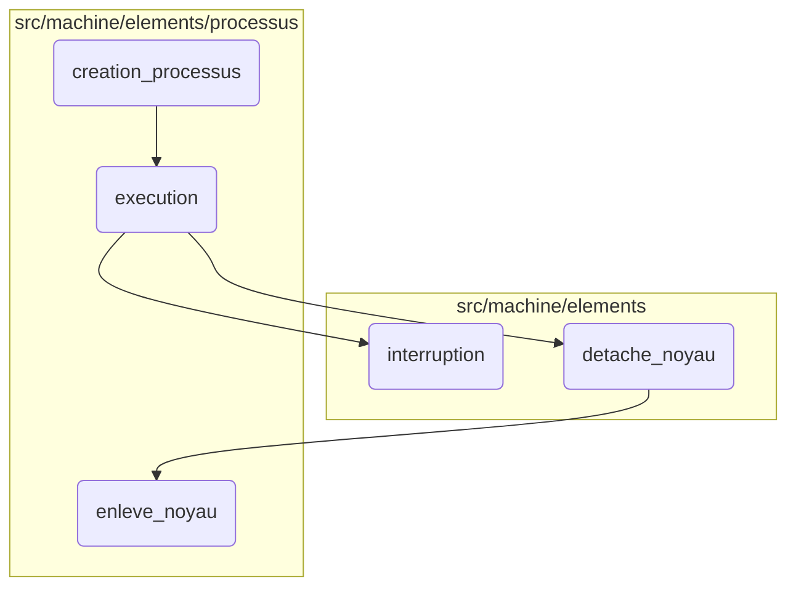
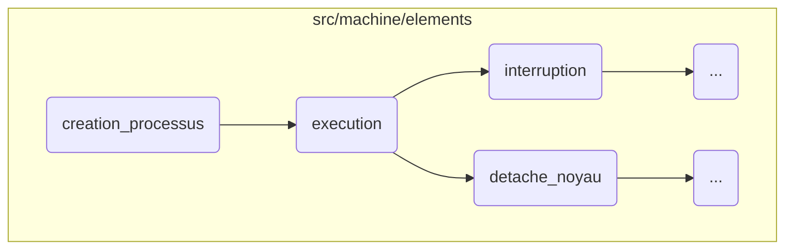
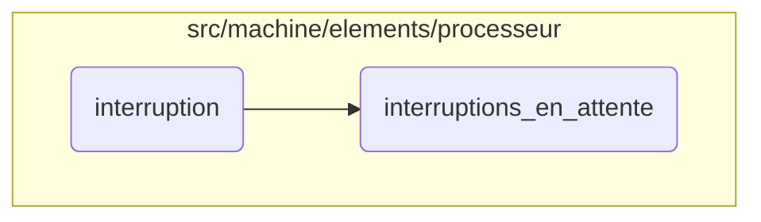
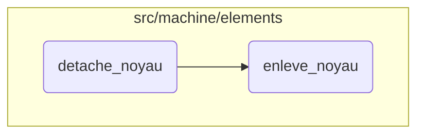

In this document, we will explain the process of creating and managing processes. The process involves the following steps: creating a new process, executing the process, handling interruptions, and detaching the kernel.

The flow starts with creating a new process, which involves initializing it with necessary parameters and adding it to the system. Next, the process is executed in a separate thread, where it manages the current kernel and handles any interruptions or errors. If an interruption occurs, it is added to the list of pending interruptions and processed accordingly. Finally, the kernel is detached from the process, ensuring that all necessary clean-up actions are performed.

Here is a high level diagram of the flow, showing only the most important functions:



# Flow drill down

First, we'll zoom into this section of the flow:



<SwmSnippet path="/src/machine/elements/processus/processus.cpp" line="52">

---

## Process Creation

First, the <SwmToken path="src/machine/elements/processus/processus.cpp" pos="52:4:4" line-data="ProcessusSP Processus::creation_processus(const std::string&amp; nom, const SVM::Machine::Element::Systeme::SystemeSP&amp; systeme, const SVM_Base::BaseSP&amp; base, const SVM_Valeur::PointEntreeExtensionSP&amp; sequenceur, const bool terminaison_automatique, SVM_Noyau::NoyauSP&amp; noyau)">`creation_processus`</SwmToken> function is responsible for creating a new process. It initializes the process with a name, system, base, and other parameters. The process is then added to the system and its execution is started.

```c++
ProcessusSP Processus::creation_processus(const std::string& nom, const SVM::Machine::Element::Systeme::SystemeSP& systeme, const SVM_Base::BaseSP& base, const SVM_Valeur::PointEntreeExtensionSP& sequenceur, const bool terminaison_automatique, SVM_Noyau::NoyauSP& noyau)
{
	auto processus = std::make_shared<Processus>(nom,systeme,base,terminaison_automatique);
	processus->_sequenceur = SVM_Sequenceur::Sequenceur::creation_sequenceur(base->_debugueur,sequenceur,processus);
	processus->_adresse=SVM_Systeme::Livraison::adresse(processus->shared_from_this());
	processus->_livraison->creation_boite(processus->_adresse);
	//base->_gestionnaire_extensions->initialisation_processus(processus,noyau);
	SVM_Interface::EnvironnementSP environnement;
	processus->_sequenceur->attache_noyau(noyau,environnement,0,nullptr);
	systeme->ajoute_processus(processus);
	processus->execution();
	processus->_piege = SVM_Debugueur::Debugueur::ajoute_piege<PiegeProcessus>(base->_debugueur,processus);
	static std::atomic<unsigned long long> identifiant(0);
	processus->_identifiant = ++identifiant;
	return processus;
```

---

</SwmSnippet>

<SwmSnippet path="/src/machine/elements/processus/processus.cpp" line="87">

---

## Process Execution

Next, the <SwmToken path="src/machine/elements/processus/processus.cpp" pos="87:4:4" line-data="void Processus::execution()">`execution`</SwmToken> function handles the execution of the process. It runs the process in a separate thread, manages the current kernel, and handles any interruptions or errors that occur during execution. The function ensures that the process state is updated and notifies the system of any changes.

```c++
void Processus::execution()
{
	try
	{
		_travailleur = std::thread([this] ()
		{
		SVM_TRACE("PROCESS " << _nom << " depart travailleur");
		std::lock_guard<std::mutex> protege(_execution);
		if(not _etat.executable())
			return;
		SVM_Valeur::InterruptionSP interruption_transmise;
		for( ; ; )
		{
			
			try
			{
				_noyau_courant = _sequenceur->noyau_courant();
				if(static_cast<bool>(_piege)) { _piege->notification_changement_objet(); }
			}
			catch(SVM_Valeur::Interruption& i)
			{
```

---

</SwmSnippet>

<SwmSnippet path="/src/machine/elements/sequenceur/sequenceur_defaut.cpp" line="40">

---

## Kernel Detachment

Finally, the <SwmToken path="src/machine/elements/sequenceur/sequenceur_defaut.cpp" pos="40:4:4" line-data="bool SequenceurDefaut::detache_noyau(const SVM_Noyau::NoyauSP&amp; noyau, SVM_Interface::EnvironnementSP&amp; env_parent, const size_t argc, SVM_Parameter *argv)">`detache_noyau`</SwmToken> function is responsible for detaching the kernel from the process. It checks if the kernel is currently attached and, if so, removes it from the process, resets the kernel's process and sequencer, and notifies any observers of the change.

```c++
bool SequenceurDefaut::detache_noyau(const SVM_Noyau::NoyauSP& noyau, SVM_Interface::EnvironnementSP& env_parent, const size_t argc, SVM_Parameter *argv)
{
	if(static_cast<bool>(_noyau) and (noyau==_noyau))
	{
		auto processus = _processus.lock();
		processus->enleve_noyau(noyau);
		_noyau->_processus.reset();
		_noyau->_sequenceur.reset();
		_noyau.reset();
		if(static_cast<bool>(_piege)) { _piege->notification_changement_objet(); }
		if(static_cast<bool>(noyau->_piege)) { noyau->_piege->notification_changement_objet(); }
		return true;
	}
	return false;
}
```

---

</SwmSnippet>

Now, lets zoom into this section of the flow:



<SwmSnippet path="/src/machine/elements/processeur/processeur.h" line="254">

---

## Handling Interruptions

First, the <SwmToken path="src/machine/elements/processeur/processeur.h" pos="254:3:3" line-data="		void interruption(const SVM_Valeur::Interruption&amp; i)">`interruption`</SwmToken> function is called when an interruption occurs. It adds the interruption to the list of pending interruptions. If there is a trap set (<SwmToken path="src/machine/elements/processeur/processeur.h" pos="257:8:8" line-data="			if(static_cast&lt;bool&gt;(_piege)) { _piege-&gt;interruptions_en_attente(_interruptions_en_attente); }">`_piege`</SwmToken>), it updates the trap with the current list of pending interruptions.

```c
		void interruption(const SVM_Valeur::Interruption& i)
		{
			_interruptions_en_attente.push_back(i);
			if(static_cast<bool>(_piege)) { _piege->interruptions_en_attente(_interruptions_en_attente); }
		}
```

---

</SwmSnippet>

<SwmSnippet path="/src/machine/elements/processeur/processeur.cpp" line="425">

---

## Managing Pending Interruptions

Next, the <SwmToken path="src/machine/elements/processeur/processeur.cpp" pos="425:4:4" line-data="void PiegeProcesseur::interruptions_en_attente(const std::list&lt;SVM_Valeur::Interruption&gt;&amp; interruptions, const bool point_arret)">`interruptions_en_attente`</SwmToken> method processes the list of pending interruptions. It creates a JSON object to represent the interruptions and notifies the debugger of the changes. If a breakpoint is set, it checks if any of the pending interruptions match the trap conditions and triggers the breakpoint if necessary.

```c++
void PiegeProcesseur::interruptions_en_attente(const std::list<SVM_Valeur::Interruption>& interruptions, const bool point_arret)
{
	auto e = SVM_Debugueur::JSON::objet();
	auto ia = SVM_Debugueur::JSON::tableau();
	for(const auto& i: interruptions)
	{
		ia->ajoute(i.debugueur());
	}
	e->ajoute("waiting_interruptions",ia);
	notification_evenement_objet(SVM_Debugueur::Evenement::Categorie::CHANGEMENT_OBJET,e);
	if(not point_arret) return;
	auto processeur = _processeur.lock();
	if(not processeur) return;
	bool arret = false;
	std::ostringstream oss;
	oss << "With:";
	for(const auto& i : processeur->_interruptions_en_attente)
	{
		if(_interruptions.find(i)!=_interruptions.end())
		{
			arret = true;
```

---

</SwmSnippet>

Now, lets zoom into this section of the flow:



<SwmSnippet path="/src/machine/elements/processus/processus.h" line="210">

---

## Removing the Kernel

The function <SwmToken path="src/machine/elements/processus/processus.h" pos="210:3:3" line-data="		void enleve_noyau(const SVM_Noyau::NoyauSP&amp; noyau)">`enleve_noyau`</SwmToken> is responsible for removing the kernel from the list of kernels. It first searches for the kernel in the list, and if found, it removes it. After removing the kernel, it checks if there is a trap set, and if so, it triggers a notification of the object change.

```c
		void enleve_noyau(const SVM_Noyau::NoyauSP& noyau)
		{
			auto it = _noyaux.find(noyau);
			if(it!=_noyaux.end())
			{
				_noyaux.erase(it);
				if(static_cast<bool>(_piege)) { _piege->notification_changement_objet(); }
			}
		}
```

---

</SwmSnippet>

&nbsp;

*This is an auto-generated document by Swimm 🌊 and has not yet been verified by a human*

<SwmMeta version="3.0.0" repo-id="Z2l0aHViJTNBJTNBc3ZtLTIuNy4yMDI0MTEwNyUzQSUzQVN3aW1tLURlbW8=" repo-name="svm-2.7.20241107"><sup>Powered by [Swimm](/)</sup></SwmMeta>
