This document explains the process of creating and managing a system. The process involves initializing the system, executing processes, checking for alive processes, requesting termination, posting events, and generating UML descriptions.

The flow starts with initializing the system by setting up necessary components and schedulers. Then, it moves on to executing processes, where each process is initialized and attached to a scheduler. The system continuously checks if there are any alive processes and requests termination if none are found. Events are posted to the system's delivery box, and UML descriptions are generated for debugging and logging purposes.

# Flow drill down

```mermaid
graph TD;
      subgraph srcmachineelementssysteme["src/machine/elements/systeme"]
fdf60cd4b1764b9b3107634bfa31428600a30ea526a5f3a6f0471ccde1328424(creation_systeme) --> 497f680a3d96272984d9e1dd60c9ca6a02ec7a63532ef91a95f96edd941b7e9e(execution)
end

subgraph srcmachineelementssysteme["src/machine/elements/systeme"]
497f680a3d96272984d9e1dd60c9ca6a02ec7a63532ef91a95f96edd941b7e9e(execution) --> 96812150bc079d9cca6959d491703d60180e87b328337fc779e5a5a15151ae90(encore_un_vivant)
end

subgraph srcmachineelementssysteme["src/machine/elements/systeme"]
96812150bc079d9cca6959d491703d60180e87b328337fc779e5a5a15151ae90(encore_un_vivant) --> 94830d289b0509adc3e59a7e49fdab43042b7ebfadd0464b59c3ab9ce1fc2665(terminaison_demandee)
end

subgraph srcmachineelementssysteme["src/machine/elements/systeme"]
94830d289b0509adc3e59a7e49fdab43042b7ebfadd0464b59c3ab9ce1fc2665(terminaison_demandee) --> 9f08e79bb502c881aa66eb8541c637540e32265f8108ada17e0608a12e369cd1(poste)
end

subgraph srcmachineelementssysteme["src/machine/elements/systeme"]
9f08e79bb502c881aa66eb8541c637540e32265f8108ada17e0608a12e369cd1(poste) --> 820c98d8e2719c305bd02f2b31d10131eb814b3080dc7edaf6ddc6390e3e2c77(uml)
end


      classDef mainFlowStyle color:#000000,fill:#7CB9F4
classDef rootsStyle color:#000000,fill:#00FFF4
classDef Style1 color:#000000,fill:#00FFAA
classDef Style2 color:#000000,fill:#FFFF00
classDef Style3 color:#000000,fill:#AA7CB9
```



<SwmSnippet path="/src/machine/elements/systeme/systeme.cpp" line="37">

---

## Initializing the System

First, the <SwmToken path="src/machine/elements/systeme/systeme.cpp" pos="37:4:4" line-data="SystemeSP Systeme::creation_systeme(const SVM_Machine::MachineSP&amp; machine)">`creation_systeme`</SwmToken> function initializes the system by creating a shared pointer to a new <SwmToken path="src/machine/elements/systeme/systeme.cpp" pos="37:2:2" line-data="SystemeSP Systeme::creation_systeme(const SVM_Machine::MachineSP&amp; machine)">`Systeme`</SwmToken> object. It sets up the system's address, delivery box, and debugger traps. It also initializes the hardware interrupt manager and the extension manager. Default and extension schedulers are created and added to the system's schedulers list. Finally, all schedulers are executed.

```c++
SystemeSP Systeme::creation_systeme(const SVM_Machine::MachineSP& machine)
{
	auto systeme = std::make_shared<Systeme>(machine);
	systeme->_adresse = Livraison::adresse(systeme->shared_from_this()); 
	systeme->_livraison->creation_boite(systeme->_adresse);
	systeme->_livraison->_piege = SVM::Machine::Debugueur::Debugueur::ajoute_piege<PiegeEvenements>(machine->_base->_debugueur);
	machine->_base->_gestionnaire_interruptions_materielles->_systeme = systeme;
	machine->_base->_gestionnaire_extensions->initialisation_generale(machine);
	auto ord_defaut = SVM_Ordonnanceur::OrdonnanceurDefaut::creation_ordonnanceur(systeme->shared_from_this());
	systeme->_ordonnanceurs.insert(std::make_pair(SVM_Valeur::PointEntreeExtensionSP(),ord_defaut));
	for(auto& o : machine->_base->_gestionnaire_extensions->liste_ordonannanceurs())
	{
		auto nom = std::make_shared<SVM_Valeur::PointEntreeExtension>(o);
		auto ord_extension = SVM_Ordonnanceur::OrdonnanceurExtension::creation_ordonnanceur(nom,systeme->shared_from_this());
		systeme->_ordonnanceurs.insert(std::make_pair(nom,ord_extension));
	}
	for(auto& o: systeme->_ordonnanceurs)
	{
		o.second->execution();
	}
	return systeme;
```

---

</SwmSnippet>

<SwmSnippet path="/src/machine/elements/systeme/systeme.cpp" line="60">

---

## Executing Processes

Next, the <SwmToken path="src/machine/elements/systeme/systeme.cpp" pos="60:4:4" line-data="int Systeme::execution(const SVM::Machine::MachineSP&amp; machine, std::vector&lt;SVM_Machine::Processus&gt;&amp; liste_processus)">`execution`</SwmToken> function manages the execution of processes. It starts by initializing the general extensions and checking if there are any processes to execute. Each process is initialized with memory and attached to a scheduler. If a process is ready, it is marked as such; otherwise, it is terminated and removed. The function then enters a loop to handle events, process terminations, and scheduler detachments. It ensures that all processes are either executed or terminated properly.

```c++
int Systeme::execution(const SVM::Machine::MachineSP& machine, std::vector<SVM_Machine::Processus>& liste_processus)
{
	size_t retour_naturel = 0;
	bool au_moins_un = false;
	bool alerte_au_moins_un_vivant = false;
	SHARED_PTR(size_t) retour;
	{
		machine->_base->_gestionnaire_extensions->demarrage_general(machine);
		if(liste_processus.empty())
			return 0;
		for(auto& p: liste_processus)
		{
			try
			{
				auto memoire = SVM_Memoire::Memoire::creation_memoire(machine->_base->_debugueur,SVM_Noyau::ControleAccesSP());
				p.initialise(memoire);
				SVM_Processus::ProcessusSP processus = SVM_Processus::Processus::creation_processus(p._nom,this->shared_from_this(),machine->_base,p._sequenceur,p._terminaison_automatique,p._code,memoire);
				auto ordonnanceur = _ordonnanceurs.find(p._ordonnanceur);
				ordonnanceur->second->attache(_adresse,processus,0);
				if(attente_reponse(processus))
				{
```

---

</SwmSnippet>

<SwmSnippet path="/src/machine/elements/systeme/systeme.cpp" line="363">

---

## Checking for Alive Processes

Moving to the <SwmToken path="src/machine/elements/systeme/systeme.cpp" pos="363:4:4" line-data="void Systeme::encore_un_vivant(bool&amp; alerte)">`encore_un_vivant`</SwmToken> function, it checks if there are any alive processes. If no processes are alive and no alert has been raised, it logs that no processes are alive and requests termination for all processes.

```c++
void Systeme::encore_un_vivant(bool& alerte)
{
	bool encore_un_vivant = false;
	auto lp = this->liste_processus();
	for(auto& p : lp)
	{
		encore_un_vivant |= p->vivant();
	}
	if(not encore_un_vivant and not alerte)
	{
		SVM_TRACE("Aucun processus vivant");
		for(auto& p : this->liste_processus())
		{
			p->terminaison_demandee(_adresse);
		}
		alerte = true;
	}
}
```

---

</SwmSnippet>

<SwmSnippet path="/src/machine/elements/systeme/systeme.cpp" line="314">

---

## Requesting Termination

Then, the <SwmToken path="src/machine/elements/systeme/systeme.cpp" pos="314:4:4" line-data="void Systeme::terminaison_demandee()">`terminaison_demandee`</SwmToken> function posts a termination event to the system's delivery box, signaling that the system should terminate.

```c++
void Systeme::terminaison_demandee()
{
	_livraison->poste(_adresse,_adresse,std::make_shared<SVM_Systeme::Evenement>(SVM_Systeme::Evenement::Type::TERMINAISON));
}
```

---

</SwmSnippet>

<SwmSnippet path="/src/machine/elements/systeme/evenement.h" line="187">

---

## Posting Events

The <SwmToken path="src/machine/elements/systeme/evenement.h" pos="187:3:3" line-data="		void poste(const SVM::Machine::Element::Synchronisation::AdresseSP&amp; source, const SVM::Machine::Element::Synchronisation::AdresseSP&amp; destination, const EvenementSP&amp; evenement)">`poste`</SwmToken> function is responsible for posting events. It locks the event list, creates a JSON object for the event, and adds it to the event list. It also notifies the debugger about the new event.

```c
		void poste(const SVM::Machine::Element::Synchronisation::AdresseSP& source, const SVM::Machine::Element::Synchronisation::AdresseSP& destination, const EvenementSP& evenement)
		{
			std::lock_guard<std::mutex> verrou(_protection);
			auto e = SVM_Debugueur::JSON::objet({ { "source" , PiegeEvenements::adresse(source) } , { "target" , PiegeEvenements::adresse(destination) } , { "type" , SVM_Debugueur::JSON::chaine("post") } , { "event" , SVM_Debugueur::JSON::chaine(evenement->uml()) } });
			auto indice = _evenements->taille();
			e->ajoute("id",SVM_Debugueur::JSON::entier(indice));
			_evenements->ajoute(e);
			_index.insert(std::make_pair(evenement.get(),indice));
			notification_evenement_objet(SVM_Debugueur::Evenement::Categorie::CHANGEMENT_OBJET,e);
		}
```

---

</SwmSnippet>

<SwmSnippet path="/src/machine/elements/systeme/evenement.h" line="124">

---

## Generating UML Descriptions

Finally, the <SwmToken path="src/machine/elements/systeme/evenement.h" pos="124:5:5" line-data="		std::string uml() const">`uml`</SwmToken> function generates a UML description of the event. It creates a string representation of the event based on its type and other attributes, which is used for debugging and logging purposes.

```c
		std::string uml() const
		{
			std::ostringstream oss;
			switch(_type)
			{
				case Type::ETAT: oss << "state " << SVM_Processus::Etat::texte(_etat); break;
				case Type::EXECUTION:
					{
						oss << "execute";
						if(_entier>0)
						{
							oss << " with delay " << _entier << "ms";
						}
						break;
					}
				case Type::SUSPENSION: oss << "suspend"; break;
				case Type::TERMINAISON: oss << "terminate"; break;
				case Type::VERROUILLAGE:
					{
						oss << "lock";
						if(_reponse==Reponse::OUI)
```

---

</SwmSnippet>

&nbsp;

*This is an auto-generated document by Swimm 🌊 and has not yet been verified by a human*

<SwmMeta version="3.0.0" repo-id="Z2l0aHViJTNBJTNBc3ZtLTIuNy4yMDI0MTEwNyUzQSUzQVN3aW1tLURlbW8=" repo-name="svm-2.7.20241107"><sup>Powered by [Swimm](/)</sup></SwmMeta>
