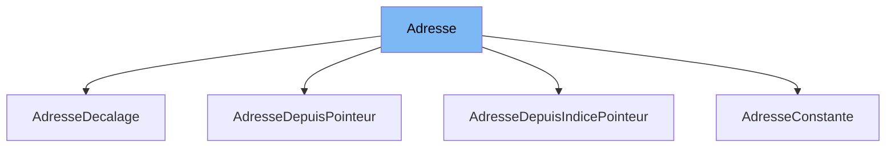

This document will cover the class <SwmToken path="src/machine/elements/programme/adresse_programme.h" pos="84:3:3" line-data="	struct AdresseDepuisPointeur : public Adresse">`AdresseDepuisPointeur`</SwmToken> in the file <SwmPath>[src/machine/elements/programme/adresse_programme.h](src/machine/elements/programme/adresse_programme.h)</SwmPath>. We will cover:

1. What the file <SwmPath>[src/machine/elements/programme/adresse_programme.h](src/machine/elements/programme/adresse_programme.h)</SwmPath> is and what it is used for.
2. What <SwmToken path="src/machine/elements/programme/adresse_programme.h" pos="84:3:3" line-data="	struct AdresseDepuisPointeur : public Adresse">`AdresseDepuisPointeur`</SwmToken> is and its relationship to <SwmToken path="src/machine/elements/programme/adresse_programme.h" pos="38:3:3" line-data="	DECL_SHARED_PTR(Adresse);">`Adresse`</SwmToken>.
3. The variables and functions defined in <SwmToken path="src/machine/elements/programme/adresse_programme.h" pos="84:3:3" line-data="	struct AdresseDepuisPointeur : public Adresse">`AdresseDepuisPointeur`</SwmToken>.



# What is

The file <SwmPath>[src/machine/elements/programme/adresse_programme.h](src/machine/elements/programme/adresse_programme.h)</SwmPath> is part of the Simple Virtual Machine (SVM) project. It defines various classes related to program addresses within the virtual machine. These classes are used to manage and manipulate memory addresses in the context of the SVM's execution environment.

# What is <SwmToken path="src/machine/elements/programme/adresse_programme.h" pos="84:3:3" line-data="	struct AdresseDepuisPointeur : public Adresse">`AdresseDepuisPointeur`</SwmToken>

<SwmToken path="src/machine/elements/programme/adresse_programme.h" pos="84:3:3" line-data="	struct AdresseDepuisPointeur : public Adresse">`AdresseDepuisPointeur`</SwmToken> is a class defined in <SwmPath>[src/machine/elements/programme/adresse_programme.h](src/machine/elements/programme/adresse_programme.h)</SwmPath>. It inherits from the <SwmToken path="src/machine/elements/programme/adresse_programme.h" pos="38:3:3" line-data="	DECL_SHARED_PTR(Adresse);">`Adresse`</SwmToken> class and represents an address derived from a pointer. This class is used to evaluate and manipulate memory addresses based on pointer values within the SVM environment.

<SwmSnippet path="/src/machine/elements/programme/adresse_programme.h" line="95">

---

# Variables and functions

The variable <SwmToken path="src/machine/elements/programme/adresse_programme.h" pos="95:3:3" line-data="			ValeurSP _pointeur;">`_pointeur`</SwmToken> is a private member of the <SwmToken path="src/machine/elements/programme/adresse_programme.h" pos="84:3:3" line-data="	struct AdresseDepuisPointeur : public Adresse">`AdresseDepuisPointeur`</SwmToken> class. It stores a shared pointer to a <SwmToken path="src/machine/elements/programme/adresse_programme.h" pos="28:12:12" line-data="namespace SVM_Valeur = SVM::Machine::Element::Valeur;">`Valeur`</SwmToken> object, which represents the pointer value from which the address is derived.

```c
			ValeurSP _pointeur;
```

---

</SwmSnippet>

<SwmSnippet path="/src/machine/elements/programme/adresse_programme.h" line="89">

---

The function <SwmToken path="src/machine/elements/programme/adresse_programme.h" pos="89:5:5" line-data="		virtual void decoration(SVM_Valeur::Decorateur&amp; decorateur) override;">`decoration`</SwmToken> is an overridden virtual function from the <SwmToken path="src/machine/elements/programme/adresse_programme.h" pos="38:3:3" line-data="	DECL_SHARED_PTR(Adresse);">`Adresse`</SwmToken> class. It takes a <SwmToken path="src/machine/elements/programme/adresse_programme.h" pos="89:9:9" line-data="		virtual void decoration(SVM_Valeur::Decorateur&amp; decorateur) override;">`Decorateur`</SwmToken> object as a parameter and applies decorations to the address.

```c
		virtual void decoration(SVM_Valeur::Decorateur& decorateur) override;
```

---

</SwmSnippet>

<SwmSnippet path="/src/machine/elements/programme/adresse_programme.h" line="90">

---

The function <SwmToken path="src/machine/elements/programme/adresse_programme.h" pos="90:7:7" line-data="		virtual SVM_Valeur::AdresseMemoire evaluation(const SVM_Noyau::NoyauSP&amp; ce) const override;">`evaluation`</SwmToken> is an overridden virtual function from the <SwmToken path="src/machine/elements/programme/adresse_programme.h" pos="38:3:3" line-data="	DECL_SHARED_PTR(Adresse);">`Adresse`</SwmToken> class. It takes a shared pointer to a <SwmToken path="src/machine/elements/programme/adresse_programme.h" pos="27:12:12" line-data="namespace SVM_Noyau = SVM::Machine::Element::Noyau;">`Noyau`</SwmToken> object and returns the evaluated memory address as an <SwmToken path="src/machine/elements/programme/adresse_programme.h" pos="90:5:5" line-data="		virtual SVM_Valeur::AdresseMemoire evaluation(const SVM_Noyau::NoyauSP&amp; ce) const override;">`AdresseMemoire`</SwmToken> object.

```c
		virtual SVM_Valeur::AdresseMemoire evaluation(const SVM_Noyau::NoyauSP& ce) const override;
```

---

</SwmSnippet>

<SwmSnippet path="/src/machine/elements/programme/adresse_programme.h" line="91">

---

The function <SwmToken path="src/machine/elements/programme/adresse_programme.h" pos="91:7:7" line-data="		virtual SVM_Valeur::AdresseMemoire explique_calcul(const SVM_Noyau::NoyauSP&amp; noyau, SVM_Valeur::ArbreSubstitutionSP&amp; arbre) const override;">`explique_calcul`</SwmToken> is an overridden virtual function from the <SwmToken path="src/machine/elements/programme/adresse_programme.h" pos="38:3:3" line-data="	DECL_SHARED_PTR(Adresse);">`Adresse`</SwmToken> class. It takes a shared pointer to a <SwmToken path="src/machine/elements/programme/adresse_programme.h" pos="27:12:12" line-data="namespace SVM_Noyau = SVM::Machine::Element::Noyau;">`Noyau`</SwmToken> object and a shared pointer to an `ArbreSubstitution` object, and returns the calculated memory address as an <SwmToken path="src/machine/elements/programme/adresse_programme.h" pos="91:5:5" line-data="		virtual SVM_Valeur::AdresseMemoire explique_calcul(const SVM_Noyau::NoyauSP&amp; noyau, SVM_Valeur::ArbreSubstitutionSP&amp; arbre) const override;">`AdresseMemoire`</SwmToken> object.

```c
		virtual SVM_Valeur::AdresseMemoire explique_calcul(const SVM_Noyau::NoyauSP& noyau, SVM_Valeur::ArbreSubstitutionSP& arbre) const override;
```

---

</SwmSnippet>

<SwmSnippet path="/src/machine/elements/programme/adresse_programme.h" line="92">

---

The function <SwmToken path="src/machine/elements/programme/adresse_programme.h" pos="92:5:5" line-data="		virtual void format(std::ostream&amp; os) const override;">`format`</SwmToken> is an overridden virtual function from the <SwmToken path="src/machine/elements/programme/adresse_programme.h" pos="38:3:3" line-data="	DECL_SHARED_PTR(Adresse);">`Adresse`</SwmToken> class. It takes an output stream as a parameter and formats the address for output.

```c
		virtual void format(std::ostream& os) const override;
```

---

</SwmSnippet>

<SwmSnippet path="/src/machine/elements/programme/adresse_programme.h" line="93">

---

The function <SwmToken path="src/machine/elements/programme/adresse_programme.h" pos="93:5:5" line-data="		virtual void html(std::ostream&amp; os) const override;">`html`</SwmToken> is an overridden virtual function from the <SwmToken path="src/machine/elements/programme/adresse_programme.h" pos="38:3:3" line-data="	DECL_SHARED_PTR(Adresse);">`Adresse`</SwmToken> class. It takes an output stream as a parameter and formats the address for HTML output.

```c
		virtual void html(std::ostream& os) const override;
```

---

</SwmSnippet>

&nbsp;

*This is an auto-generated document by Swimm 🌊 and has not yet been verified by a human*

<SwmMeta version="3.0.0" repo-id="Z2l0aHViJTNBJTNBc3ZtLTIuNy4yMDI0MTEwNyUzQSUzQVN3aW1tLURlbW8=" repo-name="svm-2.7.20241107"><sup>Powered by [Swimm](/)</sup></SwmMeta>
