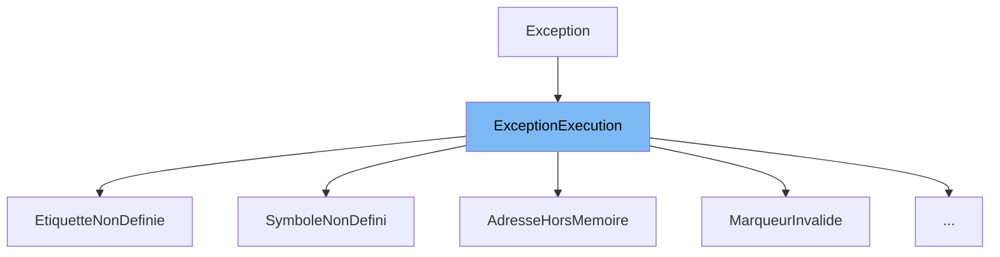

This document will cover the class <SwmToken path="src/machine/elements/valeur/pointeur.h" pos="49:2:2" line-data="struct AdresseHorsMemoire : public ExceptionExecution">`AdresseHorsMemoire`</SwmToken> in detail. We will cover:

1. What is Exception
2. What is <SwmToken path="src/machine/elements/valeur/pointeur.h" pos="49:2:2" line-data="struct AdresseHorsMemoire : public ExceptionExecution">`AdresseHorsMemoire`</SwmToken>
3. Variables and functions in <SwmToken path="src/machine/elements/valeur/pointeur.h" pos="49:2:2" line-data="struct AdresseHorsMemoire : public ExceptionExecution">`AdresseHorsMemoire`</SwmToken>



# What is Exception

The `Exception` class in <SwmPath>[src/machine/elements/valeur/exception.h](src/machine/elements/valeur/exception.h)</SwmPath> is a base class for handling various types of exceptions in the virtual machine environment. It provides a structure for defining specific exceptions that can occur during the execution of the virtual machine. The `Exception` class is used to create more specific exception types, such as `ExceptionDemarrage` for boot errors and <SwmToken path="src/machine/elements/valeur/pointeur.h" pos="49:8:8" line-data="struct AdresseHorsMemoire : public ExceptionExecution">`ExceptionExecution`</SwmToken> for runtime errors.

# What is <SwmToken path="src/machine/elements/valeur/pointeur.h" pos="49:2:2" line-data="struct AdresseHorsMemoire : public ExceptionExecution">`AdresseHorsMemoire`</SwmToken>

The <SwmToken path="src/machine/elements/valeur/pointeur.h" pos="49:2:2" line-data="struct AdresseHorsMemoire : public ExceptionExecution">`AdresseHorsMemoire`</SwmToken> class in <SwmPath>[src/machine/elements/valeur/pointeur.h](src/machine/elements/valeur/pointeur.h)</SwmPath> is a specific type of exception that is thrown when an address is outside the allocated memory. It inherits from the <SwmToken path="src/machine/elements/valeur/pointeur.h" pos="49:8:8" line-data="struct AdresseHorsMemoire : public ExceptionExecution">`ExceptionExecution`</SwmToken> class, which in turn inherits from the `Exception` class. This class is used to handle memory access violations within the virtual machine, ensuring that any attempt to access memory outside the allocated range is properly managed and reported.

<SwmSnippet path="/src/machine/elements/valeur/pointeur.h" line="49">

---

# Variables and functions

The <SwmToken path="src/machine/elements/valeur/pointeur.h" pos="49:2:2" line-data="struct AdresseHorsMemoire : public ExceptionExecution">`AdresseHorsMemoire`</SwmToken> constructor initializes the exception with the address that caused the exception. It calls the <SwmToken path="src/machine/elements/valeur/pointeur.h" pos="49:8:8" line-data="struct AdresseHorsMemoire : public ExceptionExecution">`ExceptionExecution`</SwmToken> constructor with the <SwmToken path="src/machine/elements/valeur/pointeur.h" pos="52:10:10" line-data="	:ExceptionExecution(SVM_Valeur::Interruption::InterruptionInterne::MEMOIRE)">`MEMOIRE`</SwmToken> interruption type and sets the exception details to indicate that the address is outside memory.

```c
struct AdresseHorsMemoire : public ExceptionExecution
{
	AdresseHorsMemoire(const ssize_t adresse)
	:ExceptionExecution(SVM_Valeur::Interruption::InterruptionInterne::MEMOIRE)
	{
		DETAILS_EXCEPTION("Address &" << adresse << " is outside memory.");
	}
	virtual ~AdresseHorsMemoire() {};
};
```

---

</SwmSnippet>

<SwmSnippet path="/src/machine/elements/valeur/pointeur.h" line="51">

---

The constructor <SwmToken path="src/machine/elements/valeur/pointeur.h" pos="51:1:8" line-data="	AdresseHorsMemoire(const ssize_t adresse)">`AdresseHorsMemoire(const ssize_t adresse)`</SwmToken> initializes the exception with the given address and sets the exception details message.

```c
	AdresseHorsMemoire(const ssize_t adresse)
	:ExceptionExecution(SVM_Valeur::Interruption::InterruptionInterne::MEMOIRE)
	{
		DETAILS_EXCEPTION("Address &" << adresse << " is outside memory.");
	}
```

---

</SwmSnippet>

<SwmSnippet path="/src/machine/elements/valeur/pointeur.h" line="56">

---

The destructor <SwmToken path="src/machine/elements/valeur/pointeur.h" pos="56:3:6" line-data="	virtual ~AdresseHorsMemoire() {};">`~AdresseHorsMemoire()`</SwmToken> is a virtual destructor that ensures proper cleanup of the exception object.

```c
	virtual ~AdresseHorsMemoire() {};
```

---

</SwmSnippet>

&nbsp;

*This is an auto-generated document by Swimm 🌊 and has not yet been verified by a human*

<SwmMeta version="3.0.0" repo-id="Z2l0aHViJTNBJTNBc3ZtLTIuNy4yMDI0MTEwNyUzQSUzQVN3aW1tLURlbW8=" repo-name="svm-2.7.20241107"><sup>Powered by [Swimm](/)</sup></SwmMeta>
