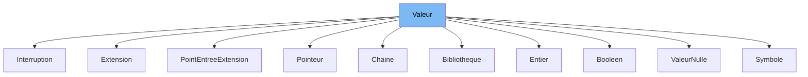

This document will cover the class <SwmToken path="src/machine/elements/memoire/booleen.h" pos="40:1:1" line-data="		Booleen(const bool valeur)">`Booleen`</SwmToken> in the file <SwmPath>[src/machine/elements/memoire/booleen.h](src/machine/elements/memoire/booleen.h)</SwmPath>. We will cover:

1. What <SwmToken path="src/machine/elements/memoire/booleen.h" pos="52:9:9" line-data="		virtual SVM::Machine::Element::Valeur::Comparaison compare(const Valeur&amp; droite) const override">`Valeur`</SwmToken> is in <SwmPath>[src/machine/elements/memoire/valeur.h](src/machine/elements/memoire/valeur.h)</SwmPath> and what it is used for.
2. What <SwmToken path="src/machine/elements/memoire/booleen.h" pos="40:1:1" line-data="		Booleen(const bool valeur)">`Booleen`</SwmToken> is and its relationship to <SwmToken path="src/machine/elements/memoire/booleen.h" pos="52:9:9" line-data="		virtual SVM::Machine::Element::Valeur::Comparaison compare(const Valeur&amp; droite) const override">`Valeur`</SwmToken>.
3. The variables and functions defined in <SwmToken path="src/machine/elements/memoire/booleen.h" pos="40:1:1" line-data="		Booleen(const bool valeur)">`Booleen`</SwmToken>.



# What is Valeur

<SwmToken path="src/machine/elements/memoire/booleen.h" pos="52:9:9" line-data="		virtual SVM::Machine::Element::Valeur::Comparaison compare(const Valeur&amp; droite) const override">`Valeur`</SwmToken> is a base class defined in <SwmPath>[src/machine/elements/memoire/valeur.h](src/machine/elements/memoire/valeur.h)</SwmPath>. It is used as a base class for various types of values in the virtual machine environment. The class provides a common interface for value manipulation, comparison, and serialization. It includes methods for copying, formatting, and comparing values, as well as managing their state (e.g., whether they are constant or movable).

# What is Booleen

<SwmToken path="src/machine/elements/memoire/booleen.h" pos="40:1:1" line-data="		Booleen(const bool valeur)">`Booleen`</SwmToken> is a class defined in <SwmPath>[src/machine/elements/memoire/booleen.h](src/machine/elements/memoire/booleen.h)</SwmPath>. It represents a boolean value in the virtual machine environment and inherits from the <SwmToken path="src/machine/elements/memoire/booleen.h" pos="52:9:9" line-data="		virtual SVM::Machine::Element::Valeur::Comparaison compare(const Valeur&amp; droite) const override">`Valeur`</SwmToken> class. The <SwmToken path="src/machine/elements/memoire/booleen.h" pos="40:1:1" line-data="		Booleen(const bool valeur)">`Booleen`</SwmToken> class provides methods for copying, formatting, and comparing boolean values. It also includes operators for converting to and from boolean types. The relationship between <SwmToken path="src/machine/elements/memoire/booleen.h" pos="40:1:1" line-data="		Booleen(const bool valeur)">`Booleen`</SwmToken> and <SwmToken path="src/machine/elements/memoire/booleen.h" pos="52:9:9" line-data="		virtual SVM::Machine::Element::Valeur::Comparaison compare(const Valeur&amp; droite) const override">`Valeur`</SwmToken> is that <SwmToken path="src/machine/elements/memoire/booleen.h" pos="40:1:1" line-data="		Booleen(const bool valeur)">`Booleen`</SwmToken> extends <SwmToken path="src/machine/elements/memoire/booleen.h" pos="52:9:9" line-data="		virtual SVM::Machine::Element::Valeur::Comparaison compare(const Valeur&amp; droite) const override">`Valeur`</SwmToken>, inheriting its interface and functionality while providing specific implementations for boolean values.

<SwmSnippet path="/src/machine/elements/memoire/booleen.h" line="76">

---

# Variables and functions

The variable <SwmToken path="src/machine/elements/memoire/booleen.h" pos="76:3:3" line-data="		bool _valeur;">`_valeur`</SwmToken> is used to store the boolean value of the <SwmToken path="src/machine/elements/memoire/booleen.h" pos="40:1:1" line-data="		Booleen(const bool valeur)">`Booleen`</SwmToken> instance. It is a private member of the class.

```c
		bool _valeur;
```

---

</SwmSnippet>

<SwmSnippet path="/src/machine/elements/memoire/booleen.h" line="40">

---

The constructor <SwmToken path="src/machine/elements/memoire/booleen.h" pos="40:1:8" line-data="		Booleen(const bool valeur)">`Booleen(const bool valeur)`</SwmToken> initializes the <SwmToken path="src/machine/elements/memoire/booleen.h" pos="41:2:2" line-data="		:_valeur(valeur) {};">`_valeur`</SwmToken> member with the provided boolean value.

```c
		Booleen(const bool valeur)
		:_valeur(valeur) {};
```

---

</SwmSnippet>

<SwmSnippet path="/src/machine/elements/memoire/booleen.h" line="42">

---

The destructor <SwmToken path="src/machine/elements/memoire/booleen.h" pos="42:3:6" line-data="		virtual ~Booleen() {};">`~Booleen()`</SwmToken> is a virtual destructor for the <SwmToken path="src/machine/elements/memoire/booleen.h" pos="42:4:4" line-data="		virtual ~Booleen() {};">`Booleen`</SwmToken> class.

```c
		virtual ~Booleen() {};
```

---

</SwmSnippet>

<SwmSnippet path="/src/machine/elements/memoire/booleen.h" line="43">

---

The function <SwmToken path="src/machine/elements/memoire/booleen.h" pos="43:3:11" line-data="		virtual ValeurSP copie() const override { return std::make_shared&lt;Booleen&gt;(_valeur); }">`ValeurSP copie() const override`</SwmToken> creates and returns a copy of the <SwmToken path="src/machine/elements/memoire/booleen.h" pos="43:21:21" line-data="		virtual ValeurSP copie() const override { return std::make_shared&lt;Booleen&gt;(_valeur); }">`Booleen`</SwmToken> instance.

```c
		virtual ValeurSP copie() const override { return std::make_shared<Booleen>(_valeur); }
```

---

</SwmSnippet>

<SwmSnippet path="/src/machine/elements/memoire/booleen.h" line="44">

---

The function <SwmToken path="src/machine/elements/memoire/booleen.h" pos="44:3:17" line-data="		virtual void format(std::ostream&amp; os) const override">`void format(std::ostream& os) const override`</SwmToken> formats the boolean value as a string (`TRUE` or `FALSE`) and outputs it to the provided stream.

```c
		virtual void format(std::ostream& os) const override
		{
			os << ( _valeur?"TRUE":"FALSE");
		}
```

---

</SwmSnippet>

<SwmSnippet path="/src/machine/elements/memoire/booleen.h" line="48">

---

The function <SwmToken path="src/machine/elements/memoire/booleen.h" pos="48:3:3" line-data="		virtual operator Type () const override">`operator`</SwmToken>` Type() const `<SwmToken path="src/machine/elements/memoire/booleen.h" pos="48:12:12" line-data="		virtual operator Type () const override">`override`</SwmToken> converts the <SwmToken path="src/machine/elements/memoire/booleen.h" pos="40:1:1" line-data="		Booleen(const bool valeur)">`Booleen`</SwmToken> instance to a <SwmToken path="src/machine/elements/memoire/booleen.h" pos="48:5:5" line-data="		virtual operator Type () const override">`Type`</SwmToken> object representing a boolean type.

```c
		virtual operator Type () const override
		{
			return Type(Type::TypeInterne::BOOLEEN);
		}
```

---

</SwmSnippet>

<SwmSnippet path="/src/machine/elements/memoire/booleen.h" line="52">

---

The function <SwmToken path="src/machine/elements/memoire/booleen.h" pos="52:3:25" line-data="		virtual SVM::Machine::Element::Valeur::Comparaison compare(const Valeur&amp; droite) const override">`SVM::Machine::Element::Valeur::Comparaison compare(const Valeur& droite) const override`</SwmToken> compares the <SwmToken path="src/machine/elements/memoire/booleen.h" pos="54:3:3" line-data="			const Booleen *d=dynamic_cast&lt;const Booleen*&gt;(&amp;droite);                                                                                                  ">`Booleen`</SwmToken> instance with another <SwmToken path="src/machine/elements/memoire/booleen.h" pos="52:9:9" line-data="		virtual SVM::Machine::Element::Valeur::Comparaison compare(const Valeur&amp; droite) const override">`Valeur`</SwmToken> instance and returns a <SwmToken path="src/machine/elements/memoire/booleen.h" pos="52:11:11" line-data="		virtual SVM::Machine::Element::Valeur::Comparaison compare(const Valeur&amp; droite) const override">`Comparaison`</SwmToken> object indicating the result of the comparison.

```c
		virtual SVM::Machine::Element::Valeur::Comparaison compare(const Valeur& droite) const override
		{
			const Booleen *d=dynamic_cast<const Booleen*>(&droite);                                                                                                  
			SVM::Machine::Element::Valeur::Comparaison c;
			if(_valeur==d->_valeur)
			{
				c._egal = true;
			}
			if(not _valeur and d->_valeur)
			{
				c._inferieur = true;
			}
			if(_valeur and not d->_valeur)
			{
				c._superieur = true;
			}
			c._ordre = true;
			c._total = true;
			c._faible = true;
			return c;
```

---

</SwmSnippet>

<SwmSnippet path="/src/machine/elements/memoire/booleen.h" line="73">

---

The function <SwmToken path="src/machine/elements/memoire/booleen.h" pos="73:1:1" line-data="		operator bool () const { return _valeur; }">`operator`</SwmToken>` bool() const` converts the <SwmToken path="src/machine/elements/memoire/booleen.h" pos="40:1:1" line-data="		Booleen(const bool valeur)">`Booleen`</SwmToken> instance to a boolean value.

```c
		operator bool () const { return _valeur; }
```

---

</SwmSnippet>

<SwmSnippet path="/src/machine/elements/memoire/booleen.h" line="74">

---

The function <SwmToken path="src/machine/elements/memoire/booleen.h" pos="74:1:1" line-data="		operator bool&amp; () { return _valeur; }">`operator`</SwmToken>` bool&()` returns a reference to the boolean value stored in the <SwmToken path="src/machine/elements/memoire/booleen.h" pos="40:1:1" line-data="		Booleen(const bool valeur)">`Booleen`</SwmToken> instance.

```c
		operator bool& () { return _valeur; }
```

---

</SwmSnippet>

&nbsp;

*This is an auto-generated document by Swimm 🌊 and has not yet been verified by a human*

<SwmMeta version="3.0.0" repo-id="Z2l0aHViJTNBJTNBc3ZtLTIuNy4yMDI0MTEwNyUzQSUzQVN3aW1tLURlbW8=" repo-name="svm-2.7.20241107"><sup>Powered by [Swimm](/)</sup></SwmMeta>
