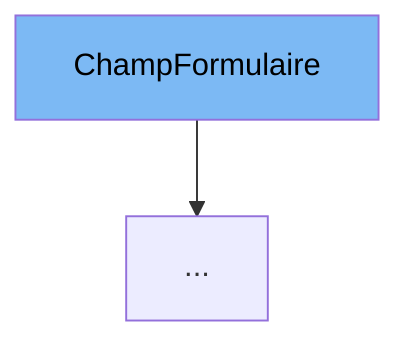

This document will cover the class <SwmToken path="src/machine/interface/svm.cpp" pos="836:1:1" line-data="	CocheFormulaire(const std::string&amp; etiquette, const bool defaut)">`CocheFormulaire`</SwmToken> in <SwmPath>[src/machine/interface/svm.cpp](src/machine/interface/svm.cpp)</SwmPath>. We will cover:

1. What <SwmPath>[src/machine/interface/svm.cpp](src/machine/interface/svm.cpp)</SwmPath> is and what it is used for.
2. What <SwmToken path="src/machine/interface/svm.cpp" pos="836:1:1" line-data="	CocheFormulaire(const std::string&amp; etiquette, const bool defaut)">`CocheFormulaire`</SwmToken> is and its relationship to <SwmPath>[src/machine/interface/svm.cpp](src/machine/interface/svm.cpp)</SwmPath>.
3. Variables and functions defined in <SwmToken path="src/machine/interface/svm.cpp" pos="836:1:1" line-data="	CocheFormulaire(const std::string&amp; etiquette, const bool defaut)">`CocheFormulaire`</SwmToken>.



# What is <SwmPath>[src/machine/interface/svm.cpp](src/machine/interface/svm.cpp)</SwmPath>

<SwmPath>[src/machine/interface/svm.cpp](src/machine/interface/svm.cpp)</SwmPath> is a source file in the project that contains various implementations related to the Simple Virtual Machine (SVM). It includes functions and structures that handle memory management, process synchronization, and other virtual machine operations.

# What is <SwmToken path="src/machine/interface/svm.cpp" pos="836:1:1" line-data="	CocheFormulaire(const std::string&amp; etiquette, const bool defaut)">`CocheFormulaire`</SwmToken>

<SwmToken path="src/machine/interface/svm.cpp" pos="836:1:1" line-data="	CocheFormulaire(const std::string&amp; etiquette, const bool defaut)">`CocheFormulaire`</SwmToken> is a class defined in <SwmPath>[src/machine/interface/svm.cpp](src/machine/interface/svm.cpp)</SwmPath>. It is used to represent a checkbox form field within the SVM's debugging interface. This class is part of the form handling mechanism in the SVM, allowing users to interact with and manipulate form elements in the debugging environment.

<SwmSnippet path="/src/machine/interface/svm.cpp" line="836">

---

# Variables and functions

The variable <SwmToken path="src/machine/interface/svm.cpp" pos="837:8:8" line-data="	:ChampFormulaire(etiquette), _defaut(defaut) {}">`_defaut`</SwmToken> is used to store the default state of the checkbox. It is a boolean value that indicates whether the checkbox is checked by default.

```c++
	CocheFormulaire(const std::string& etiquette, const bool defaut)
	:ChampFormulaire(etiquette), _defaut(defaut) {}
```

---

</SwmSnippet>

<SwmSnippet path="/src/machine/interface/svm.cpp" line="839">

---

The function <SwmToken path="src/machine/interface/svm.cpp" pos="839:9:9" line-data="	virtual SVM_Debugueur::JSON_Interne::ObjetSP json() const override">`json`</SwmToken> is used to generate a JSON representation of the checkbox form field. It returns a JSON object with the type set to 'checkbox', the label set to the field's label, and the value set to the default state of the checkbox.

```c++
	virtual SVM_Debugueur::JSON_Interne::ObjetSP json() const override
	{
		return SVM_Debugueur::JSON::objet({ { "type" , SVM_Debugueur::JSON::chaine("checkbox") } , { "label" , SVM_Debugueur::JSON::chaine(_etiquette) } , { "value" , SVM_Debugueur::JSON::booleen(_defaut) } });
	}
```

---

</SwmSnippet>

<SwmSnippet path="/src/machine/interface/svm.cpp" line="843">

---

The function <SwmToken path="src/machine/interface/svm.cpp" pos="843:5:5" line-data="	virtual ValeurFormulaireSP valeur(const SVM_Debugueur::JSON_Interne::ValeurSP&amp; valeur) override">`valeur`</SwmToken> is used to convert a JSON value into a form value. It checks if the provided JSON value is a boolean and, if so, creates a <SwmToken path="src/machine/interface/svm.cpp" pos="848:7:10" line-data="		return std::make_shared&lt;ValeurSpecifiqueFormulaire&lt;bool&gt; &gt;(*b);">`ValeurSpecifiqueFormulaire<bool>`</SwmToken> object with the boolean value.

```c++
	virtual ValeurFormulaireSP valeur(const SVM_Debugueur::JSON_Interne::ValeurSP& valeur) override
	{
		auto b = SVM_Debugueur::JSON::booleen(valeur);
		if(not SVM_Debugueur::JSON::est(b))
			return ValeurFormulaireSP();
		return std::make_shared<ValeurSpecifiqueFormulaire<bool> >(*b);
	}
```

---

</SwmSnippet>

&nbsp;

*This is an auto-generated document by Swimm 🌊 and has not yet been verified by a human*

<SwmMeta version="3.0.0" repo-id="Z2l0aHViJTNBJTNBc3ZtLTIuNy4yMDI0MTEwNyUzQSUzQVN3aW1tLURlbW8=" repo-name="svm-2.7.20241107"><sup>Powered by [Swimm](/)</sup></SwmMeta>
