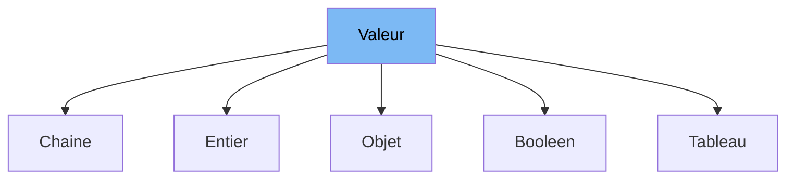

This document will cover the class <SwmToken path="src/machine/debugueur/json.h" pos="48:3:3" line-data="		explicit Entier(const Type v)">`Entier`</SwmToken> in the file <SwmPath>[src/machine/debugueur/json.h](src/machine/debugueur/json.h)</SwmPath>. We will cover:

1. What <SwmToken path="src/machine/debugueur/json.h" pos="31:3:3" line-data="	DECL_SHARED_PTR(Valeur);">`Valeur`</SwmToken> is and what it is used for.
2. What <SwmToken path="src/machine/debugueur/json.h" pos="48:3:3" line-data="		explicit Entier(const Type v)">`Entier`</SwmToken> is and its relationship to <SwmToken path="src/machine/debugueur/json.h" pos="31:3:3" line-data="	DECL_SHARED_PTR(Valeur);">`Valeur`</SwmToken>.
3. Variables and functions defined in <SwmToken path="src/machine/debugueur/json.h" pos="48:3:3" line-data="		explicit Entier(const Type v)">`Entier`</SwmToken>.



# What is Valeur

<SwmToken path="src/machine/debugueur/json.h" pos="31:3:3" line-data="	DECL_SHARED_PTR(Valeur);">`Valeur`</SwmToken> is a base class in the <SwmPath>[src/machine/debugueur/json.h](src/machine/debugueur/json.h)</SwmPath> file. It is used as a base for various types of values that can be formatted and outputted as JSON. The class defines a virtual destructor and a pure virtual function <SwmToken path="src/machine/debugueur/json.h" pos="51:5:5" line-data="		virtual void format(std::ostream&amp; os) const override">`format`</SwmToken> that must be implemented by derived classes. It also provides an overloaded <SwmToken path="src/machine/debugueur/json.h" pos="37:6:7" line-data="		friend Flux&amp; operator&lt;&lt;(Flux&amp; f, const Valeur&amp; v)">`operator<<`</SwmToken> to format the value using the <SwmToken path="src/machine/debugueur/json.h" pos="51:5:5" line-data="		virtual void format(std::ostream&amp; os) const override">`format`</SwmToken> function.

# What is Entier

<SwmToken path="src/machine/debugueur/json.h" pos="48:3:3" line-data="		explicit Entier(const Type v)">`Entier`</SwmToken> is a class in the <SwmPath>[src/machine/debugueur/json.h](src/machine/debugueur/json.h)</SwmPath> file that inherits from the <SwmToken path="src/machine/debugueur/json.h" pos="31:3:3" line-data="	DECL_SHARED_PTR(Valeur);">`Valeur`</SwmToken> class. It represents an integer value and is used to handle and format integer values in JSON. The <SwmToken path="src/machine/debugueur/json.h" pos="48:3:3" line-data="		explicit Entier(const Type v)">`Entier`</SwmToken> class provides functionality to store an integer, format it as a JSON value, and convert it to its underlying type.

<SwmSnippet path="/src/machine/debugueur/json.h" line="47">

---

# Variables and functions

The <SwmToken path="src/machine/debugueur/json.h" pos="47:9:9" line-data="		typedef long long int Type;">`Type`</SwmToken> typedef is used to define the underlying type of the integer value, which is <SwmToken path="src/machine/debugueur/json.h" pos="47:3:7" line-data="		typedef long long int Type;">`long long int`</SwmToken>.

```c
		typedef long long int Type;
```

---

</SwmSnippet>

<SwmSnippet path="/src/machine/debugueur/json.h" line="48">

---

The constructor <SwmToken path="src/machine/debugueur/json.h" pos="48:1:10" line-data="		explicit Entier(const Type v)">`explicit Entier(const Type v)`</SwmToken> initializes the <SwmToken path="src/machine/debugueur/json.h" pos="48:3:3" line-data="		explicit Entier(const Type v)">`Entier`</SwmToken> object with the given integer value <SwmToken path="src/machine/debugueur/json.h" pos="48:9:9" line-data="		explicit Entier(const Type v)">`v`</SwmToken>.

```c
		explicit Entier(const Type v)
		:_v(v) {}
```

---

</SwmSnippet>

<SwmSnippet path="/src/machine/debugueur/json.h" line="50">

---

The destructor <SwmToken path="src/machine/debugueur/json.h" pos="50:1:6" line-data="		virtual ~Entier() {}">`virtual ~Entier()`</SwmToken> is defined to ensure proper cleanup of the <SwmToken path="src/machine/debugueur/json.h" pos="50:4:4" line-data="		virtual ~Entier() {}">`Entier`</SwmToken> object.

```c
		virtual ~Entier() {}
```

---

</SwmSnippet>

<SwmSnippet path="/src/machine/debugueur/json.h" line="51">

---

The <SwmToken path="src/machine/debugueur/json.h" pos="51:5:5" line-data="		virtual void format(std::ostream&amp; os) const override">`format`</SwmToken> function <SwmToken path="src/machine/debugueur/json.h" pos="51:1:17" line-data="		virtual void format(std::ostream&amp; os) const override">`virtual void format(std::ostream& os) const override`</SwmToken> formats the integer value as a JSON value by outputting it to the provided output stream <SwmToken path="src/machine/debugueur/json.h" pos="51:12:12" line-data="		virtual void format(std::ostream&amp; os) const override">`os`</SwmToken>.

```c
		virtual void format(std::ostream& os) const override
		{
			os << _v;
		}
```

---

</SwmSnippet>

<SwmSnippet path="/src/machine/debugueur/json.h" line="55">

---

The type conversion operator <SwmToken path="src/machine/debugueur/json.h" pos="55:1:8" line-data="		operator Type () const { return _v; }">`operator Type () const`</SwmToken> allows the <SwmToken path="src/machine/debugueur/json.h" pos="48:3:3" line-data="		explicit Entier(const Type v)">`Entier`</SwmToken> object to be converted to its underlying integer type.

```c
		operator Type () const { return _v; }
```

---

</SwmSnippet>

<SwmSnippet path="/src/machine/debugueur/json.h" line="57">

---

The private member variable <SwmToken path="src/machine/debugueur/json.h" pos="57:3:3" line-data="			Type _v;">`_v`</SwmToken> stores the integer value of the <SwmToken path="src/machine/debugueur/json.h" pos="48:3:3" line-data="		explicit Entier(const Type v)">`Entier`</SwmToken> object.

```c
			Type _v;
```

---

</SwmSnippet>

&nbsp;

*This is an auto-generated document by Swimm 🌊 and has not yet been verified by a human*

<SwmMeta version="3.0.0" repo-id="Z2l0aHViJTNBJTNBc3ZtLTIuNy4yMDI0MTEwNyUzQSUzQVN3aW1tLURlbW8=" repo-name="svm-2.7.20241107"><sup>Powered by [Swimm](/)</sup></SwmMeta>
