This document will cover the class <SwmToken path="src/machine/elements/programme/valeur_programme.h" pos="109:1:1" line-data="		LectureMemoire(const AdresseSP&amp; adresse)">`LectureMemoire`</SwmToken> in the file <SwmPath>[src/machine/elements/programme/valeur_programme.h](src/machine/elements/programme/valeur_programme.h)</SwmPath>. We will cover:

1. What <SwmToken path="src/machine/elements/programme/valeur_programme.h" pos="55:2:2" line-data="namespace Valeur">`Valeur`</SwmToken> is
2. What <SwmToken path="src/machine/elements/programme/valeur_programme.h" pos="109:1:1" line-data="		LectureMemoire(const AdresseSP&amp; adresse)">`LectureMemoire`</SwmToken> is
3. Variables and functions in <SwmToken path="src/machine/elements/programme/valeur_programme.h" pos="109:1:1" line-data="		LectureMemoire(const AdresseSP&amp; adresse)">`LectureMemoire`</SwmToken>



```mermaid
graph TD;
  Valeur:::currentBaseStyle
Valeur --> InterruptionInterne
Valeur --> PointEntreeExtension
Valeur --> Pointeur
Valeur --> Chaine
Valeur --> Entier
Valeur --> InterruptionExterne
Valeur --> Booleen
Valeur --> LectureMemoire
Valeur --> ConstanteExtension
Valeur --> PointeurAlias
Valeur --> 1[...]

 classDef currentBaseStyle color:#000000,fill:#7CB9F4

%% Swimm:
%% graph TD;
%%   Valeur:::currentBaseStyle
%% Valeur --> <SwmToken path="src/machine/elements/programme/valeur_programme.h" pos="282:8:8" line-data="		:ExceptionExecution(SVM_Valeur::Interruption::InterruptionInterne::MEMOIRE)">`InterruptionInterne`</SwmToken>
%% Valeur --> <SwmToken path="src/machine/elements/programme/valeur_programme.h" pos="77:3:3" line-data="		SVM_Valeur::PointEntreeExtension evaluation_point_entree_extension(const SVM_Memoire::ValeurSP&amp; valeur) const;">`PointEntreeExtension`</SwmToken>
%% Valeur --> Pointeur
%% Valeur --> Chaine
%% Valeur --> Entier
%% Valeur --> <SwmToken path="src/machine/elements/programme/valeur_programme.h" pos="419:3:3" line-data="	struct InterruptionExterne;">`InterruptionExterne`</SwmToken>
%% Valeur --> Booleen
%% Valeur --> <SwmToken path="src/machine/elements/programme/valeur_programme.h" pos="109:1:1" line-data="		LectureMemoire(const AdresseSP&amp; adresse)">`LectureMemoire`</SwmToken>
%% Valeur --> <SwmToken path="src/machine/elements/programme/valeur_programme.h" pos="183:3:3" line-data="	struct ConstanteExtension;">`ConstanteExtension`</SwmToken>
%% Valeur --> <SwmToken path="src/machine/elements/programme/valeur_programme.h" pos="312:3:3" line-data="	struct PointeurAlias : public Valeur">`PointeurAlias`</SwmToken>
%% Valeur --> 1[...]
%% 
%%  classDef currentBaseStyle color:#000000,fill:#7CB9F4
```

# What is Valeur

<SwmToken path="src/machine/elements/programme/valeur_programme.h" pos="55:2:2" line-data="namespace Valeur">`Valeur`</SwmToken> is a base class in <SwmPath>[src/machine/elements/programme/valeur_programme.h](src/machine/elements/programme/valeur_programme.h)</SwmPath>. It is used as a base for various value types in the Simple Virtual Machine (SVM). The class provides a common interface for evaluating and formatting values, as well as for explaining calculations and decorations.

# What is <SwmToken path="src/machine/elements/programme/valeur_programme.h" pos="109:1:1" line-data="		LectureMemoire(const AdresseSP&amp; adresse)">`LectureMemoire`</SwmToken>

<SwmToken path="src/machine/elements/programme/valeur_programme.h" pos="109:1:1" line-data="		LectureMemoire(const AdresseSP&amp; adresse)">`LectureMemoire`</SwmToken> is a class in <SwmPath>[src/machine/elements/programme/valeur_programme.h](src/machine/elements/programme/valeur_programme.h)</SwmPath> that inherits from <SwmToken path="src/machine/elements/programme/valeur_programme.h" pos="55:2:2" line-data="namespace Valeur">`Valeur`</SwmToken>. It is used to represent a memory read operation in the SVM. The class holds an address and provides methods to evaluate and explain the memory read operation. It also allows specifying the desired type for validation.

<SwmSnippet path="/src/machine/elements/programme/valeur_programme.h" line="109">

---

# Variables and functions

The constructor <SwmToken path="src/machine/elements/programme/valeur_programme.h" pos="109:1:9" line-data="		LectureMemoire(const AdresseSP&amp; adresse)">`LectureMemoire(const AdresseSP& adresse)`</SwmToken> initializes the <SwmToken path="src/machine/elements/programme/valeur_programme.h" pos="109:1:1" line-data="		LectureMemoire(const AdresseSP&amp; adresse)">`LectureMemoire`</SwmToken> object with the given address.

```c
		LectureMemoire(const AdresseSP& adresse)
```

---

</SwmSnippet>

<SwmSnippet path="/src/machine/elements/programme/valeur_programme.h" line="111">

---

The destructor <SwmToken path="src/machine/elements/programme/valeur_programme.h" pos="111:3:6" line-data="		virtual ~LectureMemoire() {}">`~LectureMemoire()`</SwmToken> is a virtual destructor ensuring proper cleanup of derived classes.

```c
		virtual ~LectureMemoire() {}
```

---

</SwmSnippet>

<SwmSnippet path="/src/machine/elements/programme/valeur_programme.h" line="112">

---

The function <SwmToken path="src/machine/elements/programme/valeur_programme.h" pos="112:5:13" line-data="		virtual void decoration(SVM_Valeur::Decorateur&amp; decorateur) override;">`decoration(SVM_Valeur::Decorateur& decorateur)`</SwmToken> is an override that decorates the value.

```c
		virtual void decoration(SVM_Valeur::Decorateur& decorateur) override;
```

---

</SwmSnippet>

<SwmSnippet path="/src/machine/elements/programme/valeur_programme.h" line="113">

---

The function <SwmToken path="src/machine/elements/programme/valeur_programme.h" pos="113:7:19" line-data="		virtual SVM_Memoire::ValeurSP evaluation(const SVM_Noyau::NoyauSP&amp; ce) const override;">`evaluation(const SVM_Noyau::NoyauSP& ce) const`</SwmToken> is an override that evaluates the memory read operation and returns the result.

```c
		virtual SVM_Memoire::ValeurSP evaluation(const SVM_Noyau::NoyauSP& ce) const override;
```

---

</SwmSnippet>

<SwmSnippet path="/src/machine/elements/programme/valeur_programme.h" line="114">

---

The function <SwmToken path="src/machine/elements/programme/valeur_programme.h" pos="114:7:27" line-data="		virtual SVM_Memoire::ValeurSP explique_calcul(const SVM_Noyau::NoyauSP&amp; noyau, SVM_Valeur::ArbreSubstitutionSP&amp; arbre) const override;">`explique_calcul(const SVM_Noyau::NoyauSP& noyau, SVM_Valeur::ArbreSubstitutionSP& arbre) const`</SwmToken> is an override that explains the calculation of the memory read operation.

```c
		virtual SVM_Memoire::ValeurSP explique_calcul(const SVM_Noyau::NoyauSP& noyau, SVM_Valeur::ArbreSubstitutionSP& arbre) const override;
```

---

</SwmSnippet>

<SwmSnippet path="/src/machine/elements/programme/valeur_programme.h" line="115">

---

The function <SwmToken path="src/machine/elements/programme/valeur_programme.h" pos="115:3:33" line-data="		void type_voulu(std::function&lt;bool(const SVM_Memoire::Type&amp; type)&gt; validateur, const std::string&amp; types_attendus)">`type_voulu(std::function<bool(const SVM_Memoire::Type& type)> validateur, const std::string& types_attendus)`</SwmToken> sets the desired type validator and expected types for the memory read operation.

```c
		void type_voulu(std::function<bool(const SVM_Memoire::Type& type)> validateur, const std::string& types_attendus)
		{
			_validateur = validateur;
			_types_attendus = types_attendus;
		}
```

---

</SwmSnippet>

<SwmSnippet path="/src/machine/elements/programme/valeur_programme.h" line="120">

---

The function <SwmToken path="src/machine/elements/programme/valeur_programme.h" pos="120:5:15" line-data="		virtual void format(std::ostream&amp; os) const override">`format(std::ostream& os) const`</SwmToken> is an override that formats the memory read operation as a string.

```c
		virtual void format(std::ostream& os) const override
		{
			os << "@" << (*_adresse);
		}
```

---

</SwmSnippet>

<SwmSnippet path="/src/machine/elements/programme/valeur_programme.h" line="124">

---

The function <SwmToken path="src/machine/elements/programme/valeur_programme.h" pos="124:5:15" line-data="		virtual void html(std::ostream&amp; os) const override">`html(std::ostream& os) const`</SwmToken> is an override that formats the memory read operation as HTML.

```c
		virtual void html(std::ostream& os) const override
		{
			os << "<span class=\"operator\">@</span>";
			_adresse->html(os);
		}
```

---

</SwmSnippet>

<SwmSnippet path="/src/machine/elements/programme/valeur_programme.h" line="130">

---

The variable <SwmToken path="src/machine/elements/programme/valeur_programme.h" pos="130:3:3" line-data="		AdresseSP _adresse;">`_adresse`</SwmToken> is a private member that stores the address for the memory read operation.

```c
		AdresseSP _adresse;
```

---

</SwmSnippet>

<SwmSnippet path="/src/machine/elements/programme/valeur_programme.h" line="131">

---

The variable <SwmToken path="src/machine/elements/programme/valeur_programme.h" pos="131:18:18" line-data="		std::function&lt;bool(const SVM_Memoire::Type&amp; type)&gt; _validateur;">`_validateur`</SwmToken> is a private member that stores the type validator function.

```c
		std::function<bool(const SVM_Memoire::Type& type)> _validateur;
```

---

</SwmSnippet>

<SwmSnippet path="/src/machine/elements/programme/valeur_programme.h" line="132">

---

The variable <SwmToken path="src/machine/elements/programme/valeur_programme.h" pos="132:5:5" line-data="		std::string _types_attendus;">`_types_attendus`</SwmToken> is a private member that stores the expected types as a string.

```c
		std::string _types_attendus;
```

---

</SwmSnippet>

&nbsp;

*This is an auto-generated document by Swimm 🌊 and has not yet been verified by a human*

<SwmMeta version="3.0.0" repo-id="Z2l0aHViJTNBJTNBc3ZtLTIuNy4yMDI0MTEwNyUzQSUzQVN3aW1tLURlbW8=" repo-name="svm-2.7.20241107"><sup>Powered by [Swimm](/)</sup></SwmMeta>
