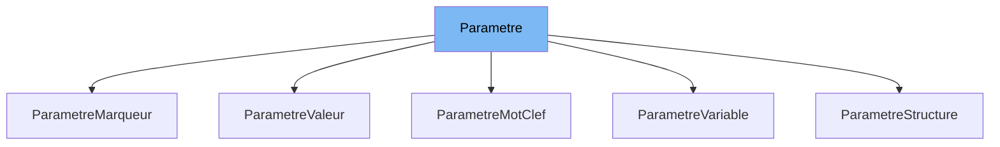

This document will cover the class <SwmToken path="src/machine/elements/valeur/parametre.h" pos="101:1:1" line-data="		ParametreMarqueur(const Marqueur marqueur)">`ParametreMarqueur`</SwmToken> in <SwmPath>[src/machine/elements/valeur/parametre.h](src/machine/elements/valeur/parametre.h)</SwmPath>. We will cover:

1. What <SwmPath>[src/machine/elements/valeur/parametre.h](src/machine/elements/valeur/parametre.h)</SwmPath> is and what it is used for.
2. What <SwmToken path="src/machine/elements/valeur/parametre.h" pos="101:1:1" line-data="		ParametreMarqueur(const Marqueur marqueur)">`ParametreMarqueur`</SwmToken> is and its relationship to <SwmToken path="src/machine/elements/valeur/parametre.h" pos="43:3:3" line-data="	DECL_SHARED_PTR(Parametre);">`Parametre`</SwmToken>.
3. Variables and functions defined in <SwmToken path="src/machine/elements/valeur/parametre.h" pos="101:1:1" line-data="		ParametreMarqueur(const Marqueur marqueur)">`ParametreMarqueur`</SwmToken>.



# What is <SwmPath>[src/machine/elements/valeur/parametre.h](src/machine/elements/valeur/parametre.h)</SwmPath>

<SwmPath>[src/machine/elements/valeur/parametre.h](src/machine/elements/valeur/parametre.h)</SwmPath> is a header file that defines various parameter-related classes used within the Simple Virtual Machine (SVM) architecture. These classes include <SwmToken path="src/machine/elements/valeur/parametre.h" pos="43:3:3" line-data="	DECL_SHARED_PTR(Parametre);">`Parametre`</SwmToken>, <SwmToken path="src/machine/elements/valeur/parametre.h" pos="58:3:3" line-data="	struct ParametreValeur : public Parametre">`ParametreValeur`</SwmToken>, <SwmToken path="src/machine/elements/valeur/parametre.h" pos="101:1:1" line-data="		ParametreMarqueur(const Marqueur marqueur)">`ParametreMarqueur`</SwmToken>, <SwmToken path="src/machine/elements/valeur/parametre.h" pos="208:3:3" line-data="	struct ParametreMotClef : public Parametre">`ParametreMotClef`</SwmToken>, <SwmToken path="src/machine/elements/valeur/parametre.h" pos="222:3:3" line-data="	struct ParametreStructure : public Parametre">`ParametreStructure`</SwmToken>, and <SwmToken path="src/machine/elements/valeur/parametre.h" pos="233:3:3" line-data="	struct ParametreVariable : public Parametre">`ParametreVariable`</SwmToken>. These classes are used to represent different types of parameters that can be processed by the virtual machine.

# What is <SwmToken path="src/machine/elements/valeur/parametre.h" pos="101:1:1" line-data="		ParametreMarqueur(const Marqueur marqueur)">`ParametreMarqueur`</SwmToken>

<SwmToken path="src/machine/elements/valeur/parametre.h" pos="101:1:1" line-data="		ParametreMarqueur(const Marqueur marqueur)">`ParametreMarqueur`</SwmToken> is a class defined in <SwmPath>[src/machine/elements/valeur/parametre.h](src/machine/elements/valeur/parametre.h)</SwmPath> that inherits from the <SwmToken path="src/machine/elements/valeur/parametre.h" pos="43:3:3" line-data="	DECL_SHARED_PTR(Parametre);">`Parametre`</SwmToken> class. It is used to represent a parameter that is a marker. The class defines an enumeration <SwmToken path="src/machine/elements/valeur/parametre.h" pos="86:5:5" line-data="		enum class Marqueur">`Marqueur`</SwmToken> which includes various types of markers such as <SwmToken path="src/machine/elements/valeur/parametre.h" pos="88:1:1" line-data="			INFERIEUR,">`INFERIEUR`</SwmToken>, <SwmToken path="src/machine/elements/valeur/parametre.h" pos="89:1:1" line-data="			SUPERIEUR,">`SUPERIEUR`</SwmToken>, <SwmToken path="src/machine/elements/valeur/parametre.h" pos="93:1:1" line-data="			EGAL,">`EGAL`</SwmToken>, etc. The <SwmToken path="src/machine/elements/valeur/parametre.h" pos="101:1:1" line-data="		ParametreMarqueur(const Marqueur marqueur)">`ParametreMarqueur`</SwmToken> class provides functionality to format these markers and convert them to and from string representations.

<SwmSnippet path="/src/machine/elements/valeur/parametre.h" line="86">

---

# Variables and functions

The <SwmToken path="src/machine/elements/valeur/parametre.h" pos="86:5:5" line-data="		enum class Marqueur">`Marqueur`</SwmToken> enum defines various types of markers that <SwmToken path="src/machine/elements/valeur/parametre.h" pos="101:1:1" line-data="		ParametreMarqueur(const Marqueur marqueur)">`ParametreMarqueur`</SwmToken> can represent. These include <SwmToken path="src/machine/elements/valeur/parametre.h" pos="88:1:1" line-data="			INFERIEUR,">`INFERIEUR`</SwmToken>, <SwmToken path="src/machine/elements/valeur/parametre.h" pos="89:1:1" line-data="			SUPERIEUR,">`SUPERIEUR`</SwmToken>, <SwmToken path="src/machine/elements/valeur/parametre.h" pos="93:1:1" line-data="			EGAL,">`EGAL`</SwmToken>, and others.

```c
		enum class Marqueur
		{
			INFERIEUR,
			SUPERIEUR,
			INFERIEUR_INFERIEUR,
			SUPERIEUR_SUPERIEUR,
			INFERIEUR_SUPERIEUR,
			EGAL,
			INFERIEUR_OU_EGAL,
			SUPERIEUR_OU_EGAL,
			DEBUT_ACCOLADE,
			VIRGULE,
			POINT_VIRGULE,
			FIN_ACCOLADE
		};
```

---

</SwmSnippet>

<SwmSnippet path="/src/machine/elements/valeur/parametre.h" line="101">

---

The constructor <SwmToken path="src/machine/elements/valeur/parametre.h" pos="101:1:8" line-data="		ParametreMarqueur(const Marqueur marqueur)">`ParametreMarqueur(const Marqueur marqueur)`</SwmToken> initializes the <SwmToken path="src/machine/elements/valeur/parametre.h" pos="101:1:1" line-data="		ParametreMarqueur(const Marqueur marqueur)">`ParametreMarqueur`</SwmToken> object with a specific marker.

```c
		ParametreMarqueur(const Marqueur marqueur)
		:_marqueur(marqueur) {}
```

---

</SwmSnippet>

<SwmSnippet path="/src/machine/elements/valeur/parametre.h" line="103">

---

The <SwmToken path="src/machine/elements/valeur/parametre.h" pos="103:7:7" line-data="		virtual SVM_Extension::RegexParametresElementCSP type() const override;">`type`</SwmToken> function returns the type of the parameter as <SwmToken path="src/machine/elements/valeur/parametre.h" pos="103:3:5" line-data="		virtual SVM_Extension::RegexParametresElementCSP type() const override;">`SVM_Extension::RegexParametresElementCSP`</SwmToken>.

```c
		virtual SVM_Extension::RegexParametresElementCSP type() const override;
```

---

</SwmSnippet>

<SwmSnippet path="/src/machine/elements/valeur/parametre.h" line="104">

---

The destructor <SwmToken path="src/machine/elements/valeur/parametre.h" pos="104:3:4" line-data="		virtual ~ParametreMarqueur() {}">`~ParametreMarqueur`</SwmToken> is defined to clean up resources when a <SwmToken path="src/machine/elements/valeur/parametre.h" pos="104:4:4" line-data="		virtual ~ParametreMarqueur() {}">`ParametreMarqueur`</SwmToken> object is destroyed.

```c
		virtual ~ParametreMarqueur() {}
```

---

</SwmSnippet>

<SwmSnippet path="/src/machine/elements/valeur/parametre.h" line="105">

---

The <SwmToken path="src/machine/elements/valeur/parametre.h" pos="105:5:5" line-data="		virtual void format(std::ostream&amp; os) const override">`format`</SwmToken> function formats the marker and outputs it to the provided output stream.

```c
		virtual void format(std::ostream& os) const override
		{
			os << ParametreMarqueur::texte(_marqueur);
		}
```

---

</SwmSnippet>

<SwmSnippet path="/src/machine/elements/valeur/parametre.h" line="109">

---

The static function <SwmToken path="src/machine/elements/valeur/parametre.h" pos="109:7:7" line-data="		static std::string texte(const Marqueur marqueur)">`texte`</SwmToken> converts a <SwmToken path="src/machine/elements/valeur/parametre.h" pos="109:11:11" line-data="		static std::string texte(const Marqueur marqueur)">`Marqueur`</SwmToken> enum value to its corresponding string representation.

```c
		static std::string texte(const Marqueur marqueur)
		{
			switch(marqueur)
			{
				case Marqueur::INFERIEUR:
					return "<"; break;
				case Marqueur::SUPERIEUR:
					return ">"; break;
				case Marqueur::INFERIEUR_INFERIEUR:
					return "<<"; break;
				case Marqueur::SUPERIEUR_SUPERIEUR:
					return ">>"; break;
				case Marqueur::INFERIEUR_SUPERIEUR:
					return "<>"; break;
				case Marqueur::EGAL:
					return "="; break;
				case Marqueur::INFERIEUR_OU_EGAL:
					return "<="; break;
				case Marqueur::SUPERIEUR_OU_EGAL:
					return "=>"; break;
				case Marqueur::DEBUT_ACCOLADE:
```

---

</SwmSnippet>

<SwmSnippet path="/src/machine/elements/valeur/parametre.h" line="140">

---

The static function <SwmToken path="src/machine/elements/valeur/parametre.h" pos="140:5:5" line-data="		static Marqueur marqueur(const std::string&amp; marqueur)">`marqueur`</SwmToken> converts a string representation of a marker to its corresponding <SwmToken path="src/machine/elements/valeur/parametre.h" pos="140:3:3" line-data="		static Marqueur marqueur(const std::string&amp; marqueur)">`Marqueur`</SwmToken> enum value. If the string does not match any known marker, it throws a <SwmToken path="src/machine/elements/valeur/parametre.h" pos="74:3:3" line-data="	struct MarqueurInvalide : public ExceptionExecution">`MarqueurInvalide`</SwmToken> exception.

```c
		static Marqueur marqueur(const std::string& marqueur)
		{
			if(marqueur=="<")
				return Marqueur::INFERIEUR;
			if(marqueur==">")
				return Marqueur::SUPERIEUR;
			if(marqueur=="<<")
				return Marqueur::INFERIEUR_INFERIEUR;
			if(marqueur==">>")
				return Marqueur::SUPERIEUR_SUPERIEUR;
			if(marqueur=="<>")
				return Marqueur::INFERIEUR_SUPERIEUR;
			if(marqueur=="=")
				return Marqueur::EGAL;
			if(marqueur=="<=")
				return Marqueur::INFERIEUR_OU_EGAL;
			if(marqueur=="=>")
				return Marqueur::SUPERIEUR_OU_EGAL;
			if(marqueur=="{")
				return Marqueur::DEBUT_ACCOLADE;
			if(marqueur==",")
```

---

</SwmSnippet>

<SwmSnippet path="/src/machine/elements/valeur/parametre.h" line="168">

---

The static function <SwmToken path="src/machine/elements/valeur/parametre.h" pos="168:5:5" line-data="		static bool separateur(const Marqueur marqueur)">`separateur`</SwmToken> checks if a given <SwmToken path="src/machine/elements/valeur/parametre.h" pos="168:9:9" line-data="		static bool separateur(const Marqueur marqueur)">`Marqueur`</SwmToken> is a separator.

```c
		static bool separateur(const Marqueur marqueur)
		{
			switch(marqueur)
			{
				case Marqueur::INFERIEUR_SUPERIEUR:
				case Marqueur::EGAL:
				case Marqueur::VIRGULE:
				case Marqueur::POINT_VIRGULE:
					return true; break;
				default:
					break;
			}
			return false;
		}
```

---

</SwmSnippet>

<SwmSnippet path="/src/machine/elements/valeur/parametre.h" line="182">

---

The static function <SwmToken path="src/machine/elements/valeur/parametre.h" pos="182:5:5" line-data="		static bool ouverture(const Marqueur marqueur)">`ouverture`</SwmToken> checks if a given <SwmToken path="src/machine/elements/valeur/parametre.h" pos="182:9:9" line-data="		static bool ouverture(const Marqueur marqueur)">`Marqueur`</SwmToken> is an opening marker.

```c
		static bool ouverture(const Marqueur marqueur)
		{
			switch(marqueur)
			{
				case Marqueur::DEBUT_ACCOLADE:
				case Marqueur::INFERIEUR:
				case Marqueur::INFERIEUR_OU_EGAL:
				case Marqueur::INFERIEUR_INFERIEUR:
					return true; break;
				default:
					break;
			}
			return false;
		}
```

---

</SwmSnippet>

<SwmSnippet path="/src/machine/elements/valeur/parametre.h" line="196">

---

The static function <SwmToken path="src/machine/elements/valeur/parametre.h" pos="196:5:5" line-data="		static bool fermeture(const Marqueur marqueur, const Marqueur ouverture)">`fermeture`</SwmToken> checks if a given <SwmToken path="src/machine/elements/valeur/parametre.h" pos="196:9:9" line-data="		static bool fermeture(const Marqueur marqueur, const Marqueur ouverture)">`Marqueur`</SwmToken> is a closing marker that matches a given opening marker.

```c
		static bool fermeture(const Marqueur marqueur, const Marqueur ouverture)
		{
			if((marqueur==Marqueur::FIN_ACCOLADE) and (ouverture==Marqueur::DEBUT_ACCOLADE)) return true;
			if((marqueur==Marqueur::SUPERIEUR) and (ouverture==Marqueur::INFERIEUR)) return true;
			if((marqueur==Marqueur::SUPERIEUR_OU_EGAL) and (ouverture==Marqueur::INFERIEUR_OU_EGAL)) return true;
			if((marqueur==Marqueur::SUPERIEUR_SUPERIEUR) and (ouverture==Marqueur::INFERIEUR_INFERIEUR)) return true;
			return false;
		}
```

---

</SwmSnippet>

<SwmSnippet path="/src/machine/elements/valeur/parametre.h" line="205">

---

The variable <SwmToken path="src/machine/elements/valeur/parametre.h" pos="205:3:3" line-data="		Marqueur _marqueur;">`_marqueur`</SwmToken> stores the <SwmToken path="src/machine/elements/valeur/parametre.h" pos="205:1:1" line-data="		Marqueur _marqueur;">`Marqueur`</SwmToken> enum value representing the marker.

```c
		Marqueur _marqueur;
```

---

</SwmSnippet>

&nbsp;

*This is an auto-generated document by Swimm 🌊 and has not yet been verified by a human*

<SwmMeta version="3.0.0" repo-id="Z2l0aHViJTNBJTNBc3ZtLTIuNy4yMDI0MTEwNyUzQSUzQVN3aW1tLURlbW8=" repo-name="svm-2.7.20241107"><sup>Powered by [Swimm](/)</sup></SwmMeta>
