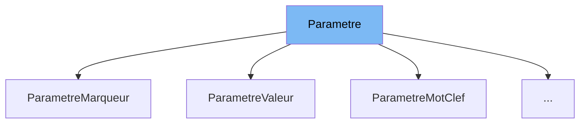

This document will cover the class <SwmToken path="src/machine/elements/programme/parametre.h" pos="114:1:1" line-data="		ParametreMotClef(const std::string&amp; mot_clef)">`ParametreMotClef`</SwmToken> in the file <SwmPath>[src/machine/elements/programme/parametre.h](src/machine/elements/programme/parametre.h)</SwmPath>. We will cover:

1. What <SwmToken path="src/machine/elements/programme/parametre.h" pos="35:3:3" line-data="	DECL_SHARED_PTR(Parametre);">`Parametre`</SwmToken> is.
2. What <SwmToken path="src/machine/elements/programme/parametre.h" pos="114:1:1" line-data="		ParametreMotClef(const std::string&amp; mot_clef)">`ParametreMotClef`</SwmToken> is.
3. Variables and functions in <SwmToken path="src/machine/elements/programme/parametre.h" pos="114:1:1" line-data="		ParametreMotClef(const std::string&amp; mot_clef)">`ParametreMotClef`</SwmToken>.



# What is Parametre

The <SwmToken path="src/machine/elements/programme/parametre.h" pos="35:3:3" line-data="	DECL_SHARED_PTR(Parametre);">`Parametre`</SwmToken> class in <SwmPath>[src/machine/elements/programme/parametre.h](src/machine/elements/programme/parametre.h)</SwmPath> is an abstract base class used to define parameters within the Simple Virtual Machine (SVM) environment. It provides a common interface for different types of parameters, including methods for decoration, evaluation, formatting, and HTML representation.

# What is <SwmToken path="src/machine/elements/programme/parametre.h" pos="114:1:1" line-data="		ParametreMotClef(const std::string&amp; mot_clef)">`ParametreMotClef`</SwmToken>

The <SwmToken path="src/machine/elements/programme/parametre.h" pos="114:1:1" line-data="		ParametreMotClef(const std::string&amp; mot_clef)">`ParametreMotClef`</SwmToken> class in <SwmPath>[src/machine/elements/programme/parametre.h](src/machine/elements/programme/parametre.h)</SwmPath> is a derived class from <SwmToken path="src/machine/elements/programme/parametre.h" pos="35:3:3" line-data="	DECL_SHARED_PTR(Parametre);">`Parametre`</SwmToken>. It represents a parameter that is identified by a keyword (<SwmToken path="src/machine/elements/programme/parametre.h" pos="114:10:10" line-data="		ParametreMotClef(const std::string&amp; mot_clef)">`mot_clef`</SwmToken>). This class is used to handle keyword parameters within the SVM environment, providing specific implementations for evaluation, formatting, and HTML representation.

<SwmSnippet path="/src/machine/elements/programme/parametre.h" line="114">

---

# Variables and functions

The constructor <SwmToken path="src/machine/elements/programme/parametre.h" pos="114:1:11" line-data="		ParametreMotClef(const std::string&amp; mot_clef)">`ParametreMotClef(const std::string& mot_clef)`</SwmToken> initializes the <SwmToken path="src/machine/elements/programme/parametre.h" pos="114:1:1" line-data="		ParametreMotClef(const std::string&amp; mot_clef)">`ParametreMotClef`</SwmToken> object with a keyword.

```c
		ParametreMotClef(const std::string& mot_clef)
		:_mot_clef(mot_clef) {}
```

---

</SwmSnippet>

<SwmSnippet path="/src/machine/elements/programme/parametre.h" line="116">

---

The destructor <SwmToken path="src/machine/elements/programme/parametre.h" pos="116:3:6" line-data="		virtual ~ParametreMotClef() {}">`~ParametreMotClef()`</SwmToken> is a virtual destructor ensuring proper cleanup of derived classes.

```c
		virtual ~ParametreMotClef() {}
```

---

</SwmSnippet>

<SwmSnippet path="/src/machine/elements/programme/parametre.h" line="117">

---

The function <SwmToken path="src/machine/elements/programme/parametre.h" pos="117:7:21" line-data="		virtual SVM_Valeur::ParametreSP evaluation(const SVM_Noyau::NoyauSP&amp; noyau) const override">`evaluation(const SVM_Noyau::NoyauSP& noyau) const override`</SwmToken> evaluates the parameter within the given context (<SwmToken path="src/machine/elements/programme/parametre.h" pos="117:16:16" line-data="		virtual SVM_Valeur::ParametreSP evaluation(const SVM_Noyau::NoyauSP&amp; noyau) const override">`noyau`</SwmToken>) and returns a shared pointer to a new <SwmToken path="src/machine/elements/programme/parametre.h" pos="119:9:9" line-data="			return std::make_shared&lt;SVM_Valeur::ParametreMotClef&gt;(_mot_clef);">`ParametreMotClef`</SwmToken> object.

```c
		virtual SVM_Valeur::ParametreSP evaluation(const SVM_Noyau::NoyauSP& noyau) const override
		{
			return std::make_shared<SVM_Valeur::ParametreMotClef>(_mot_clef);
		}
```

---

</SwmSnippet>

<SwmSnippet path="/src/machine/elements/programme/parametre.h" line="121">

---

The function <SwmToken path="src/machine/elements/programme/parametre.h" pos="121:5:17" line-data="		virtual void format(std::ostream&amp; os) const override">`format(std::ostream& os) const override`</SwmToken> formats the keyword parameter and outputs it to the provided stream.

```c
		virtual void format(std::ostream& os) const override
		{
			os << _mot_clef;
		}
```

---

</SwmSnippet>

<SwmSnippet path="/src/machine/elements/programme/parametre.h" line="125">

---

The function <SwmToken path="src/machine/elements/programme/parametre.h" pos="125:5:17" line-data="		virtual void html(std::ostream&amp; os) const override">`html(std::ostream& os) const override`</SwmToken> formats the keyword parameter as HTML and outputs it to the provided stream.

```c
		virtual void html(std::ostream& os) const override
		{
			os << "<span class=\"keyword\">" << _mot_clef << "</span>";
		}
```

---

</SwmSnippet>

<SwmSnippet path="/src/machine/elements/programme/parametre.h" line="130">

---

The private member variable <SwmToken path="src/machine/elements/programme/parametre.h" pos="130:5:5" line-data="			std::string _mot_clef;">`_mot_clef`</SwmToken> is a <SwmToken path="src/machine/elements/programme/parametre.h" pos="130:1:3" line-data="			std::string _mot_clef;">`std::string`</SwmToken> that stores the keyword associated with this parameter.

```c
			std::string _mot_clef;
	};
```

---

</SwmSnippet>

&nbsp;

*This is an auto-generated document by Swimm 🌊 and has not yet been verified by a human*

<SwmMeta version="3.0.0" repo-id="Z2l0aHViJTNBJTNBc3ZtLTIuNy4yMDI0MTEwNyUzQSUzQVN3aW1tLURlbW8=" repo-name="svm-2.7.20241107"><sup>Powered by [Swimm](/)</sup></SwmMeta>
