This document will cover the class <SwmToken path="src/machine/extensions/patron_objet_extension.h" pos="71:1:1" line-data="		PatronTypeExtension(const SVM_Valeur::PointEntreeExtension&amp; nom, Destructeur destructeur, Copie copie, Comparaison comparaison, Constante constante, Affichage affichage)">`PatronTypeExtension`</SwmToken> in the file <SwmPath>[src/machine/extensions/patron_objet_extension.h](src/machine/extensions/patron_objet_extension.h)</SwmPath>. We will cover:

1. What the file <SwmPath>[src/machine/extensions/patron_objet_extension.h](src/machine/extensions/patron_objet_extension.h)</SwmPath> is and what it is used for.
2. What <SwmToken path="src/machine/extensions/patron_objet_extension.h" pos="71:1:1" line-data="		PatronTypeExtension(const SVM_Valeur::PointEntreeExtension&amp; nom, Destructeur destructeur, Copie copie, Comparaison comparaison, Constante constante, Affichage affichage)">`PatronTypeExtension`</SwmToken> is and its relationship to <SwmToken path="src/machine/extensions/patron_objet_extension.h" pos="72:2:2" line-data="		:PatronObjetExtension(nom),_destructeur(destructeur), _copie(copie), _comparaison(comparaison), _constante(constante), _affichage(affichage) {}">`PatronObjetExtension`</SwmToken>.
3. The variables and functions defined in <SwmToken path="src/machine/extensions/patron_objet_extension.h" pos="71:1:1" line-data="		PatronTypeExtension(const SVM_Valeur::PointEntreeExtension&amp; nom, Destructeur destructeur, Copie copie, Comparaison comparaison, Constante constante, Affichage affichage)">`PatronTypeExtension`</SwmToken>.



```mermaid
graph TD;
  PatronObjetExtension:::currentBaseStyle
PatronObjetExtension --> PatronTypeExtension
PatronObjetExtension --> PatronFonctionExtension
PatronObjetExtension --> PatronInterruptionExtension
PatronObjetExtension --> PatronInstructionExtension
PatronObjetExtension --> PatronOptionExtension
PatronObjetExtension --> PatronArgumentExtension
PatronObjetExtension --> PatronArgumentsExtension
PatronObjetExtension --> PatronSequenceurExtension
PatronObjetExtension --> PatronOrdonnanceurExtension
PatronObjetExtension --> 1[...]

 classDef currentBaseStyle color:#000000,fill:#7CB9F4

%% Swimm:
%% graph TD;
%%   PatronObjetExtension:::currentBaseStyle
%% <SwmToken path="src/machine/extensions/patron_objet_extension.h" pos="72:2:2" line-data="		:PatronObjetExtension(nom),_destructeur(destructeur), _copie(copie), _comparaison(comparaison), _constante(constante), _affichage(affichage) {}">`PatronObjetExtension`</SwmToken> --> <SwmToken path="src/machine/extensions/patron_objet_extension.h" pos="71:1:1" line-data="		PatronTypeExtension(const SVM_Valeur::PointEntreeExtension&amp; nom, Destructeur destructeur, Copie copie, Comparaison comparaison, Constante constante, Affichage affichage)">`PatronTypeExtension`</SwmToken>
%% <SwmToken path="src/machine/extensions/patron_objet_extension.h" pos="72:2:2" line-data="		:PatronObjetExtension(nom),_destructeur(destructeur), _copie(copie), _comparaison(comparaison), _constante(constante), _affichage(affichage) {}">`PatronObjetExtension`</SwmToken> --> <SwmToken path="src/machine/extensions/patron_objet_extension.h" pos="251:3:3" line-data="	DECL_SHARED_PTR(PatronFonctionExtension);">`PatronFonctionExtension`</SwmToken>
%% <SwmToken path="src/machine/extensions/patron_objet_extension.h" pos="72:2:2" line-data="		:PatronObjetExtension(nom),_destructeur(destructeur), _copie(copie), _comparaison(comparaison), _constante(constante), _affichage(affichage) {}">`PatronObjetExtension`</SwmToken> --> <SwmToken path="src/machine/extensions/patron_objet_extension.h" pos="296:3:3" line-data="	DECL_SHARED_PTR(PatronInterruptionExtension);">`PatronInterruptionExtension`</SwmToken>
%% <SwmToken path="src/machine/extensions/patron_objet_extension.h" pos="72:2:2" line-data="		:PatronObjetExtension(nom),_destructeur(destructeur), _copie(copie), _comparaison(comparaison), _constante(constante), _affichage(affichage) {}">`PatronObjetExtension`</SwmToken> --> <SwmToken path="src/machine/extensions/patron_objet_extension.h" pos="120:3:3" line-data="	DECL_SHARED_PTR(PatronInstructionExtension);">`PatronInstructionExtension`</SwmToken>
%% <SwmToken path="src/machine/extensions/patron_objet_extension.h" pos="72:2:2" line-data="		:PatronObjetExtension(nom),_destructeur(destructeur), _copie(copie), _comparaison(comparaison), _constante(constante), _affichage(affichage) {}">`PatronObjetExtension`</SwmToken> --> <SwmToken path="src/machine/extensions/patron_objet_extension.h" pos="414:3:3" line-data="	DECL_SHARED_PTR(PatronOptionExtension);">`PatronOptionExtension`</SwmToken>
%% <SwmToken path="src/machine/extensions/patron_objet_extension.h" pos="72:2:2" line-data="		:PatronObjetExtension(nom),_destructeur(destructeur), _copie(copie), _comparaison(comparaison), _constante(constante), _affichage(affichage) {}">`PatronObjetExtension`</SwmToken> --> <SwmToken path="src/machine/extensions/patron_objet_extension.h" pos="456:3:3" line-data="	DECL_SHARED_PTR(PatronArgumentExtension);">`PatronArgumentExtension`</SwmToken>
%% <SwmToken path="src/machine/extensions/patron_objet_extension.h" pos="72:2:2" line-data="		:PatronObjetExtension(nom),_destructeur(destructeur), _copie(copie), _comparaison(comparaison), _constante(constante), _affichage(affichage) {}">`PatronObjetExtension`</SwmToken> --> <SwmToken path="src/machine/extensions/patron_objet_extension.h" pos="490:3:3" line-data="	DECL_SHARED_PTR(PatronArgumentsExtension);">`PatronArgumentsExtension`</SwmToken>
%% <SwmToken path="src/machine/extensions/patron_objet_extension.h" pos="72:2:2" line-data="		:PatronObjetExtension(nom),_destructeur(destructeur), _copie(copie), _comparaison(comparaison), _constante(constante), _affichage(affichage) {}">`PatronObjetExtension`</SwmToken> --> <SwmToken path="src/machine/extensions/patron_objet_extension.h" pos="357:3:3" line-data="	DECL_SHARED_PTR(PatronSequenceurExtension);">`PatronSequenceurExtension`</SwmToken>
%% <SwmToken path="src/machine/extensions/patron_objet_extension.h" pos="72:2:2" line-data="		:PatronObjetExtension(nom),_destructeur(destructeur), _copie(copie), _comparaison(comparaison), _constante(constante), _affichage(affichage) {}">`PatronObjetExtension`</SwmToken> --> <SwmToken path="src/machine/extensions/patron_objet_extension.h" pos="320:3:3" line-data="	DECL_SHARED_PTR(PatronOrdonnanceurExtension);">`PatronOrdonnanceurExtension`</SwmToken>
%% <SwmToken path="src/machine/extensions/patron_objet_extension.h" pos="72:2:2" line-data="		:PatronObjetExtension(nom),_destructeur(destructeur), _copie(copie), _comparaison(comparaison), _constante(constante), _affichage(affichage) {}">`PatronObjetExtension`</SwmToken> --> 1[...]
%% 
%%  classDef currentBaseStyle color:#000000,fill:#7CB9F4
```

# What is

The file <SwmPath>[src/machine/extensions/patron_objet_extension.h](src/machine/extensions/patron_objet_extension.h)</SwmPath> is part of the Simple Virtual Machine (SVM) project. It defines various extensions for handling different types of objects within the virtual machine. These extensions include types, structures, instructions, and more, providing a flexible architecture for managing different object behaviors and interactions in the SVM environment.

# What is <SwmToken path="src/machine/extensions/patron_objet_extension.h" pos="71:1:1" line-data="		PatronTypeExtension(const SVM_Valeur::PointEntreeExtension&amp; nom, Destructeur destructeur, Copie copie, Comparaison comparaison, Constante constante, Affichage affichage)">`PatronTypeExtension`</SwmToken>

<SwmToken path="src/machine/extensions/patron_objet_extension.h" pos="71:1:1" line-data="		PatronTypeExtension(const SVM_Valeur::PointEntreeExtension&amp; nom, Destructeur destructeur, Copie copie, Comparaison comparaison, Constante constante, Affichage affichage)">`PatronTypeExtension`</SwmToken> is a class defined in <SwmPath>[src/machine/extensions/patron_objet_extension.h](src/machine/extensions/patron_objet_extension.h)</SwmPath>. It is used to manage type-specific behaviors and operations within the Simple Virtual Machine (SVM). This class inherits from <SwmToken path="src/machine/extensions/patron_objet_extension.h" pos="72:2:2" line-data="		:PatronObjetExtension(nom),_destructeur(destructeur), _copie(copie), _comparaison(comparaison), _constante(constante), _affichage(affichage) {}">`PatronObjetExtension`</SwmToken>, which is a base class for various object extensions in the SVM. <SwmToken path="src/machine/extensions/patron_objet_extension.h" pos="71:1:1" line-data="		PatronTypeExtension(const SVM_Valeur::PointEntreeExtension&amp; nom, Destructeur destructeur, Copie copie, Comparaison comparaison, Constante constante, Affichage affichage)">`PatronTypeExtension`</SwmToken> provides functionalities such as destruction, copying, comparison, constant creation, and display of type-specific objects.

<SwmSnippet path="/src/machine/extensions/patron_objet_extension.h" line="87">

---

# Variables and functions

The variable <SwmToken path="src/machine/extensions/patron_objet_extension.h" pos="87:3:3" line-data="		Destructeur _destructeur;">`_destructeur`</SwmToken> is a function pointer used to define the destructor for the type-specific object. It is called to properly clean up and release resources associated with the object.

```c
		Destructeur _destructeur;
```

---

</SwmSnippet>

<SwmSnippet path="/src/machine/extensions/patron_objet_extension.h" line="88">

---

The variable <SwmToken path="src/machine/extensions/patron_objet_extension.h" pos="88:3:3" line-data="		Copie _copie;">`_copie`</SwmToken> is a function pointer used to define the copy operation for the type-specific object. It is used to create a duplicate of the object.

```c
		Copie _copie;
```

---

</SwmSnippet>

<SwmSnippet path="/src/machine/extensions/patron_objet_extension.h" line="89">

---

The variable <SwmToken path="src/machine/extensions/patron_objet_extension.h" pos="89:3:3" line-data="		Comparaison _comparaison;">`_comparaison`</SwmToken> is a function pointer used to define the comparison operation for the type-specific object. It is used to compare two objects of the same type.

```c
		Comparaison _comparaison;
```

---

</SwmSnippet>

<SwmSnippet path="/src/machine/extensions/patron_objet_extension.h" line="90">

---

The variable <SwmToken path="src/machine/extensions/patron_objet_extension.h" pos="90:3:3" line-data="		Constante _constante;">`_constante`</SwmToken> is a function pointer used to define the creation of a constant value for the type-specific object. It is used to initialize the object with a constant value.

```c
		Constante _constante;
```

---

</SwmSnippet>

<SwmSnippet path="/src/machine/extensions/patron_objet_extension.h" line="91">

---

The variable <SwmToken path="src/machine/extensions/patron_objet_extension.h" pos="91:3:3" line-data="		Affichage _affichage;">`_affichage`</SwmToken> is a function pointer used to define the display operation for the type-specific object. It is used to convert the object to a string representation for debugging or display purposes.

```c
		Affichage _affichage;
```

---

</SwmSnippet>

<SwmSnippet path="/src/machine/extensions/patron_objet_extension.h" line="71">

---

The constructor <SwmToken path="src/machine/extensions/patron_objet_extension.h" pos="71:1:1" line-data="		PatronTypeExtension(const SVM_Valeur::PointEntreeExtension&amp; nom, Destructeur destructeur, Copie copie, Comparaison comparaison, Constante constante, Affichage affichage)">`PatronTypeExtension`</SwmToken> initializes the object with the provided function pointers for destruction, copying, comparison, constant creation, and display. It also initializes the base class <SwmToken path="src/machine/extensions/patron_objet_extension.h" pos="72:2:2" line-data="		:PatronObjetExtension(nom),_destructeur(destructeur), _copie(copie), _comparaison(comparaison), _constante(constante), _affichage(affichage) {}">`PatronObjetExtension`</SwmToken> with the given name.

```c
		PatronTypeExtension(const SVM_Valeur::PointEntreeExtension& nom, Destructeur destructeur, Copie copie, Comparaison comparaison, Constante constante, Affichage affichage)
		:PatronObjetExtension(nom),_destructeur(destructeur), _copie(copie), _comparaison(comparaison), _constante(constante), _affichage(affichage) {}
```

---

</SwmSnippet>

<SwmSnippet path="/src/machine/extensions/patron_objet_extension.h" line="73">

---

The constructor <SwmToken path="src/machine/extensions/patron_objet_extension.h" pos="73:1:1" line-data="		PatronTypeExtension(const SVM_Valeur::PointEntreeExtension&amp; nom)">`PatronTypeExtension`</SwmToken> initializes the object with default null function pointers for destruction, copying, comparison, constant creation, and display. It also initializes the base class <SwmToken path="src/machine/extensions/patron_objet_extension.h" pos="72:2:2" line-data="		:PatronObjetExtension(nom),_destructeur(destructeur), _copie(copie), _comparaison(comparaison), _constante(constante), _affichage(affichage) {}">`PatronObjetExtension`</SwmToken> with the given name.

```c
		PatronTypeExtension(const SVM_Valeur::PointEntreeExtension& nom)
		:PatronTypeExtension(nom,nullptr,nullptr,nullptr,nullptr,nullptr) {}
```

---

</SwmSnippet>

<SwmSnippet path="/src/machine/extensions/patron_objet_extension.h" line="75">

---

The destructor <SwmToken path="src/machine/extensions/patron_objet_extension.h" pos="75:3:4" line-data="		virtual ~PatronTypeExtension() {}">`~PatronTypeExtension`</SwmToken> is a virtual destructor that ensures proper cleanup of resources when the object is destroyed.

```c
		virtual ~PatronTypeExtension() {}
```

---

</SwmSnippet>

<SwmSnippet path="/src/machine/extensions/patron_objet_extension.h" line="76">

---

The function <SwmToken path="src/machine/extensions/patron_objet_extension.h" pos="76:5:5" line-data="		virtual bool compatible(const PatronObjetExtensionSP&amp; patron) const override">`compatible`</SwmToken> checks if another <SwmToken path="src/machine/extensions/patron_objet_extension.h" pos="72:2:2" line-data="		:PatronObjetExtension(nom),_destructeur(destructeur), _copie(copie), _comparaison(comparaison), _constante(constante), _affichage(affichage) {}">`PatronObjetExtension`</SwmToken> object is compatible with this <SwmToken path="src/machine/extensions/patron_objet_extension.h" pos="78:1:1" line-data="			PatronTypeExtension *p=dynamic_cast&lt;PatronTypeExtension*&gt;(patron.get());">`PatronTypeExtension`</SwmToken> object. It performs a dynamic cast to <SwmToken path="src/machine/extensions/patron_objet_extension.h" pos="78:1:1" line-data="			PatronTypeExtension *p=dynamic_cast&lt;PatronTypeExtension*&gt;(patron.get());">`PatronTypeExtension`</SwmToken> and compares the names of the objects.

```c
		virtual bool compatible(const PatronObjetExtensionSP& patron) const override
		{
			PatronTypeExtension *p=dynamic_cast<PatronTypeExtension*>(patron.get());
			if(not p)
				return false;
			return _nom==p->_nom;
		}
```

---

</SwmSnippet>

<SwmSnippet path="/src/machine/extensions/patron_objet_extension.h" line="83">

---

The function <SwmToken path="src/machine/extensions/patron_objet_extension.h" pos="83:5:5" line-data="		virtual void format(std::ostream&amp; os) const override">`format`</SwmToken> outputs the type name to the provided output stream. It is used for displaying the type information.

```c
		virtual void format(std::ostream& os) const override
		{
			os << "TYPE " << _nom;
		}
```

---

</SwmSnippet>

&nbsp;

*This is an auto-generated document by Swimm 🌊 and has not yet been verified by a human*

<SwmMeta version="3.0.0" repo-id="Z2l0aHViJTNBJTNBc3ZtLTIuNy4yMDI0MTEwNyUzQSUzQVN3aW1tLURlbW8=" repo-name="svm-2.7.20241107"><sup>Powered by [Swimm](/)</sup></SwmMeta>
