```mermaid
graph TD;
 RegexParametres --> RegexParametresElement:::currentBaseStyle
RegexParametresElement --> RegexParametresValeur
RegexParametresElement --> RegexParametresJokerTotal
RegexParametresElement --> RegexParametresStructure
RegexParametresElement --> RegexParametresJokerPartielValeur
RegexParametresElement --> RegexParametresJokerPartielStructure
RegexParametresElement --> RegexParametresJokerPartielVariable
RegexParametresElement --> RegexParametresMarqueur
RegexParametresElement --> RegexParametresMotClef
RegexParametresElement --> 1[...]

 classDef currentBaseStyle color:#000000,fill:#7CB9F4

%% Swimm:
%% graph TD;
%%  <SwmToken path="src/machine/extensions/description.h" pos="91:3:3" line-data="	DECL_SHARED_PTR(RegexParametres);">`RegexParametres`</SwmToken> --> RegexParametresElement:::currentBaseStyle
%% <SwmToken path="src/machine/extensions/description.h" pos="157:10:10" line-data="		virtual bool operator&lt;(const RegexParametresElement&amp; element) const override">`RegexParametresElement`</SwmToken> --> <SwmToken path="src/machine/extensions/description.h" pos="257:3:3" line-data="	DECL_SHARED_PTR(RegexParametresValeur);">`RegexParametresValeur`</SwmToken>
%% <SwmToken path="src/machine/extensions/description.h" pos="157:10:10" line-data="		virtual bool operator&lt;(const RegexParametresElement&amp; element) const override">`RegexParametresElement`</SwmToken> --> <SwmToken path="src/machine/extensions/description.h" pos="141:4:4" line-data="		virtual ~RegexParametresJokerTotal() {}">`RegexParametresJokerTotal`</SwmToken>
%% <SwmToken path="src/machine/extensions/description.h" pos="157:10:10" line-data="		virtual bool operator&lt;(const RegexParametresElement&amp; element) const override">`RegexParametresElement`</SwmToken> --> <SwmToken path="src/machine/extensions/description.h" pos="537:3:3" line-data="	DECL_SHARED_PTR(RegexParametresStructure);">`RegexParametresStructure`</SwmToken>
%% <SwmToken path="src/machine/extensions/description.h" pos="157:10:10" line-data="		virtual bool operator&lt;(const RegexParametresElement&amp; element) const override">`RegexParametresElement`</SwmToken> --> <SwmToken path="src/machine/extensions/description.h" pos="213:3:3" line-data="	struct RegexParametresJokerPartielValeur : public RegexParametresElement">`RegexParametresJokerPartielValeur`</SwmToken>
%% <SwmToken path="src/machine/extensions/description.h" pos="157:10:10" line-data="		virtual bool operator&lt;(const RegexParametresElement&amp; element) const override">`RegexParametresElement`</SwmToken> --> <SwmToken path="src/machine/extensions/description.h" pos="461:3:3" line-data="	struct RegexParametresJokerPartielStructure : public RegexParametresElement">`RegexParametresJokerPartielStructure`</SwmToken>
%% <SwmToken path="src/machine/extensions/description.h" pos="157:10:10" line-data="		virtual bool operator&lt;(const RegexParametresElement&amp; element) const override">`RegexParametresElement`</SwmToken> --> <SwmToken path="src/machine/extensions/description.h" pos="505:3:3" line-data="	struct RegexParametresJokerPartielVariable : public RegexParametresElement">`RegexParametresJokerPartielVariable`</SwmToken>
%% <SwmToken path="src/machine/extensions/description.h" pos="157:10:10" line-data="		virtual bool operator&lt;(const RegexParametresElement&amp; element) const override">`RegexParametresElement`</SwmToken> --> <SwmToken path="src/machine/extensions/description.h" pos="345:3:3" line-data="	struct RegexParametresMarqueur : public RegexParametresElement">`RegexParametresMarqueur`</SwmToken>
%% <SwmToken path="src/machine/extensions/description.h" pos="157:10:10" line-data="		virtual bool operator&lt;(const RegexParametresElement&amp; element) const override">`RegexParametresElement`</SwmToken> --> <SwmToken path="src/machine/extensions/description.h" pos="420:3:3" line-data="	struct RegexParametresMotClef : public RegexParametresElement">`RegexParametresMotClef`</SwmToken>
%% <SwmToken path="src/machine/extensions/description.h" pos="157:10:10" line-data="		virtual bool operator&lt;(const RegexParametresElement&amp; element) const override">`RegexParametresElement`</SwmToken> --> 1[...]
%% 
%%  classDef currentBaseStyle color:#000000,fill:#7CB9F4
```

This document will cover the class <SwmToken path="src/machine/extensions/description.h" pos="141:4:4" line-data="		virtual ~RegexParametresJokerTotal() {}">`RegexParametresJokerTotal`</SwmToken> in detail. We will cover:

1. What is <SwmToken path="src/machine/extensions/description.h" pos="91:3:3" line-data="	DECL_SHARED_PTR(RegexParametres);">`RegexParametres`</SwmToken>
2. What is <SwmToken path="src/machine/extensions/description.h" pos="141:4:4" line-data="		virtual ~RegexParametresJokerTotal() {}">`RegexParametresJokerTotal`</SwmToken>
3. Variables and functions in <SwmToken path="src/machine/extensions/description.h" pos="141:4:4" line-data="		virtual ~RegexParametresJokerTotal() {}">`RegexParametresJokerTotal`</SwmToken>



# What is <SwmToken path="src/machine/extensions/description.h" pos="91:3:3" line-data="	DECL_SHARED_PTR(RegexParametres);">`RegexParametres`</SwmToken>

The <SwmToken path="src/machine/extensions/description.h" pos="91:3:3" line-data="	DECL_SHARED_PTR(RegexParametres);">`RegexParametres`</SwmToken> class is a base class used for handling regular expression parameters within the virtual machine environment. It provides a common interface for formatting and converting these parameters into a non-deterministic automaton. This class is designed to be extended by other classes that implement specific types of regular expression parameters.

# What is <SwmToken path="src/machine/extensions/description.h" pos="141:4:4" line-data="		virtual ~RegexParametresJokerTotal() {}">`RegexParametresJokerTotal`</SwmToken>

The <SwmToken path="src/machine/extensions/description.h" pos="141:4:4" line-data="		virtual ~RegexParametresJokerTotal() {}">`RegexParametresJokerTotal`</SwmToken> class is a specific implementation of the <SwmToken path="src/machine/extensions/description.h" pos="157:10:10" line-data="		virtual bool operator&lt;(const RegexParametresElement&amp; element) const override">`RegexParametresElement`</SwmToken> class. It represents a wildcard parameter in a regular expression, matching any single character. This class is used to handle cases where a wildcard character is needed in the regular expression. It inherits from <SwmToken path="src/machine/extensions/description.h" pos="157:10:10" line-data="		virtual bool operator&lt;(const RegexParametresElement&amp; element) const override">`RegexParametresElement`</SwmToken> and provides specific implementations for formatting, copying, and comparing wildcard parameters.

<SwmSnippet path="/src/machine/extensions/description.h" line="141">

---

# Variables and functions

The destructor <SwmToken path="src/machine/extensions/description.h" pos="141:3:4" line-data="		virtual ~RegexParametresJokerTotal() {}">`~RegexParametresJokerTotal`</SwmToken> is defined to clean up any resources when an instance of <SwmToken path="src/machine/extensions/description.h" pos="141:4:4" line-data="		virtual ~RegexParametresJokerTotal() {}">`RegexParametresJokerTotal`</SwmToken> is destroyed.

```c
		virtual ~RegexParametresJokerTotal() {}
```

---

</SwmSnippet>

<SwmSnippet path="/src/machine/extensions/description.h" line="142">

---

The <SwmToken path="src/machine/extensions/description.h" pos="142:5:5" line-data="		virtual void format(std::ostream&amp; os) const override">`format`</SwmToken> function is used to output the wildcard character (.) to the provided output stream. This function overrides the pure virtual function in the base class.

```c
		virtual void format(std::ostream& os) const override
		{
			os << ".";
		}
```

---

</SwmSnippet>

<SwmSnippet path="/src/machine/extensions/description.h" line="146">

---

The <SwmToken path="src/machine/extensions/description.h" pos="146:5:5" line-data="		virtual RegexParametresElementSP joker() const override">`joker`</SwmToken> function returns a null shared pointer, indicating that there is no further wildcard expansion possible. This function overrides the pure virtual function in the base class.

```c
		virtual RegexParametresElementSP joker() const override
		{
			return RegexParametresElementSP();
		}
```

---

</SwmSnippet>

<SwmSnippet path="/src/machine/extensions/description.h" line="150">

---

The <SwmToken path="src/machine/extensions/description.h" pos="150:3:5" line-data="		virtual operator AutomateNonDeterministeSP () const override;">`operator AutomateNonDeterministeSP`</SwmToken> function is a type conversion operator that converts the wildcard parameter into a non-deterministic automaton. The implementation of this function is provided in the source file.

```c
		virtual operator AutomateNonDeterministeSP () const override;
```

---

</SwmSnippet>

<SwmSnippet path="/src/machine/extensions/description.h" line="151">

---

The <SwmToken path="src/machine/extensions/description.h" pos="151:5:5" line-data="		virtual RegexParametresElementSP copie() const override">`copie`</SwmToken> function creates a copy of the <SwmToken path="src/machine/extensions/description.h" pos="153:11:11" line-data="			auto c = std::make_shared&lt;RegexParametresJokerTotal&gt;();">`RegexParametresJokerTotal`</SwmToken> instance. It returns a shared pointer to the new instance, with the <SwmToken path="src/machine/extensions/description.h" pos="154:3:3" line-data="			c-&gt;_modifiable = _modifiable;">`_modifiable`</SwmToken> flag copied from the original instance.

```c
		virtual RegexParametresElementSP copie() const override
		{
			auto c = std::make_shared<RegexParametresJokerTotal>();
			c->_modifiable = _modifiable;
			return c;
		}
```

---

</SwmSnippet>

<SwmSnippet path="/src/machine/extensions/description.h" line="157">

---

The <SwmToken path="src/machine/extensions/description.h" pos="157:5:6" line-data="		virtual bool operator&lt;(const RegexParametresElement&amp; element) const override">`operator<`</SwmToken> function compares the current instance with another <SwmToken path="src/machine/extensions/description.h" pos="157:10:10" line-data="		virtual bool operator&lt;(const RegexParametresElement&amp; element) const override">`RegexParametresElement`</SwmToken> instance. It first checks if the types are different and compares their type hashes. If the types are the same, it returns false, indicating that no ordering is defined for instances of the same type.

```c
		virtual bool operator<(const RegexParametresElement& element) const override
		{
			if(typeid(*this).hash_code()!=typeid(element).hash_code())
			{
				return typeid(*this).hash_code()<typeid(element).hash_code();
			}
			return false;
		}
```

---

</SwmSnippet>

<SwmSnippet path="/src/machine/extensions/description.h" line="165">

---

The <SwmToken path="src/machine/extensions/description.h" pos="165:5:6" line-data="		virtual bool operator==(const RegexParametresElement&amp; element) const override">`operator==`</SwmToken> function checks if the current instance is equal to another <SwmToken path="src/machine/extensions/description.h" pos="165:10:10" line-data="		virtual bool operator==(const RegexParametresElement&amp; element) const override">`RegexParametresElement`</SwmToken> instance. It compares the type hashes of the two instances and returns true if they are the same, indicating that the instances are of the same type.

```c
		virtual bool operator==(const RegexParametresElement& element) const override
		{
			return (typeid(*this).hash_code()==typeid(element).hash_code());
		}
```

---

</SwmSnippet>

&nbsp;

*This is an auto-generated document by Swimm 🌊 and has not yet been verified by a human*

<SwmMeta version="3.0.0" repo-id="Z2l0aHViJTNBJTNBc3ZtLTIuNy4yMDI0MTEwNyUzQSUzQVN3aW1tLURlbW8=" repo-name="svm-2.7.20241107"><sup>Powered by [Swimm](/)</sup></SwmMeta>
