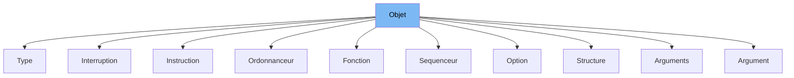

This document will cover the class <SwmToken path="src/machine/extensions/description.h" pos="718:1:1" line-data="		Type(const size_t ligne, const SVM_Valeur::PointEntreeExtension&amp; type)">`Type`</SwmToken> in <SwmPath>[src/machine/extensions/description.h](src/machine/extensions/description.h)</SwmPath>. We will cover:

1. What <SwmToken path="src/machine/extensions/description.h" pos="694:3:3" line-data="	DECL_SHARED_PTR(Objet);">`Objet`</SwmToken> is.
2. What <SwmToken path="src/machine/extensions/description.h" pos="718:1:1" line-data="		Type(const size_t ligne, const SVM_Valeur::PointEntreeExtension&amp; type)">`Type`</SwmToken> is.
3. Variables and functions in <SwmToken path="src/machine/extensions/description.h" pos="718:1:1" line-data="		Type(const size_t ligne, const SVM_Valeur::PointEntreeExtension&amp; type)">`Type`</SwmToken>.



# What is Objet

In <SwmPath>[src/machine/extensions/description.h](src/machine/extensions/description.h)</SwmPath>, <SwmToken path="src/machine/extensions/description.h" pos="694:3:3" line-data="	DECL_SHARED_PTR(Objet);">`Objet`</SwmToken> is a base class that represents an object within the Simple Virtual Machine (SVM) environment. It provides a common interface and structure for various types of objects, including methods for formatting, verification, and generation of code. <SwmToken path="src/machine/extensions/description.h" pos="694:3:3" line-data="	DECL_SHARED_PTR(Objet);">`Objet`</SwmToken> serves as a foundation for more specific object types, ensuring consistency and reusability across the SVM framework.

# What is Type

In <SwmPath>[src/machine/extensions/description.h](src/machine/extensions/description.h)</SwmPath>, <SwmToken path="src/machine/extensions/description.h" pos="718:1:1" line-data="		Type(const size_t ligne, const SVM_Valeur::PointEntreeExtension&amp; type)">`Type`</SwmToken> is a class that inherits from <SwmToken path="src/machine/extensions/description.h" pos="694:3:3" line-data="	DECL_SHARED_PTR(Objet);">`Objet`</SwmToken>. It represents a specific type of object within the SVM environment. The <SwmToken path="src/machine/extensions/description.h" pos="718:1:1" line-data="		Type(const size_t ligne, const SVM_Valeur::PointEntreeExtension&amp; type)">`Type`</SwmToken> class is used to define and manage types, ensuring they conform to the expected structure and behavior within the SVM framework. It includes methods for formatting the type, verifying its correctness, and generating the necessary code for its usage. <SwmToken path="src/machine/extensions/description.h" pos="718:1:1" line-data="		Type(const size_t ligne, const SVM_Valeur::PointEntreeExtension&amp; type)">`Type`</SwmToken> is closely related to <SwmToken path="src/machine/extensions/description.h" pos="694:3:3" line-data="	DECL_SHARED_PTR(Objet);">`Objet`</SwmToken> as it extends its functionality to handle type-specific operations.

<SwmSnippet path="/src/machine/extensions/description.h" line="718">

---

# Variables and functions

The constructor <SwmToken path="src/machine/extensions/description.h" pos="718:1:18" line-data="		Type(const size_t ligne, const SVM_Valeur::PointEntreeExtension&amp; type)">`Type(const size_t ligne, const SVM_Valeur::PointEntreeExtension& type)`</SwmToken> initializes a <SwmToken path="src/machine/extensions/description.h" pos="718:1:1" line-data="		Type(const size_t ligne, const SVM_Valeur::PointEntreeExtension&amp; type)">`Type`</SwmToken> object with a line number and a type entry point.

```c
		Type(const size_t ligne, const SVM_Valeur::PointEntreeExtension& type)
```

---

</SwmSnippet>

<SwmSnippet path="/src/machine/extensions/description.h" line="720">

---

The destructor <SwmToken path="src/machine/extensions/description.h" pos="720:1:6" line-data="		virtual ~Type() {}">`virtual ~Type()`</SwmToken> ensures proper cleanup of <SwmToken path="src/machine/extensions/description.h" pos="720:4:4" line-data="		virtual ~Type() {}">`Type`</SwmToken> objects.

```c
		virtual ~Type() {}
```

---

</SwmSnippet>

<SwmSnippet path="/src/machine/extensions/description.h" line="721">

---

The <SwmToken path="src/machine/extensions/description.h" pos="721:5:5" line-data="		virtual void format(std::ostream&amp; os) const override">`format`</SwmToken> function <SwmToken path="src/machine/extensions/description.h" pos="721:1:17" line-data="		virtual void format(std::ostream&amp; os) const override">`virtual void format(std::ostream& os) const override`</SwmToken> outputs the type information to the provided output stream.

```c
		virtual void format(std::ostream& os) const override
		{
			os << "TYPE " << _type;
		}
```

---

</SwmSnippet>

<SwmSnippet path="/src/machine/extensions/description.h" line="725">

---

The type conversion operator <SwmToken path="src/machine/extensions/description.h" pos="725:1:12" line-data="		virtual operator ReferenceObjet () const override">`virtual operator ReferenceObjet () const override`</SwmToken> converts the <SwmToken path="src/machine/extensions/description.h" pos="727:7:7" line-data="			return ReferenceObjet(ReferenceObjet::Type::TYPE,_type,_ligne);">`Type`</SwmToken> object to a <SwmToken path="src/machine/extensions/description.h" pos="725:5:5" line-data="		virtual operator ReferenceObjet () const override">`ReferenceObjet`</SwmToken>.

```c
		virtual operator ReferenceObjet () const override
		{
			return ReferenceObjet(ReferenceObjet::Type::TYPE,_type,_ligne);
		}
```

---

</SwmSnippet>

<SwmSnippet path="/src/machine/extensions/description.h" line="729">

---

The <SwmToken path="src/machine/extensions/description.h" pos="729:5:5" line-data="		virtual PatronObjetExtensionSP patron(const std::string&amp; nom, void *fichier) const override;">`patron`</SwmToken> function <SwmToken path="src/machine/extensions/description.h" pos="729:1:25" line-data="		virtual PatronObjetExtensionSP patron(const std::string&amp; nom, void *fichier) const override;">`virtual PatronObjetExtensionSP patron(const std::string& nom, void *fichier) const override`</SwmToken> returns a shared pointer to a <SwmToken path="src/machine/extensions/description.h" pos="43:3:3" line-data="	DECL_SHARED_PTR(PatronObjetExtension);">`PatronObjetExtension`</SwmToken> object.

```c
		virtual PatronObjetExtensionSP patron(const std::string& nom, void *fichier) const override;
		virtual PatronObjetExtensionSP dependance(const std::string& nom) const override;
```

---

</SwmSnippet>

<SwmSnippet path="/src/machine/extensions/description.h" line="730">

---

The <SwmToken path="src/machine/extensions/description.h" pos="730:5:5" line-data="		virtual PatronObjetExtensionSP dependance(const std::string&amp; nom) const override;">`dependance`</SwmToken> function <SwmToken path="src/machine/extensions/description.h" pos="730:1:19" line-data="		virtual PatronObjetExtensionSP dependance(const std::string&amp; nom) const override;">`virtual PatronObjetExtensionSP dependance(const std::string& nom) const override`</SwmToken> returns a shared pointer to a <SwmToken path="src/machine/extensions/description.h" pos="43:3:3" line-data="	DECL_SHARED_PTR(PatronObjetExtension);">`PatronObjetExtension`</SwmToken> object representing a dependency.

```c
		virtual PatronObjetExtensionSP dependance(const std::string& nom) const override;
		virtual void verification(const std::string& extension, const std::function<bool(const std::string&, const std::string&)>& verif) const override
```

---

</SwmSnippet>

<SwmSnippet path="/src/machine/extensions/description.h" line="731">

---

The <SwmToken path="src/machine/extensions/description.h" pos="731:5:5" line-data="		virtual void verification(const std::string&amp; extension, const std::function&lt;bool(const std::string&amp;, const std::string&amp;)&gt;&amp; verif) const override">`verification`</SwmToken> function <SwmToken path="src/machine/extensions/description.h" pos="731:1:46" line-data="		virtual void verification(const std::string&amp; extension, const std::function&lt;bool(const std::string&amp;, const std::string&amp;)&gt;&amp; verif) const override">`virtual void verification(const std::string& extension, const std::function<bool(const std::string&, const std::string&)>& verif) const override`</SwmToken> checks if the type name matches the expected extension name and throws an exception if it does not.

```c
		virtual void verification(const std::string& extension, const std::function<bool(const std::string&, const std::string&)>& verif) const override
		{
			if(not verif(_type.nom_extension(),extension))
			{
				throw MauvaisNomExtension(extension,_type.nom_extension(),_ligne);
			}
		}
```

---

</SwmSnippet>

<SwmSnippet path="/src/machine/extensions/description.h" line="738">

---

The <SwmToken path="src/machine/extensions/description.h" pos="738:5:5" line-data="		virtual void generation(std::ostream&amp; os, const SVM::Outils::Langage&amp; langage, const SVM::Outils::DefinitionObjet* definition) const override;">`generation`</SwmToken> function <SwmToken path="src/machine/extensions/description.h" pos="738:1:41" line-data="		virtual void generation(std::ostream&amp; os, const SVM::Outils::Langage&amp; langage, const SVM::Outils::DefinitionObjet* definition) const override;">`virtual void generation(std::ostream& os, const SVM::Outils::Langage& langage, const SVM::Outils::DefinitionObjet* definition) const override`</SwmToken> generates the necessary code for the type.

```c
		virtual void generation(std::ostream& os, const SVM::Outils::Langage& langage, const SVM::Outils::DefinitionObjet* definition) const override;
		SVM_Valeur::PointEntreeExtension _type;
```

---

</SwmSnippet>

<SwmSnippet path="/src/machine/extensions/description.h" line="739">

---

The variable <SwmToken path="src/machine/extensions/description.h" pos="739:5:5" line-data="		SVM_Valeur::PointEntreeExtension _type;">`_type`</SwmToken> of type <SwmToken path="src/machine/extensions/description.h" pos="739:1:3" line-data="		SVM_Valeur::PointEntreeExtension _type;">`SVM_Valeur::PointEntreeExtension`</SwmToken> stores the type entry point information.

```c
		SVM_Valeur::PointEntreeExtension _type;
	};
```

---

</SwmSnippet>

&nbsp;

*This is an auto-generated document by Swimm 🌊 and has not yet been verified by a human*

<SwmMeta version="3.0.0" repo-id="Z2l0aHViJTNBJTNBc3ZtLTIuNy4yMDI0MTEwNyUzQSUzQVN3aW1tLURlbW8=" repo-name="svm-2.7.20241107"><sup>Powered by [Swimm](/)</sup></SwmMeta>
